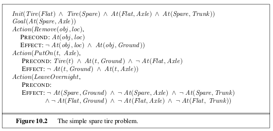

```{r setup, include=FALSE}
knitr::opts_chunk$set(echo = TRUE)
```

_In which we see how an agent can take advantage of the structure of a problem to construct complex plans of action._

# 10.1 | Definition of Classical Planning 

Planning researchers have settled on a **factored representation** -- one in which a state of the world is represented by a collection of variables. Classical planning concentrates on problems where most actions leave most things unchanged. For example, when an action is performed on an object, the system need only take notice of the change in the acted upon object, not all the objects which remain unchanged. 

A set of ground (variable free) actions can be represented by a single **action schema**. The schema is a **lifted representation** - it lifts the level of reasoning from propositional logic to a restricted subset of first order logic. The schema consists of an action name, a list of all the variables used in the schema, a **precondition** and an **effect**. 

In formal notation: $(a \in \mathrm{Actions}(s) \iff s \models \mathrm{Precond}(a))$

We say that an action $a$ is **applicable** in state $s$ if the preconditions are satisfied by $s$. The **result** of executing action $a$ in state $s$ is defined as a state $s'$ which is represented by the set of fluents formed by starting with $s$, removing the fluents that appear as negative literals in the action's effects, and adding the fluents that are positive literals in the actions effects. 

The **goal** is just like a precondition: a conjunction of literals (positive or negative) that may contain variables.

Now we have defined planning as a search problem: we have an initial state, an action function, a result function, and a goal test. 

As an example: 



## 10.1.4 | The Complexity of Classical Planning 

**PlanSAT** is the question of whether there exists any plan that solves a planning problem. 

**Bounded PlanSAT** asks whether there is a solution of length $k$ or less; this can be used to find an optimal plan. 

Both PlanSAT and Bounded PlanSAT are in the complexity class PSPACE, a class that is largers and more difficult than NP and refers to problems that can be solved by a deterministic Turing macbine with a polynomial amount of space. If we disallow negative effects, both problems are still NP-hard. If we disallow negative preconditions, PlanSAT reduces to the class P. 

# 10.2 | Algorithms for Planning as State-Space Search 

Thanks to the declarative representation of action schemas, we can search forward and backward from a goal.

## 10.2.1 | Forward (Progression) State-Space Search 

From the early days of planning research (around 1961) until around 1998 it was considered impractical to implement forward search.

One reason is that forward search is prone to exploring irrelevant actions. For example, search through ISBNs for books has 10 digits, so our algorithm would have to start enumerating around 10 billion actions ($10^{10}$) to find one that leads to the goal. 

Another reason is that planning problems tend to have really large state spaces. The branching factors tend to be huge. Forward search is feasible in cases where there are strong domain-independent heuristics that can be derived automatically. 

## 10.2.2 | Backward (Regression) Relevant-States Search

In regression search we start at the goal and apply actions backward until we find a sequence of steps that reaches the initial state. It is called **relevant states** search because we only consider actions that are relevant to the goal (or current state). 

Given a ground description $g$ and a ground action $a$, the regression from $g$ over $a$ gives us a state description $g'$ defined by $g' = (g - \mathrm{Add}(a)) \cup \mathrm{Precond}(a)$. 

## 10.2.3 | Heuristics for Planning 

Neither forward not backward search is efficient without a good heuristic function. Recall that a heuristic function $h(s)$ estimates the distance from a state $s$ to the goal and that if we derive an **admissible** heuristic for this distance - one that does not overestimate - then we can use A\* search to find optimal solutions. An admissible heuristic can be derived by defining a **relaxed problem** that is easier to solve. 

We can think of a search problem as a graph where the nodes are states and the edges are actions. The problem is to find a path connecting the initial state to a goal state. We can relax this problem in 2 ways: by adding more edges to the graph, making it strictly easier to find a path, or by grouping multiple nodes together, forming an abstraction of the state space that has fewer states, and thus easier to search. 

Heuristics that add edges to the graph: 

The **ignore preconditions** heuristic drops all preconditions from actions. Every action becomes applicable in every state, and any single goal gluent can be achieved in one step. First we relax the actions by removing all preconditions and all effects expect those that are literals in the goal. Then we count the minimum number of actions required such that the union of those actions effects' satisfies the goal. This is an instance of the **set cover problem** (which is NP hard). 

Fortunately, a simple greedy algorithm is guaranteed to return a set covering whose size is within a factor of $\log(n)$ of the true minimum covering, where $n$ is the number of literals in the goal. Unfortunately, the greedy algorithm loses the guarantee of admissibility.  

Another possibility is the **ignore delete lists** heuristic. Assume for a moment that all goals and preconditions contain only positive literals. We can create a relaxed version of the original problem where the length of the solution will serve as a good heuristic. We can do this by removing the delete lists from all actions (removing all negative literals from effects). Then we can make monotonic progress towards the goal, as no action will ever undo progress made by another action. This is still NP hard, but an approximate solution can be found in polynomial time by hill climbing. 

A key idea in defining heuristics is **decomposition**. The **subgoal independence** assumption is that the cost of solving a conjunction of subgoals is approximated by the sum of the costs of solving each subgoal independently. 

# 10.3 | Planning Graphs 

A special data structure called a **planning graph** can be used to give better heuristic estimates. A planning graph is a polynomial size approximation of the initial exponential planning tree that can be constructed quickly. The planning graph can't answer definitivel whether a state $G$ is reachable from $S_0$, but it can estimate how many steps it takes to reach $G$. The esimate is always correct when it reports the goal is not reachable, and it never overestimates the number of steps, so it is an admissible heuristic. 

A planning graph is a directed graph organized into **levels**. An entire graph with $n$ levels has a size and time to build of $O(n(a + l)^2)$. 

## Planning Graphs for Heuristic Estimation 

A planning graph, once constructed, is a source of information about the problem. If any goal literal fails to appear in the final level of the graph, then the problem is unsolvable. We can also estimate the cost of achieving any goal literal $g_i$ from state $s$ at the level at which $g_i$ first appears in the planning graph constructed from an initial state $s$. This is called the **level cost** of $g_i$.  

To estimate the cost of a conjunction of goals, there are 3 simple approaches: 

The **max-level** heuristic takes the maximum level cost of any of the goals. This is admissible, but not necessarily accurate. 

The **level sum** heuristic (requiring a subgoal independence assumption) returns the sum of the level costs of the goals. This can be inadmissible but works well in practice for problems that are largely decomposable. 

The **set-level** heuristic finds the level at which all the literals in the conjunctive goal appear in the planning graph without any pair of them being mutually exclusive. It is admissible, it dominates the max level heuristic, and it works extremely well on tasks in which there is a good deal of interaction among subplans. It is not perfect though, as it ignore interactions among 3 or more literals. 

## 10.3.2 | The GraphPlan Algorithm 

This shows how to extract a plan directly from the planning graph, rather than just using the graph to provide a heuristic. The GraphPlan algorithm repeatedly adds a level to a planning graph with expand-graph. Once all the goal show up as non-mutex in the graph, graphplan called extract-solution to search for a plan that solves the problem. If that fails, it expands another level and tries again, terminating with failure when there is no reason to go on. 

# 10.4 | Other Classical Planning Approaches 

As of the writing of AIMA 3rd ed, the most popular and effective approaches to fully automated planning are: 

- translating to a boolean satisfiability problem 
- forward state-space search with carefully crafted heuristics 
- search using a planning graph 

# 10.5 | Analysis of Planning Approaches 

Planning combines the two major areas of AI we have covered so far: search and logic. A planner can be seen either as a program that searches for a solution or as one that proves the existence of a solution. 

Planning is foremost an exercise in controlling combinatorial explosion. As we have seen, planning is PSPACE-hard. 

# 10.6 | Summary 

In this chapter, we defined the problem of planning in deterministic, fully observable, static environments.

- Planning systems are problem-solving algorithms that operate on explitic propositional or relational representations of states and actions. These representations make possible the derivation of effective heuristics and the development of powerful and flexible algorithms for solving problems. 

- PDDL, the planning domain definition language, describes the initial and goal states as conjunctions of literals, and actions in terms of their preconditions and effects. 

- State-space search can operate in forward direction (progression) or backward-direction (regression). Effective heuristics can be derived by subgoal independence assumptions and by various relaxations of the planning problem. 

- A planning graph can be constructed incrementally, starting from the initial state. Each layer contains a superset of all the literals or actions that could occur at that time step and encodes mutual exclusion relations among literals or actions that cannot co-occur. Planning graphs yield useful heuristics for state-space and partial order planners and can be used directly in the GraphPlan algorithm. 

- Other approaches include first-order deduction over situation calculus axioms; encoding a planning problem as a Boolean satisfiability problem or as a constraint satisfaction problem; and explicitly searching through the space or partially ordered plans. 

- Each of the major approaches to planning has its adherents, and there is as yet no concensus on which is best. Competition and cross-fertilization among the approaches have resulted in significant gains in efficiency for planning systems. 


