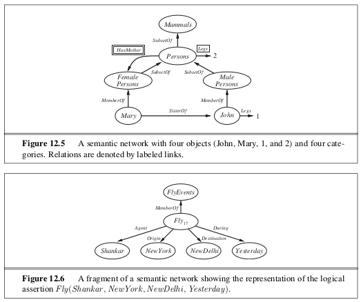

```{r setup, include=FALSE}
knitr::opts_chunk$set(echo = TRUE)
```

_In which we show how to use first-order logic to represent the most important aspects of the real world, such as action, space, time, thoughts, and shopping._

# 12.1 | Ontological Engineering 

Representing abstract concepts such as events, time, physical objects and beliefs is sometimes called ontological engineering. 

two major characteristics of general purpose ontologies distinguish them from collections of special purpose ontologies: 

- A general-purpose ontology should be applicable in more or less any special purpose domain. 

- In any sufficiently demanding domain, different areas of knowledge must be unified, because reasoning and problem solving could involve several areas simultaneously. 

# 12.2 | Categories and Objects

When setting a series of definitions of an object, we use a general technique called **logical minimization**, which means defining an object as the smallest one satisfying certain conditions. 

# 12.3 | Events

When we looked at situation calculus in section 10.4.2, we saw how it could represent actions and their effects. Unfortunately, situation calculus was designed to describe a world in which actions are discrete, instantaneous, and happen at one time. 

To handle the continuity of time, we must use an alternate formalism called **event calculus**, which is based on points of time rather than on situations. Event calculus relies on fluents and events, and the fluent is an object that refers to a fact, but does not assert its truth. We can extend event calculus to handle simultaneous events, exogenous events, continuous events and more. 

## 12.3.1 | Processes

We can state that any process $e$ that happens over an interval also happens over any subinterval. We can think of liquid events as **temporal substances**, as opposed to **spatial substances**. 

# 12.4 | Mental Events and Mental Objects 

If our agent knows 2 + 2 = 4 and that 4 < 5, we want our agent to know that 2 + 2 < 5. This property is called **referential transparency** -- it doesn't matter what term a logic uses to refer to an object, what matters is the object that the term names. But for propositional attitudes like _believes_ or _knows_, we would like to have referential opacity -- the terms used do matter, because not all agents know which terms are coreferential. 

**Modal Logic** is designed to address this problem. Regular logic is concerned with a single modality, truth, allowing us to express "P is true". Model logic includes special modal operators that take sentences (rather than terms) as arguments. For example, a knows P is represented with the notation $K_A P$ where $K$ is the modal operator for knowledge. It takes two arguments, an agent and a sentence. The syntax of modal logic is the same as first order logic, except that sentences can also be formed with modal operators. 

# 12.5 | Reasoning Systems for Categories 

Categories are the primary building blocks of large scale knowledge representation schemes. There are two closely related families of systems: **semantic networks** provide graphical aids for visualizing a knowledge base and efficient algorithms for inferring properties of an object on the basis of its category membership. **Description logics** provide a formal language for constructing and combining category definitions and efficient algorithms for deciding subset and superset relatinships between categories. 

## 12.5.1 | Semantic Networks 

The semantic network notation makes it convenient to perform inheritance reasoning. Inheritance becomes complicated when an object can belong to more than one category or when a category can be a subset of more than one other category; this is called **multiple inheritance**. In such cases, the inheritance algorithm might find two or  more conflicting values answering a query, and for this reason multiple inheritance is banned in some object-oriented programming languages such as java. It is usually allows in semantic networks. 
*
One of the most important aspects of semantic networks is their ability to represent **default values** for categories, and then to **override** them by creating specific values for instances of subclasses.




## 12.5.3 | Description Logics

Description logics are notations that are designed to  make it easier to descibe definitions and properties of categories. The principal inference tasks for description logics are **subsumption** (checking if one category is a subset of another by comparing their definitions) and **classification** (checking whether an object belongs to a category). Some systems also include **consistency** of a category definition (whether a membership criteria are logically satisfiable). 

# 12.6 | Reasoning with Default Information 

In this section we study defaults, with a view towards understanding the semantics of defaults

## 12.6.1  | Circumscription and Default Logic 

Nonmonotonicity is when a set of beliefs does not grow monotonically over time as new evidence arrives. An example would be retracting former conclusions. **Nonmonotonic logics** have been devised with modified notions of truth and entailment in order to capture such behaviour.

**Circumscription** can be seen as a more powerful and precise version of the closed-world assumption. The idea is to specify particular predicates that are assumed to be "as false as possible" - that is, false for every object except those for which we are known to be true. Circumscription can be viewed as an example of a **model preference logic**. In such logics, a sentence is entailed if it is true in all preferred models, as opposed to the requirement of truth in all models in classical logic. In addition, if we wish to give precedence over beliefs, we can use a formalism called **prioritized circumscription**.

**Default Logic** is a formalism in which default rules can be written to generate contingent, nonmonotonic conclusions. In general, a default rule has the form $P: J_1, ..., J_n/C$ where $P$ is called the prerequisite, $C$ is the conclusion, and $J_i$ are the justificatons - if any one of them can be proven false, then the conclusion can not be drawn. Any variable that appears in $J_i$ or $C$ must also appear in $P$. 

## 12.6.2 | Truth Maintenance Systems 

Many of the inferences drawn by a knowledge representation system will have only default status, rather than being absolutely certain. Inevitably, some of these inferred facts will turn out to be wrong and have to be retracted in the face of new information. This process is called **belief revision**. If we were to try to retrack certain inferences, we may run into the problem in which we would need to retract and manage all the inferences that had been carried out on top of the retracted inference. **Truth Maintenance Systems** are designed to handle exactly these kinds of complications. Effective implementations of TMS are justification-based and assumption based truth maintenance systems. 

Truth maintenance systems also provide a mechanism for generating explanations. An explanation of a sentence P is a set of sentences E such that E entails P. Explanations can also include assumptions. 

# 12.8 | Summary 

- Large scale knowledge representation requies a general-purpose ontology to organize and tie together the various specific domains of knowledge 

- A general purpose ontology needs to cover a wide variety of knowledge and should be capable, in principle, of handling any domain 

- Building a large, general purpose ontology is a significant challenge and has yet to be fully realized, although current frameworks are robust

- There is an upper ontology based on categories and the event calculus, covering categories, subcategories, parts, structured objects, measurements, substances, events, time and space, change, and beliefs. 

- Natural events cannot be defined completely in logic, but properties of natural kinds can be represented 

- Actions, events, and time can be represented either in situation calculus or in more expressive representations such as event calculus. Such representations enable an agent to construct plans by logical inference

- Special purpose representation systems, such as semantic networks and description logics have been devised to help in organizing a hierarchy of categories. Inheritance is an important form of inference, allowing the properties of objects to be deduced from their membership in categories. 

- The closed-world assumption, as implemented in logic programs, provides a simple way to avoid having to specify lots of negative information. It is best interpreted a a default that can be overridden by additional information

- Nonmonotonic logics, such as circumscription and default logic, are intended to capture default reasoning in general 

- Truth maintenance systems handle knowledge updates and revisions efficiently 


