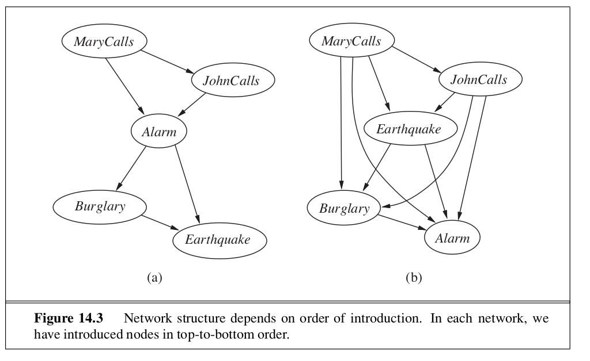
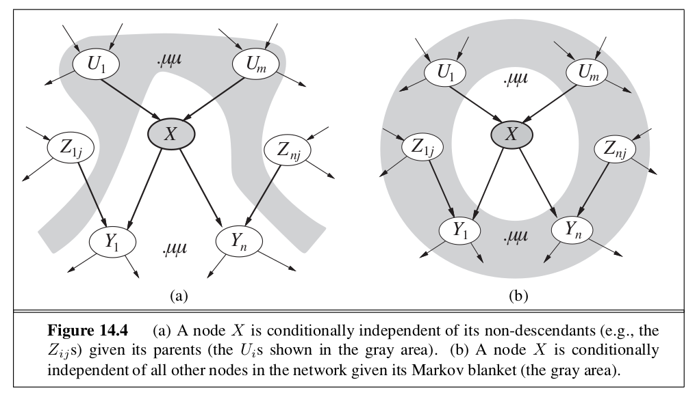
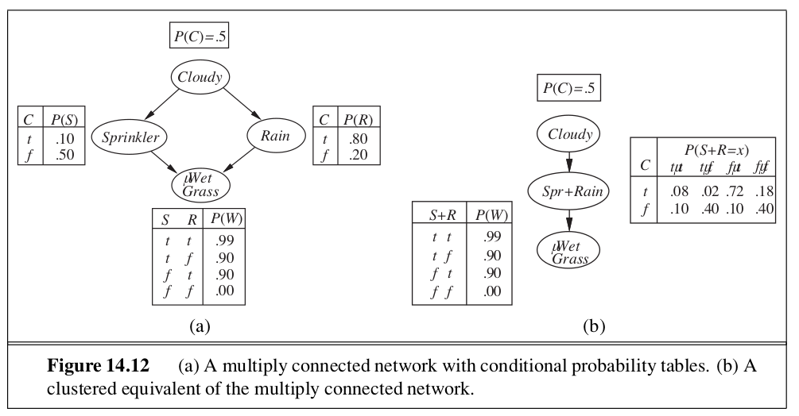
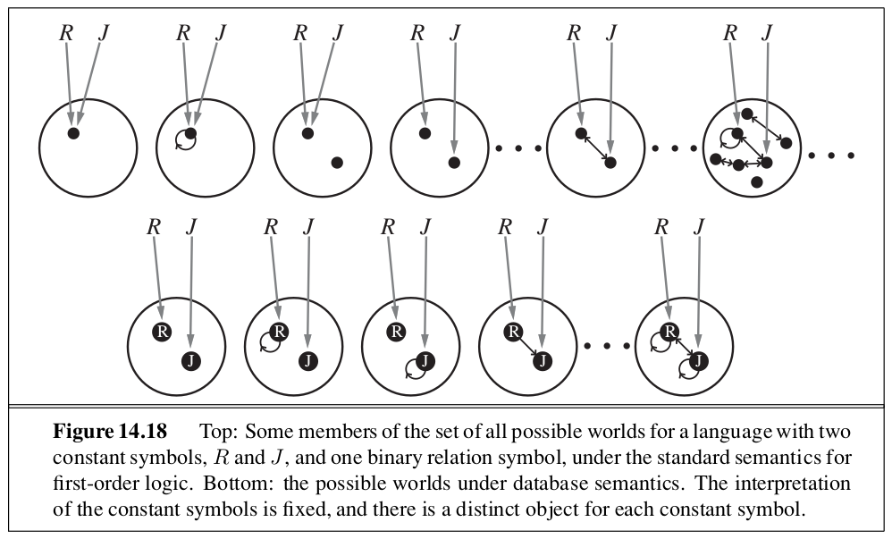

```{r setup, include=FALSE}
knitr::opts_chunk$set(echo = TRUE)
```

_In which we explain how to build network models to reason under uncertainty according to the laws of probability theory._

# 14.1 | Representing Knowledge in an Uncertain Domain

A **Bayesian Network** is a directed graph in which each node is annotated with quantitative probability information. In these networks: 

  - Each node corresponds to a random variable, which may be discrete or continuous
  - A set of directed links or arrows connects each pair of nodes. If there is an arrow from node X to node Y, X is said to be a parent of Y. The graph has no directed cycles, and hence is a directed acyclic graph. 
  - Each node $X_i$ has a conditional probability distribution $P(X_i | Parents (X_i))$ that quantifies the effect of the parents on the node.
  
The topology of the network specifies the conditional independence relationships that hold in the domain. The combination of topology and the conditional distributions suffices to specify (implicitly) the full joint distribution for all the variables.

# 14.2 | The Semantics of Bayesian Networks 

There are two ways to understand the semantics of a Bayesian network: 
  - The first is to see the network as a representation of the joint probability distribution
  - The second is to view it as an encoding of a collection of conditional independence statements

These are equivalent, but the first is helpful for constructing networks and the second is helpful in designing inference procedures. 

## 14.2.1 | Representing the Full Joint Distribution

\begin{center}

$P(x_1, ..., x_n) = \prod\limits_{i = 1}^n P(x_i | parents(X_i))$

\end{center}

### A method for constructing Bayesian Networks 

We can rewrite the entries in a joint distribution in terms of conditional probability using the product rule: 

\begin{center}
$P(x_1, ..., x_n) = P(x_n | x_{n-1}, ..., x_1) P(x_{n-1}, ..., x_1)$
\end{center}

Then we repeat the process until we have one big product: 

\begin{center}
$P(x_1, ..., x_n) = \prod\limits_{i = 1}^n P(x_i | x_{i-1}, ..., x_1)$
\end{center}

This is the chain rule, which holds for any set of random variables. Given that these nodes are directed, we can rewrite above as: 

\begin{center}
$P(X_i | X_{i - 1}, ..., X_1) = P(X_i | Parents(X_i))$ 
\end{center}

provided that $Parents(X_i) \subseteq \{X_{i-1}, ..., X_1\}$  

What this says is that a Bayesian network is a correct representation of the domain only if each node is conditionally independent of its other predecessors in the node ordering, given its parents. We can satisfy this condition with this methodology: 

  1. Nodes: First determine the set of variables that are required to model the domain. Now order them, $\{X_1, ..., X_n\}$. Any order will work, but the resulting network will be more compact if the variables are ordered such that causes precede effects. 
  2. Links: For $i = 1$ to $n$, do: 
    - Choose from $X_1, ..., X_{i-1}$, a minimal set of parents for $X_i$
    - For each parent insert a link from the parent to $X_i$
    - Conditional Probability Tables: Write down the conditional probability table, $P(X_i | Parents(X_i))$
    
### Compactness and Node Ordering 

As well as being a complete and nonredundant representation of the domain, a Bayesian network can often be far more _compact_ than the full joint distribution. The compactness of Bayesian networks is an example of a general property of **locally structured** (also called **sparse**) systems. In a locally structured system, each subcomponent interacts directly with only a bounded number of other components, regardless of the total number of components. Local structure is usually associated with linear rather than exponential growth in complexity. 

In Bayesian networks it is reasonable to suppose that in most domains each random variable is directly influenced by at most $k$ others. If we assume $n$ boolean variables for simplicity, then the amount of information needed to specify each conditional probability table will be at most $2^k$ numbers, and the complete network can be specified by $n 2^k$ numbers. In contrast, the joint distribution contains $2^n$ numbers. 

If we stick to a causal model, we end up having to specify fewer numbers, and the numbers will often be easier to come up with.



## 14.2.2 | Conditional Independence Relations in Bayesian Networks

We have looked at a "numerical" semantic system for Bayesian networks in terms of the representaiton of the full joint distribution. Using this to derive a method for constructing Bayesian networks, by consequence a node is conditionally independent of its other predecessors, given its parents. 

We can also go in the other direction - We can start from a "topological" semantic that specifies the conditional independence relationships encoded by the graph structure, and from this we can derive the numerical semantics. The topological semantics specifies that each variable is conditionally independent of its non-descendants, given its parents. In this sense, the numerical and topological semantics are equivalent. 

Another important independence property is implied by its topological semantics: a node is conditionally independent of all other nodes in the network, given its parents, children, and children's parents - that is, given its **Markov Blanket**. 



# 14.3 | Efficient Representation of Conditional Distributions 

Filling in a conditional probability table requires up to $O(2^k)$ numbers. Instead of dealing with thta, usually such relationships are describable by a **canonical distribution** that fits some standard pattern. In such cases, the complete table can be specified by naming the pattern and perhaps supplying a few parameters. 

The simplest example is provided by **deterministic nodes**, which have their values specified exactly by the values of their parents, with no uncertainty. For example, if the parent nodes are different prices for a specific make of car at different dealerships and the child is the price that the shopper ends up paying, we can see that the child (may be) the min of the parent nodes - making it determined by the parents. 

Uncertain relationships can often be characterized by **noisy** logical relationships. The standard example is the **noisy-OR** relation, which is a generalization of the logical OR. The noisy-OR model allows for uncertainty about the ability of each parent to cause the child to be true - the causal relationship between parent and child may be _inhibited_. For example in propositional logic, Fever may be true iff cold, flu or malaria is true. In the noisy-OR model, a patient could have a cold but not exhibit a fever. 

Noisy-OR models make two assumptions:
  1. It assumes that all possible causes are listed
    - if some are missing, we could add a **leak node** which covers miscellaneous causes
  2. It assumes that inhibition of each parent is independent of inhibition of any other other parents
    - For example whatever inhibits Malaria from causing a fever is independent of whatever inhibits Flu from causing a fever

Given these assumptions, Fever is false iff all its true parents are inhibited. In general, noisy logical relationships in which a variable depends on $k$ parents can be described using $O(k)$ parameters instead of $O(2^k)$ for the full conditional probability table. 

### Bayesian Networks with Continuous Variables 

By definition, continuous variables have an infinite number of possible values, so it is impossible to specify conditional probabilities explicitly for each value. One possible way to handle continuous variables is to avoid them by using **discretization** - dividing up the possible values into a fixed set of intervals. 

The most common solution for dealing with continuous variables is to define standard families of probability density functions that are specified by a finite number of **parameters** (for example a Gaussian with mean $\mu$ and variance $\sigma^2$). Another solution is the **nonparametric representation** - which defines the conditional distribution implicitly with a collection of instances, each containing specific values of the parent and child variables. 

A network with both discrete and continuous variables is called a **Hybrid Bayesian Network**. To specify a hybrid network, we need to specify two new kinds of distributions:
  1. The conditional distribution for a continuous variable given discrete or continuous parents 
  2. The conditional distribution for a discrete variable given continuous parents. 
  
A common choice for modeling these is the **linear Gaussian distribution**, in which the child has a Gaussian distribution whose mean $\mu$ varies linearly with the value of the parent and whose standard deviation $\sigma$ is fixed. A network containing only continuous variables with linear Gaussian distributions has a joint distribution that is a multivariate Gaussian distribution over all the variables. Furthermore, the posterior distribution given any evidence also has the property.


When discrete variables are added as parents (not as children) of continuous variables, the network defines a **conditional Gaussian distribution**. Given any assignment to the discrete variables, ,the distribution over the continuous variables is a multivariate Gaussian. 

# 14.4 | Exact Inference in Bayesian Networks 

The basic task for any probabilistic inference system is to compute the posterior probability distribution for a set of query variables, given some observed event. 

## 14.4.1 | Inference by Enumeration

Any conditional probability can be computer by summing terms from the full joint distribution. 

\begin{center}
$P(X | e) = \alpha P(X, e) = \alpha \sum\limits_y P(X, e, y)$
\end{center}

A query can be answered using a Bayesian network by computing sums of products of conditional probabilities from the network. 

## 14.4.2 | The variable elimination algorithm

The enumeration algorithm can be improved substantially by eliminating repeated calculations. The idea is to do the calculation once and save the results for later use. This is a form of dynamic programming. 

## 14.4.3 | The Complexity of Exact Inference

The complexity of exact inference in Bayesian networks depends strongly on the structure of the network. The networks be have seen in which arere is at most one undirected path between any two nodes in the network are called **singly connected** networks, or **polytrees**. The time and space complexity of exact inference in polytrees is linear in the size of the network.

For **multiply connected** networks, variable elimination can have exponential time and space complexity in the worst case, even when the number of parent nodes is bounded. Since these networks include inference in propositional logic as a special case, inference in Bayesian networks is NP-hard. In fact, it can be shown that the problem is as hard as that of computing the number of satisfying assignments for a propositional logic formula, meaning that is is #P hard - strictly harder than NP-complete problems. 



There is a close connection between the complexity of Bayesian network inference and the complexity of constraint satisfaction problems. Measures such as tree width, which bound the complexity of solving a CSP, can also be applied directly to Bayesian networks. Moreover, the variable elimination algorithm can be generalized to solve CSPs as well as Bayesian networks. 

## 14.4.4 | Clustering Algorithms

If we wish to compute posterior probabilities for all the variables in a network, we would need to issue $O(n)$ queries costing $O(n)$ time each, for a total of $O(n^2)$ time. Using **clustering** (or **join tree**) algorithms, this time can be reduced to $O(n)$. Once the network is in polytree form, a special purpose inference algorithm is required. The algorithm is a form of constraint propagation where the constraints ensure that neighboring meganodes agree on the posterior probability of any variables that they have in common. 

# 14.5 | Approximate Inference in Bayesian Networks 

This section describes randomized sampling algorithms, also called **Monte Carlo** algorithms. 

## 14.5.1 | Direct Sampling Methods 

Let $S_{PS}(x_1, ..., x_n)$ be the probability that a specific event is generated by the prior-sample algorithm. Then, looking at the sampling process we have $S_{PS} = \prod\limits_{i = 1}^n P(x_i | parents(X_i))$ because each sampling step depends only on the parent values. Then $S_{PS}(x_1, ..., x_n) = P(x_1, ..., x_n)$ since it is exactly the probability of an event according to the Bayesian net's representation of the joint distribution.

The answers are computed by counting the actual samples generated. Suppose there are $N$ tital samples, and let $N_{PS}(x_1, ..., x_n)$ by the number of times that the specific event $(x_1, ..., x_n)$ occurs in the set of samples. We expect this number, as a fraction of the total, to converge in the limit to its expected value according to the sampling probability: 

\begin{center}
$\lim_{N \to \infty} \frac{N_{PS}(x_1, ..., x_n)}{N} = S_{PS}(x_1, ..., x_n) = P(x_1, ..., x_n)$
\end{center}

### Rejection Sampling in Bayesian Networks 

**Rejection Sampling** is a general method for producing samples from a hard-to-sample distribution given an easy-to-sample distribution. In its simplest form, it can be used to compute conditional probabilities. 

First, it generates samples from the prior distribution specified by the network. Then it rejects all those that do not match the evidence. Finally, the estimate $\hat{P}(X = x | e)$ is obtained by counting how often $X = x$ occurs in the remaining samples. 

The biggest problem with rejection sampling is that it drops so many samples. The fraction of samples consistent with the evidence $e$ drops exponentially as the number of evidence variables grows, so the procedure is unusable for complex problems. 

### Likelihood Weighting 

**Likelihood Weighting** avoids the inefficiency of rejection sampling by generating only events that are consistent with the evidence $e$. It is a particular instance of the general statistical technique of **importance sampling**, tailored for inference in Bayesian networks. 

Likelihood weighting fixes the values for the evidence variables $E$ and samples only the nonevidence variables. This guarantees that each event generated is consistent with the evidence. Before tallying the counts in the distribution for the query table, each event is weighted by the likelihood that the event accords to the evidence, given its parents. Intuitively, events in which the actual evidence appear unlikely are given less weight. 

Since likelihood weighting uses all the samples generated, it can be much more efficient than rejection sampling. It will suffer a degradation in performance as the number of evidence variables increases. This is because most samples will have very low weight and hence the weighted estimate will be dominated by the tiny fraction of samples that accord more than an infinitesimal likelihood to the evidence. This problem is exacerbated if the evidence variables occur late in the variable ordering, becayse the nonevidence variables will have no evidence in their parents and ancestors to guide the generation of samples. This means the samples will be simulations that bear little resemblance to the reality suggested by the evidence. 

## 14.5.2 | Inference by Markov Chain Simulation

**Markov Chain Monte Carlo** algorithms work differently from rejection sampling and likelihood weighting. Instead of generating each sample from scratch, MCMC algorithms generate each sample by making a random change to the preceding sample. It is helpful to think of an MCMC algorithm as being in a particular currect stae specifying a value for every variable and generating a next state by making random changes to the current state. 

### Gibbs Sampling in Bayesian Networks 

The Gibbs sampler for a Bayesian network starts with an arbitrary state (with the evidence variables fixed at their observed states) and generates a next state by randomly sampling a value for one of the nonevidence variables $X_i$. The sampling for $X_i$ is done conditioned on the current values of the variables in the Markov blanket of $X_i$. The algorithm wanders randomly around the state space flipping one variable at a time, but keeping the evidence variables fixed. 

Essentially, the sampling process settles into a dynamic equilibrium in which the long-run fraction of time spent in each state is exactly proportional to its posterior probability. This property follows from the specific **transition probability** with which the process moves from one state to another, as defined by the conditional distribution given the Markov blanket of the variable being sampled. 

Let $q(x \to x')$ be the probability that the process makes a transition from state $x$ to state $x'$. This transition probability defines the Markov chain on the state space, and let $\pi_t(x)$ be the probability that the system is in state $x$ at time $t$. 

We can calculate $\pi_{t+1}(x')$ by summing, for all the states the system could be in at time $t$:

\begin{center}
$\pi_{t+1}(x') = \sum\limits_x \pi_t(x) q(x \to x')$
\end{center}

We say that the chain has reached its **stationary distribution** if $\pi_t = \pi_{t+1}$. 

If the transition probability distribution $q$ is **ergodic** then every state is reachable from every other state and there are no strictly periodic cycles - there is exactly one distribution $\pi$ satisfying this equation for any given $q$. We can read the equation above as saying that the expected outflow from each state is equal to the expected inflow from all the states. 

If the expected inflow between any pair of states is the same in both directions, or 

\begin{center}
$\pi(x)q(x \to x') = \pi(x')q(x' \to x)$ for all $x, x'$
\end{center}

then we say that $q(x \to x')$ is in **detailed balance** with $\pi(x)$. It can be shown that detailed balance implies stationarity by summing over x in the equation above. 

# 14.6 | Relational and First-Order Probability Models 

If we can find a way to combine probability theory with the expressive power of first order representations, we expect to be able to dramatically increase the range of problems that can be handled. 

## 14.6.1 | Possible Worlds 

For Bayesian networks, the possible worlds are assignments of values to variables; for the Boolean case, the possible worlds are those of propositional logic. For a first order probability model, we need the possible worlds to be those of first order logic (a set of objects with relations among them and an interpretation that maps constant symbols to objects, predicate symbols to relations, and function symbols to functions on those objects). The model also needs to define a probability for each such possible world, just as a Bayesian network defines a probability for each assignment of values to variables. 

If we figured out how to do this, we can obtain the probability of any first order logical sentence $\phi$ as a sum over the possible worlds where it is true: 

\begin{center}
$P(\phi) = \sum\limits_{\omega:\phi\mathrm{ is true in }\omega} P(\omega)$
\end{center}

The big problem is that the set of first-order models is infinite. Thus the summation above could be infeasible, and specifying a complete, consistent distribution over an infinite set of worlds could be very difficult. 

The next section (14.6.2) explores a way of dealing with this problem by borrowing from the database semantics rather than the standard semantics of first order logic. The database semantics makes a **unique names assumption** which we can adopt for constant symbols. It also assumes **domain closure** - there are no more objects that those which are named. With these we can guarantee a finite set of possible worlds by making the set of objects in each world be exactly the set of constant symbols that are used.  We call models defined in this way **Relational Probability Models**. The most significant difference between the semantics of RPMs and the database semantics is that RPMs do not make the closed-world assumption (assuming every unknown fact is false doesn't make sense in a probabilistic reasoning system).



## 14.6.2 | Relational Probability Models 

Like first order logic, RPMs have constant, function, and predicate symbols. We will also assume a **type signature** for each function, a specification of the type of each argument and the function's value. 

Some technical conditions must be observed to guarantee that the RPM defines a proper distribution. First, the dependencies must be acyclic, otherwise the resulting Bayesian network will have cycles and will not define a proper distribution. Second, the dependencies must be well-founded, that is, there can be no infinite ancestor chains, such as might arise from recursive dependencies. Under some circumstances, a fixed-point calculation yields a well-defined probability model for a recursive RPM. 

One approach to doing inference in RPMs is to collect the evidence and query and the constant symbols therein, construct the equivalent Bayes net, and apply any of the inference methods discussed in the chapter. This technique is called **unrolling**. The drawback is that the resulting Bayes net may be very large. Furthermore, if there are many candidate objects for an unknonw relation or function, then some variables in the network may have many parents. 

We can use multiple techniques for improving on generic inference algorithms. 

  1. The presence of repeated substructures in the unrolled Bayes nets means that many of the factors constructed during variable elimination  (and similar kinds of tables constructed by clustering algorithms) will be identical. Effective caching schemes have yielded speedups of three orders of magnitude for large networks. 

  2. Inference methods developed to take advantage of context specific independence in Bayes nets may find many applications in RPMs
  
  3. MCMC algorithms have interesting properties when applied to RPMs with relational uncertainty. MCMC samples complete possible worlds, so in each state the relational structure is completely known. Then the relational uncertainty causes no increase in network complexity, and instead the MCMC process includes transitions that change the relational structure, and hence the dependency structure, of the unrolled network. 
  
All of these methods assume that the RPM has to be partially or completely unrolled into a Bayesian network. This is analogous to the method of **propositionalization** for first order logical inference. Resolution theorem provers and logic programming systems avoid propositionalizing by instantiating the logical variables only as needed to make the inference go through (they lift the inference process above the ground propositional sentences and make each lifted step do the workd of many ground steps). This idea also applies in probabilistic inference. For example, in the variable elimination algorithm, a lifted factor can represent an entire set of ground factors that assign probabilities to random variables in the RPM, where those random variables differ only in the constant symbols used to construct them. 

## 14.6.3 | Open Universe Probability Models 

**Open Universe Probability Models** or OUPM's are based on the standard semantics of first order logic. A language for OUPMs provides a way of writing such models easily while guaranteeing a unique, consistent probability distribution over the infinite space of possible worlds. 

In essence, a Bayes net generates each possible world, event by event in the topological order defined by the network structure, where each event is an assignment of a vlaue to a variable. An RPM extends this to entire sets of events, defined by the possible instantiations of the logical variables in a given predicate or function. OUPMs go further by allowing generate steps that add objects to the possible world under construction, where the number and type of objects may depend on the objects that are already in the world. That is, the event being generated is not the assignment of a value to the variable, but the very existence of objects. 

Subject to technical conditions of acyclicity and well foundedness similar to those for RPMs, open universe models of this kind define a unique distribution over possible worlds. Research in this area is still at an early stage, but it is possible that first order probabilistic reasoning yields a tremendous increase in the effectiveness of AI systems at handling uncertain information. 

# 14.7 | Other Approaches to Uncertain Reasoning 

## 14.7.1 | Rule-Based Methods for Uncertain Reasoning 

Logical systems in general, and logical rule-based systems in particular, have 3 desirable properties: 

- Locality: In logical systems, if we have a rule of the form $A \implies B$, we can conclude B given evidence A without worrying about any other rules. In probabilistic systems, we need to consider all the evidence 

- Detachment: Once a logical proof is found for a proposition, it can be used regardless of how it was derived. It can be detached from its justification. With probabilities, the source of the evidence for a belief is important for subsequent reasoning

- Truth-functionality: In logic, the truth of complex sentences can be computed from the truth of the components. Probability combinations generally do not work this way, unless udner strong global independence assumptions. 

## 14.7.2 | Representing Ignorance: Dempster-Shafer Theory

The **Dempster-Shafer Theory** is designed to deal with the distinction between uncertainty and ignorance. Rather than computing the probability of a proposition, it computes the probability that the evidence supports the proposition. This measure of belief is called a **belief function**. These reasoning systems are skeptical in a way that has some intuitive appeal. The underpinnings are similar to probability theory, with the main difference being that instead of assigning probabilities to possible worlds, the theory assigns **masses** to sets of possible events. The masses must still add up to 1 over all possible events, and $Bel(A)$ is defined to be the sum of masses for all events that are subsets of (i.e. that entail) A, including A itself. 

## 14.7.3 | Representing Vagueness: Fuzzy Sets and Fuzzy Logic

**Fuzzy Set Theory** is a means of specifying how well an object satisfies a vague description. **Fuzzy Logic** is a method for reasoning with logical expressions describing membership in fuzzy sets. **Fuzzy Control** is a methodology for constructing control systems in which the mapping between real-valued input and output parameters is represented by fuzzy rules.

# 14.8 | Summary 

- A Bayesian network is a directed acyclic graph whose nodes correspond to random variables; each node has a conditional distribution for the node, given its parents 

- Bayesian networks provide a concise way to represent **conditional independence** relationships in the domain 

- A Bayesian network specifies a full joint distribution; each joint entry is defined as the product of the corresponding entries in the local conditional distributions. A Bayesian network is often exponentially smaller than an explicitly enumerated joint distribution. 

- Many conditional distributions can be represented compactly by canonical families of distributions. Hybrid Bayesian networks, which include both discrete and continuous variables, use a variety of canonical distributions. 

- Inference in Bayesian networks means computing the probability distributions of a set of query variables, given a set of evidence variables. Exact inference algorithms, such as variable elimination, evaluate sums of products of conditional probabilities as efficiently as possible. 

- In polytrees (singly connected networks), exact inference takes time linear in the size of the network. In the general case, the problem is intractable. 

- Stochastic approximation techniques such as likelihood weighting and Markov Chain Monte Carlo can give reasonable estimates of the true posterior probabilities in a network and can cope with much larger networks than can exact algorithms. 

- Probability theory can be combined with representational ideas from first order logic to produce very powerful systems for reasoning under uncertainty. Relational probability models include representational restrictions that guarantee a well defined probability distribution that can be expressed as an equivalent Bayesian network. Open universe probability models handle existence and identity uncertainty, defining probability distributions over the infinite space of first order possible worlds. 

- Various alternative systems for reasoning under uncertainty have been suggested. Generally speaking, truth functional systems are not well suited for such reasoning 