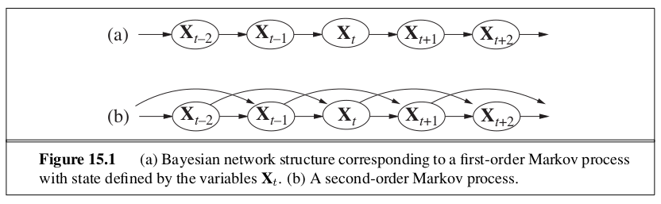
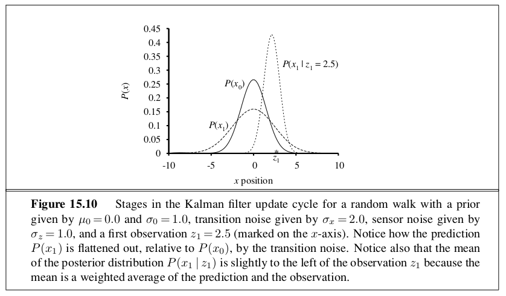

```{r setup, include=FALSE}
knitr::opts_chunk$set(echo = TRUE)
```

_In which we try to interpret the present, understand the past, and perhaps predict the future, even when very little is crystal clear._

An agent maintains a **belief state** that represents which states of the world are currently possible. From the belief state and a **transition model**, the agent can predict how the world might evolve in the next time step. From the percepts observed and a **sensor model**, the agent can update the belief state. 

In chapter 4 belief states are represented by explicitly enumerated sets of states, and in chapters 7 and 11 they are represented by logical formulas. These approaches define belief states in terms of which world states are possible, but say nothing about which belief states are likely or unlikely. In this chapter we use probability theory to quantify the degree of belief in elements of the belief state. 

# 15.1 | Time and Uncertainty 

## 15.1.1 | States and Observations 


We view the world as a series of snapshots, or **time slices**, each of which contains a set of random variables, some observable and some not. Uncertainty over continuous time can be modeled by **stochastic differential equations**. The models in this chapter can be viewed as discrete-time approximations to SDEs. 

## 15.1.2 | Transition and Sensor Models 

The transition mode specifies the probability distribution over the latest state variables, given the previous variables: $P(X_t | X_{0:t-1})$. We face the problem that the set $X_{0:t-1}$ is unbounded in size as $t$ increases. This can be solved by making a **Markov assumption** - that the current state depends on only a finite fixed number of previous states. 

Processes satisfying the Markov assumption are called **Markov Processes** or **Markov Chains**. **First order Markov processes** are the simplest variant, in which the current state depends only on the previous state and not on any earlier states. In other words, a state provides enough information to make the future conditionally independent on the past s.t. $P(X_t | X_{0:t-1}) = P(X_t | X_{t-1})$. In a first order Markov process, the transition model is the conditional distribution. 

The transitional model for a second order Markov process is the conditional distribution $P(X_t | X_{t-2}, X_{t-1})$. 

Given that there are infinitely many possible values of $t$, we avoid this problem by assuming that changes in the world state are caused by a **stationary process** - a process of change that is governed by laws that do not themselves change over time. 

Sometimes the assumption is exactly  true, and sometimes the assumption is only approximate. There are two ways to improve the accuracy of the approximation: 

  1. Increasing the order of the Markov process model
  2. Increasing the set of state variables 
    - This also increases the predicion requirements. We must predict the new variables as well.



# 15.2 | Inference in Temporal Models 

The basic inference tasks that must be solved for a generic temporal model: 

- Filtering: This is the task of computing the belief state - the posterior distribution over the most recent state - given all evidence to date. Filtering is also called state estimation. It is what a rational agent does to keep track of the current state so that rational decisions can be made. 
  
- Prediction: This is the task of computing the posterior distribution over the future state, given all evidence to date. That is, we wish to compute $P(X_{t+k} | e_{1:t})$ for some $k > 0$. Prediciton is useful for evaluation possible courses of action based on their expected outcomes. 

- Smoothing: This is the task of computing the posterior distribution over a past state, given all the evidence up to the present. That is, we wish to compute $P(X_k | e_{1:t})$ for some $k$ such that $0 \leq k < t$. Smoothing provides a better estimate of the state than was available at the time, because it incorporates more evidence. 

- Most likely explanation: Given a sequence of observations, we might wish to find the sequence of states that is most likely to have generated those observations. That is, we wish to compute $\arg \max_{x_{1:t}} P(x_{1:t} | e_{1:t})$. 

- Learning: The transition and sensor models, if not yet known, can be learned from observations. Just as with static Bayesian networks, dynamic Bayes net learning can be done as a by-product of inference. Inference provides an estimate of what transitions actually occurred and of what states generated the sensor readings, and those estimates can be used to update the models. The updated models provide new estimates, and the process iterates to convergence. The overall process is an instance of the expectation maximization or **EM algorithm**. 

Note that learning requires smoothing, rather than filtering, because smoothing provides better estimates of the states of the process. Learning with filtering can fail to converge correctly. 

## 15.2.1 | Filtering and Prediction

A useful filtering algorithm needs to maintain a current state estimate and update it, rather than going back over the entire history of percepts for each update. 

Given the result of filtering up to time $t$, the agent needs to compute the result for $t+1$ from the new evidence $e_{t+1}$: 

\begin{center}
$P(X_{t+1} | e_{1:t+1}) = f(e_{t+1}, P(X_t | E_{1:t}))$
\end{center}

for some function $f$. This process is called **recursive estimation**. We can view the calculation as being composed of two parts: first the current state distribution is projected forward from $t$ to $t+1$; then it is updated using the new evidence $e_{t+1}$. Then we can contain a one step prediction of the next state:

\begin{center}
$P(X_{t+1} | e_{1:t+1}) = \alpha P(e_{t+1 | X_{t+1}}) \sum\limits_{x_t} P(X_{t+1} | x_t, e_{1:t}) P(x_t | e_{1:t})$ \\ 
$= \alpha P(e_{t+1} | X_{t+1}) \sum\limits_{x_t} P(X_{t+1} | x_t) P(x_t | e_{1:t})$
\end{center}

The task of **prediction** can be seen simply as filtering without the addition of new evidence. 

## 15.2.2 | Smoothing 

Smoothing is the process of computing the distribution over past states given evidence up to the present, that is $P(X_k | e_{1:t})$ for $0 \leq k < t$. In anticipation of another recursive message passing approach, we can split the computation into two parts - the evidence up to $k$ and the evidence from $k+1$ to $t$:

\begin{center}
$P(X_k | E_{1:t}) = \alpha f_{1:k} \times b_{k+1:t}$
\end{center}

where $\times$ is the cross product of the vectors. Here we have defined a "backward" message $b_{k+1:t} = P(e_{k+1:t} | X_k)$ analogous to the forward message $f_{1:k}$. The forward message can be computed by filtering forward from $1$ to $k$. 

We can get this running in $O(t)$ time if we take a dunamic programming approach. The key is to record the results of forward filtering over the whole sequence. Then we run the backward recursion from $t$ down to 1, computing the smoothed estimate at each step $k$ from the computer backward message $b_{k+1:t}$ and the stored forward message $f_{1:k}$. This algorithm is called the **forward backward algorithm**. This algorithm is a special case of the polytree propagation algorithm used with clustering methods. It also forms the computational backbone for many applications that deal with sequences of noisy observations. 

It has two practical drawbacks: 

  1. Its space complexity can be too high when the state space is large and the sequences are long. It uses $O(|f|t)$ space where $|f|$ is the size of the representation of the forward message. The space requirement can be reduced to $O(|f| \log t)$ wuth a concomitant increase in time complexity by a factor of $\log t$. 
  
  2. It needs to be modified to work in an online setting where smoothed estimates must be computered for earlier time slices as new observations are continuously added to the end of the sequence. The most common requirement is for **fixed-lag smoothing**, which requires computing the smoothed estimate $P(X_{t-d} | e_{1:t})$ for fixed $d$.
  
## 15.2.3 | Finding the Most Likely Sequence 

There is a linear time algorithm for finding the most likely sequence that relies on the Markov property. We can view the problem as a path through a graph whose nodes are the possible states at each time step. Then the likelihood of any path is the product of the transition probabilities along the path and the probabilities of the given observations at each state. There is a recursive relationship between most likely paths to each state $x_{t+1}$ and most likely paths to each state $x_t$. We can write this relationship as an equation connecting the probabilities of the paths:

\begin{center}
$\max\limits_{x_1, ..., x_t} P(x_1, ..., x_t, X_{t+1} | e_{1:t+1}) = \alpha P(e_{t+1} | X_{t+1}) \max\limits_{x_t}(P(X_{t+1} | x_t) \max\limits_{x_1, ..., x_{t-1}} P(x_1, ..., x_{t-1}, x_t | e_{1:t}))$
\end{center}

This is identical to the filtering equation except that:

  1. The forward message $f_{1:t} = P(X_t | e_{1:t})$ is replaced by the message $m_{1:t} = \max\limits_{x_1, ..., x_{t-1}} P(x_1, ..., x_{t-1}, X_t | e_{1:t})$, that is, the probabilities of the most likely path to each state $x_t$.
  
  2. The summation over $x_t$ in the filtering equation is replaced by the maximization over $x_t$ in the equation above.
  
This algorithm for computing the most likely sequence is similar to filtering: it runs forward along the sequence, computing the $m$ message at each time step. At the end, it will have the probability for the most likely sequence reaching each of the final states. In otder to identify the actual sequence, as opposed to just computing its probability, the algorithm will also need to record, for each state, the best state that leads to it. The optimal sequence is identified by following these arrows backwards from the best final state. 

This algorithm is called the **Viterbi algorithm**. Its time complexity (like the filtering algorithm) is linear in $t$, the length of the sequence. Unlike filtering, which uses constant space, its space requirement is also linear in $t$. This is because the Viterbi algorithm needs to keep the pointers that identify the best sequence leading to each state. 

# 15.3 | Hidden Markov Models 

A **Hidden Markov Model** is a temporal probabilistic model in which the state of the process is described by a single discrete random variable. The possible values of the variable are the possible states of the world. If we have more than one state variable, we can fit it into the HMM framework by combining the variables into a single "megavariable" whose values are all possible tuples of values of the individual state variables. The restricted structure of HMMs allow for a simple and elegant matrix implementation of all the basic algorithms. 

## 15.3.1 | Simplified Matrix Algorithms 

With a single discrete state variable $X_t$, we can give concrete form to the representaitons of the transition model, the sensor model, and the forward and backward messages. 

Let the state variable $X_t$ have values denoted by integers $1, ..., S$ where $S$ is the number of possible states. The transition model $P(X_t | X_{t-1})$ becomes an $S \times S$ matrix $T$ where:

\begin{center}
$T_{ij} = P(X_t = j| X_{t-1} = i)$
\end{center}

That is, $T_{ij}$ is the probability of a transition from state $i$ to state $j$. As an example, the matrix for the umbrella world example in this chapter is:

\begin{center}
$T = P(X_t | X_{t-1}) = \begin{pmatrix} 0.7 & 0.3 \\ 0.3 & 0.7 \end{pmatrix}$ 
\end{center}

We can also put the sensor model in matrix form. In this case, because the value of the evidence variable $E_t$ is known at time $t$ (call it $e_t$), we need only specify, for each state, how likely it is that the state causes $e_t$ to appear. We need $P(e_t | X_t = i)$ for each state $i$. For convenience, we place these values in an $S \times S$ diagonal matrix, $O_t$, whose $i$th diagonal entry is $P(e_t | X_t = i)$ and whose other entries are 0. For example:

\begin{center}
$O_1 = \begin{pmatrix} 0.9 & 0 \\ 0 & 0.2 \end{pmatrix}; \space O_3 = \begin{pmatrix} 0.1 & 0 \\ 0 & 0.8 \end{pmatrix}$
\end{center}

Now if we use column vectors to represent the forward and backward messages, all the computations become simple matrix-vector operations. The forward and backward equations become

\begin{center}
$f_{1:t+1} = \alpha O_{t+1} T^T f_{1:t}; \space b_{k+1:t} = TO_{k+1} b_{k+2:t}$
\end{center}

Then the time complexity of the forward backward algorithm applied to a sequence of length $t$ is $O(S^2t)$ because each step requires multiplying an $S$-element vector by a $S \times S$ matrix and the space requirement is $O(St)$ because the forwarding pass stores $t$ vectors of size $S$. 


# 15.4 | Kalman Filters 

Suppose we were doing filtering: estimating state variables from noisy observations over time. If the variables were discrete, we could model the system with a hidden Markov model. This section examines methods for handling continuous variables, using an algorithm called **Kalman filtering**. We will use linear Gaussian distributions to represent the transition and sensor models. This means that the next state $X_{t+1}$ must be a linear function of the current state $X_t$, plus some Gaussian noise. Let the time interval between observations be $\Delta$, and assume constant velocity during the interval. Then the position update is given by $X_{t + \Delta} = X_t + X \Delta$. Then our linear Gaussian transition model is 

\begin{center}
$P(X_{t + \Delta} = x_{t + \Delta} | X_t = x_t, \dot{X_t} = \dot{x_t}) = \mathcal{N}(x_t + \dot{x_t}\Delta, \sigma^2)(x_{t+\Delta})$
\end{center}

## 15.4.1 | Updating Gaussian Distributions 

A key property of the linear Gaussian family of distributions is that it remains closed under the standard Bayesian network operations. We can also make this claim in the context of filtering in a temporal probability model. Then we have the two step filting calculation: 

1. If the current distribution $P(X_t | E_{1:t})$ is Gaussian and the transition model $P(X_{t+1} | x_t)$ is linear Gaussian, then the one step predicted distribution given by 

\begin{center}
$P(X_{t+1} | e_{1:t}) = \int_{x_t} P(X_{t+1} | X_t) P(x_t | e_{1:t}) d x_t$
\end{center}

is also a Gaussian distribution. 

2. If the prediction $P(X_{t+1} | e_{1:t})$ is Gaussian and the sensor model $P(e_{t+1} | X_{t+1})$ is linear Gaussian, then, after conditioning on the new evidence, the updated distribution

\begin{center}
$P(X_{t+1} | e_{1:t + 1}) = \alpha P(e_{t+1} | X_{t+1}) P(X_{t+1} | e_{1:t})$
\end{center}

is also a Gaussian distribution. 

Thus the forward operator for Kalman filtering takes a Gaussian forward message $f_{1:t}$ specified by a mean $\mu_t$ and a covariance matrix $\Sigma_t$ and produces a new multivariate Gaussian forward message $f_{1:t+1}$ specified by a mean $\mu_{t+1}$ and covariance matrix $\Sigma_{t+1}$.

This is important because, except for a few special cases, filtering with continuous or hybrid networks generates state distributions whose representation grows without bound over time. 



## 15.4.4 | Applicability of Kalman Filtering

Some applications: 

  - radar tracking of aircraft and missiles 
  - acoustic tracking of submarines and ground vehicles 
  - visual tracking of vehicles and people 
  - reconstruct particule trajectories from bubble chamber photographs 
  - reconstruct ocean currents from sattelite surface measurements 
  - any system characterized by continuous state variabels and noisy measurements 

The assumptions made for Kalman filters - linear Gaussian transition and sensor models - are very strong. The **extended Kalman Filter (EKF)** attempts to overcome nonlinearities in the system being modeled. A system is **nonlinear** if the transition model cannot be described as a matrix multiplication of the state vector. The EKF works by modeling the system as locally linear in $x_t$ in the region of $x_t = \mu_t$, the mean of the current state distribution. This works well for smooth, well behaved systems and allows the tracker to maintain and update a Gaussian state distribution that is a reasonable approximation to the true posterior. 


# 15.5 | Dynamic Bayesian Networks 

A **dynamic Bayesian network**, or DBN, is a Bayesian network that represents a temporal probability model. In general, each slice of a DBN can have any number of state variables $X_t$ and evidence variables $e_t$. For simplicity, we assume that the variables and their links are exactly replicated from slice to slice and that the DBN represents a first order Markov process, so that each variable can have parents only in its own slice or the immediately preceding slice. 

Every hidden Markov model can be represented as a DBN with a single state variable and a single evidence variable. The difference between a HMM and DBN is that by decomposing the state of a complex system into its constituent variables, they can take advantage of sparseness in the temporal probability model. For example, if we have a DBN with 20 boolean state variables, each of which has 3 parents in the preceding slice, then the transition model has $20 \times 2^3 = 160$ probabilities, whereas the corresponding HMM has $2^{20}$ states and $2^{40}$ probabilities in the transition matrix. This is bad for at least 3 reasons: 

  1. The HMM requires much more space 
  2. The huge transition matrix makes HMM inference much more expensive 
  3. The problem of learning such a huge number of parameters makes the pure HMM model intractable for large problems 
  
## 15.5.1 | Constructing DBNs

To construct a DBN, we must specify three kinds of information: 

  1. The prior distribution over the state variables $P(X_0)$
  2. The transition model $P(X_{t+1} | X_t)$
  3. The sensor model $P(E_t | X_t)$

To specify the transition and sensor models, one must also specify the topology of the connections between successive slices and between the state and evidence variables. Since the transition and sensor models are assumed to be stationary, it is most convenient to only specify them for the first slice. 

For our sensor models, with continuous measurements, a Gaussian distribution with a small variance might be used. For discrete variables, we can approximate a Gaussian using a distribution in which the probability of error drops off in the appropriate way so that the probability of a large error is very small. We use the term **Gaussian error model** to cover both the continuous and discrete versions.

## 15.5.2 | Exact Inference in DBNs

Dynamic Bayesian Networks _are_ Bayesian Networks, so we have already talked about inference algorithms. Given a sequence of observations, one can construct the full Bayesian network representation of a DBN by replicating slices until the network is large enough to accomodate the observations. This technique is called **unrolling**. Technically, the DBN is equivalent to the semi-infinite network obtained by unrolling forever. Slices added beyond the last observation have no effect on inferences within the observation period and can be omitted. Once the DBN is unrolled, we can use any of the inference algorithms - variable elimination, clustering methods, and so on that were described in ch 14. 

Unfortuneately, updating in DBNs is $O(d^{n+k})$ for the maximum factor size and the total cost per update step is $O(n d^{n+k})$, where $d$ is the domain size of the variables and $k$ is the maximum number of parents of any state variable. This is still much less than the cost of the HMM updating ($O(d^{2n})$), but it is still infeasible for large numbers of variables. Even though we can use DBNs to represent very complex temporal processes with many sparsely connected variables, we cannot reason efficiently and exactly about those processes.

## 15.5.3 | Approximate Inference in DBNs 

In 14.5 we described two approximation algorithms: likelihood weighting and Markov Chain Monte Carlo. Of the two, likelihood weighting is most easily adapted to the DBN context, but it requires several improvements before a practical method emerges. Likelihood weighting works by sampling the nonevidence nodes of the network in topological order, weighting each sample by the likelihood it accords to the observed evidence variables. As with the exact algorithms, we could apply likelihood weighting directly to an unrolled DBN, but this would suffer from the same problems of increasing time and space requirements per update as the observation sequence grows. The main problem is that the standard algorithm runs each sample in turn, all the way through the network. 

Instead we can run all $N$ samples as the forward message.We want to use the samples themselves as an approximate representation of the current state distribution. This meets the requirement of a constant time per update, although the constant depends on the number of samples required to maintain an accurate approximation. There is also no need to unroll the DBN because we need to have in memory only the current slice and the next slice. 

The second key innovation is to focus on the set of samples on the high probability regions of the state space. This can be done by throwing away samples that have very low weight, while replicating this that have high weight. That way, the population of samples will stay reasonably close to reality. 

A family of algorithms called **particle filtering** is designed to do just that. Particle filtering works as following: 

First, a population of $N$ initial state samples is created by sampling from the prior distribution $P(X_0)$. Then the update cycle is repeated for each time step: 

1. Each sample is propagated forward by sampling the next state value $x_{t+1}$ given the current value $x_t$ for the sample, based on the transition model $P(X_{t+1} | x_t)$.
2. Each sample is weighted by the likelihood it assigns to the new evidence $P(e_{t+1} | x_{t+1})$.
3. The population is resampled to generate a new population of $N$ samples. Each new sample is selected from the current population; the probability that a particular sample is selected is proportional to its weight. The new samples are unweighted.

Particle filtering is consistent, and generally efficient. It maintains a good approximation to the true posterior using a constant number of samples. Under certain assumptions, in particular that the probabilities in the transition and sensor models are strictly greater than 0 and less than 1 - it is possible to prove that the approximation maintains bounded error with high probability. 

# 15.6 | Keeping Track of Many Objects 

The preceding sections covered state estimation problems involving a single object. This section looks at what happens when two or more objects generate the observations. We now have the possibility of uncertainty about which object generated which observation. This is the **identity uncertainty problem** viewed in a temporal context. In the control theory literature, this is the **data association problem** - the problem of associating observation data with the objects that generated them. 

For data association there is no known efficient exact algorithm. This is because the filtering distribution efor an object $A$ ends up as a mixture of exponentially many distributions, one for each way of picking a sequence of observations to assign to A. 

As a result of othe complexity, many different approximate methods have been used. The simplest approach is to choose a single best assignment at each time step, given the predicted positions of the objects at the current time step. The assignment associates observations with objects and enables the track of each object to be updated and a prediction made for the next step. For choosing the best assignment, the **nearest neighbor filter** is often used, which repeatedly chooses the closest pairing of the predicted position and observation and adds that pairing to the assignment. This works well when the objects are well seperated in state space and the prediction uncertainty and observation error are small (when there is no possibility of confusion). 

When there is uncertaint to the correct assignment, we can choose the assignment that maximizes the joint probability of the current observations given the predicted positions. This can be done efficiently using the **Hungarian algorithm**, even though there are $n!$ assignments to choose from.

Under more difficult conditions, these methods fail. If they commit to an incorrect assignment, the prediction at the next time step may be significantly wrong, and so on. Two modern approaches tend to be effective for more difficult conditions: 

A **particle filtering** algorithm for data association works by maintaining a large collection of possible current assignments. An **MCMC** algorithm explores the space of assignment histories and can change its mind about previous assignment decisions. Current MCMC data association methods can handle many hundreds of objects in real time while giving a good approximation to the true posterior distributions. 

# 15.7 | Summary 

- The changing state of the world is handled by using a set of random variables to represent the state at each point in time 

- Representations can be designed to satisfy the Markov property, so that the future is independent of the past given the present. Combined with the assumption that the process is stationary, this greatly simplifies the representation.

- A temporal probability model can be thought of as containing a transition model describing the state evolution and a sensor model describing the observation process. 

- The principal inference tasks in temporal models are filtering, prediction, smoothing, and computing the most likely explanation. Each of these can be achieved using simple, recursive algorithms whose run time is linear in the length of the sequence.

- Three families of temporal models were studied in more depth: hidden Markov models, Kalman filters, and dynamic Bayesian networks (which include the other two as special cases)

- Unless special assumptions are made, as in Kalman filters, exact inference with many state variables is intractable. In practice, the particle filtering algorithm seems to be an effective approximation algorithm. 

- When trying to keep track of many objects, uncertainty arises as to which observations belong to which objects - the data association problem. The number of association hypothesis is typically intractably large, by MCMC and particle filtering algorithms for data association work well in practice. 
