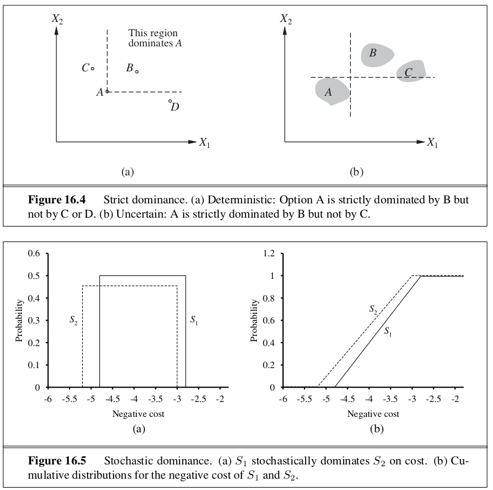
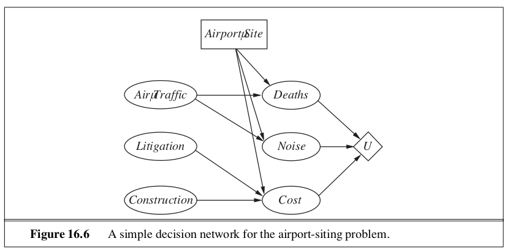
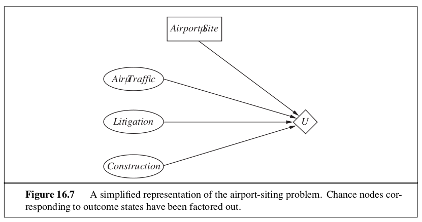
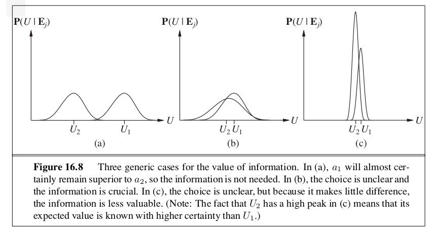

```{r setup, include=FALSE}
knitr::opts_chunk$set(echo = TRUE)
```

_In which we see how an agent should make decisions so that it gets what it wants - on average, at least._

This chapter fills in the details of how utility theory combines with probability theory to yield a decision-theoretic agent - an agent that can make rational decisions based on what it believes and what it wants.

# 16.1 | Combining Beliefs and Desires Under Uncertainty

Decision theory deals with choosing among actions based on the desirability of their immediate outcomes. Since an agent may not know the current state, we omit it and define $\mathrm{Result(a)}$ as a random variable whose values are the possible outcome states. The probability of an outcome $s'$ given evidence $e$ is written $P(\mathrm{Result(a)} = s' | a, e)$, where the $a$ on the right hand side of the conditioning bar stands for the event that action $a$ has executed. 

The agents preferences are captured by a **utility function**, $U(s)$ which assigns a single number to express the desirability of a state. The **expected utility** of an action given the evidence $EU(a|e)$ is the average utility value of the outcomes, weighed by the probability that the outcome occurs: 

\begin{center}
$EU(a|e) = \sum\limits_{s'} P(\mathrm{Result(a)} = s' | a, e) U(s')$
\end{center}

The principle of **maximum expected utility** says that a rational agent should choose the action that maximizes the agent's expected utility: $\mathrm{action} = \arg \max\limits_a EU(a | e)$. If an agent acts so as to maximize a utility function that correctly reflects the performance measure, then the agent will achieve the highest possible performance score (averaged over all possible environments).

# 16.2 | The Basis of Utility Theory

The principle of maximum utility is not the only way to make decisions. We could maximize or minimize any given metric.

## 16.2.1 | Constraints on Rational Preferences

We use the following notation to describe an agent's preferences: 


$A \succ B$     | The agent prefers A over B. 

$A \sim B$      | The agent is indifferent between A and B. 

$A \succsim B$  | The agent prefers A over B or is indifferent between them. 

There are 6 constraints we require any reasonable preference relation to obey: 

- **Orderability**: Given 2 options, the agent must prefer one to the other. It can not avoid deciding. Exactly one of $A \succ B$, $B \succ A$, or $A \sim B$ holds.

- **Transitivity**: $(A \succ B) \land (B \succ C) \implies (A \succ C)$

- **Continuity**: If some choice $B$ is between $A$ and $C$ in preference, then there is some probability $p$ for which the rational agent will be indifferent between getting $B$ for sure and the choice that yields $A$ with probability $p$ and $C$ with probability $1 - p$.
- $A \succ B \succ C \implies \exists p : [p, A; 1-p, C] \sim B$

- **Substitutability**: If an agent is indifferent between two choices $A$ and $B$, then the agent is indifferent between two more complex choices that are the same except that $B$ is substituted for $A$ in one of them. This holds regardless of the probabilities and the other outcomes in the lotteries. 
- $A \sim B \implies [p, A; 1-p, C] \sim [p, B; 1-p, C]$

- **Monotonicity**: Suppose two choices have the same two possible outcomes, $A$ and $B$. If an agent prefers $A$ to $B$, then the agent might prefer the choice that has a higher probability for $A$ and vice versa. 
- $A \succ B \implies (p > q \iff [p, A; 1-p, B] \succ [q, A; 1-q, B])$

- **Decomposability**: Compound choices can be reduced to simpler ones using the laws of probability. This has been called the "no fun in gambling" rule because it says that two consecutive choices can be compressed into a single equivalent choice.
- $[p, A; 1-p, [q, B; 1-q, C]] \sim [p, A; (1 - p)q, B; (1-p)(1-q), C]$

These constraints are the axioms of utility theory. If an agent violates one of the axioms, it can be shown that it will exhibit patently irrational behavior in some situations. 

## 16.2.2 | Preferences Lead to Utility

From the axioms of utility theory, we can derive the following: 

- **Existence of a Utility Function**: If an agent's preferences obey the axioms of utility, then there exists a function $U$ such that $U(A) > U(B)$ iff $A$ is preferred to $B$, and $U(A) = U(B)$ iff the agent is indifferent between $A$ and $B$. 
- $U(A) > U(B) \iff A \succ B$
- $U(A) = U(B) \iff A \sim B$

- **Expected Utility of a Choice**: The utility of a choice is the sum of the probability of each outcome times the utility of that outcome. Once the probabilities and utilities of the possible outcome states are specified, the utility of a compound choice involving those states is completely determined. Because the outcome of a nondeterministic action is a choice, it follows that the agent can act rationally - consistently with its preferences - only by choosing an action that maximizes expected utility. 
- $U([p_1, S_1; ...; p_n, S_n]) = \sum\limits_i p_i U(S_i)$

In a deterministic environment an agent just needs a preference ranking on states - the numbers don't matter. This is called a **value function** or **ordinal utility function**.  The existence of a utility function that describes an agent's preference behaviour does not necessarily mean that the agent is explicitly maximizing that utility function in its own deliberations. 

# 16.3 | Utility Functions 

Utility is a function that maps choices with some outcome to real numbers. 

## 16.3.1 | Utility Assessment and Utility Scales 

**Preference Elicitation** involves presenting choices to the agent and using the observed preferences to pin down the underlying utility function. 

Utility functions are not unique, because an agent's behavior would not change if its utility function $U(S)$ were transformed according to 

\begin{center}
$U'(S) = aU(S) + b$
\end{center}

where $a$ and $b$ are constants, $a > 0$. This is an affine transformation. This equation sats that there is no absolute scale for utilities, but it is helpful to establish some scale on which utilities can be recorded and compared for any particular problem. A scale can be established by fixing the utilities of any two particular outcomes. Typically we fix the utility of "best possible outcome" at $U(S) = u_{\top}$ and the "worst possible outcome" at $U(S) = u_{\bot}$. **Normalized Utilities** use a scale with $u_\bot = 0$ and $u_\top = 1$.

Given a utility scale between $u_\top$ and $u_\bot$, we can assess the utility of any particular prize $S$ by asking the agent to choose between $S$ and a **standard lottery** $[p, u_\top; (1-p), u_\bot]$. Assuming normalized utilities, the utility of $S$ is given by $p$. Once this is done for each prize, the utilities for all lotteries involving those prizes are determined. 

# 16.4 | Multiattribute Utility Functions 

Problems in which the outcomes are characterized by two or more attributes are handled by **multiattribute utility theory**. We will call the attributes $X = X_1, ..., X_n$; a complete vector of assignments will be $x = <x_1, ..., x_n>$, where each $x_i$ is either a numeric value or a discrete value with an assumed ordering on values. 

As examples of multiattribute utilities, consider deciding what levels of harmful emissions to allow from a power plant (weighing the prevention of death and disability against the benefit of the power and the economic burden of mitigating the emissions). Siting a new airport requires consideration of the disruption caused by construction, the cost of land, the distance from the centers of population, the noise of flight operations, safety issues arising from local topography, and weather conditions, and so on. 

## 16.4.1 | Dominance 

Suppose site $S_1$ costs less, generates less noise pollution, and is safer than site $S_2$. Then we say that there is a **strict dominance** of $S_1$ over $S_2$. This is often useful for narrowing down the field of choices, but it seldom yields a unique choice. 

When outcomes are uncertain, we can use a generalization called **stochastic dominance**. The idea is that we can give intervals or distributions over choices, and compare given cumulative distribution functions. 

If $A_1$ stochastically dominantes $A_2$, then for any monotonically nondecreasing utility function $U(x)$, the expected utility of $A_1$ is at least as high as the expected utility of $A_2$. 



## 16.4.2 | Preference Structure and Multiattribute Utility

Multiattribute utility theory is based on the supposition that the preferences of typical agents have some structure. The basic approach is to identify regularities in the preference behavior we would see and use what are called **representation theorems** to show that an agent with a certain kind of preference structure has a utility function 

\begin{center}
$U(x_1, ..., x_n) = F[f_1(x_1), ..., f_n(x_n)]$
\end{center}

where $F$ is a simple function such as addition. Note the similarity of the use of Bayesian networks to decompose the joint probability of several random variables. 

### Preferences Without Uncertainty

Starting with the deterministic case, we recall that for these environments the agent has a value function $V(x_1, ..., x_n)$; the aim is to represent this function concisely. The basic regularity that arises in deterministic preference structures is called **preference independence**. Two attributes $X_1$ and $X_2$ are preferentially independent of a third attribute $X_3$ if the preference between outcomes $<x_1, x_2, x_3>$ and $<x_1', x_2', x_3>$ does not depend on the particular value $x_3$ for the attribute $X_3$. 

If each attribute does not affect the way in which one trades off the other attributes against each other, then we say that they exhibit **mutual preferential independence**. We can derive this proinciple from a very simple form for an agent's value function: If attributes $X_1, ..., X_n$ are mutually preferentially independent, then the agent's preference behavior can be described as maximizing the function 

\begin{center}
$V(x_1, ..., x_n) = \sum\limits_i V_i (x_i)$
\end{center}

where each $V_i$ is a value function referring only to the attribute $X_i$. A value function of this type is called an **additive value function**. For $n$ attributes, assessing an additive value function requires assessing $n$ seperate one-dimensional value functions rather than one n-dimensional function.

### Preferences with Uncertainty 

When uncertainy is present in the domain, we also need to consider the structure of preferences between choices and to understand the resulting properties of utility functions rather than just value functions. The basic notion of **utility independence** extends preference independence to cover choices: a set of attributes $X$ is utility independent of a set of attributes $Y$ if preferences between choices on the attributes of $X$ are independent of the particular values of the attributes in $Y$. A set of attributes is **mutually utility independent** if each of its subsets is utility-independent of the remaining attributes. 

MUI implies that the agent's behavior can be described using a **multiplicative utility function**. For example, with 3 attributes we may have a function of the form: 

\begin{center}
$U = k_1U_1 + k_2U_2 + k_3U_3 + k_1k_2U_1U_2 + k_2k_3U_2U_3 + k_3k_1U_3U_1 + k_1k_2k_3U_1U_2U_3$
\end{center}

In general, an n-attribute problem exhibiting MUI can be modeled using n single-attribute utilities and n constants. 

# 16.5 | Decision Networks 

In this section we will look at **decision networks**. These are also called **influence diagrams**. Decision networks combine Bayesian networks with additional node types for actions and utilities. 

## 16.5.1 | Representing a Decision Problem with a Decision Network

In its most general form, a decision network represents information about the agent's current state, its possible actions, the state that will result from the agent's action, and the utility of that state. 



The decision network diagram shows three types of nodes: 

- **Chance Nodes** (ovals) represent random variables. 

- **Decision Nodes** (rectangles) represent points where the decision maker has a choice of actions. 

- **Utility Nodes** (diamonds) represents the agent's utility function. These are also called value nodes in the literature.  

A simplified form is also used in many cases. The notation is identical, but the chance nodes describing the outcome state are omitted. In this case, rather than representing a utility function on outcome states, the utility node represents the expected utility associated with each action - the node is associated with an **action-utility function** which as also known as a **Q-function** in reinforcement learning.



## 16.5.2 | Evaluating Decision Networks 

The algorithm for evaluating decision networks is the following: 

1. Set the evidence variables for the current state 
2. For each possible value of the decision node:
  a. Set the decision node to that value
  b. Calculate the posterior probabilities for the parent nodes of the utility node, using a standard probabilistic inference algorithm
  c. Calculate the resulting utility for the action.
3. Return the action with the highest utility

# 16.6 | The Value of Information

This section describes **information value theory**, which enables an agent to choose what information to acquire. IVT involves a simplied form of sequential decision making - simplified because the observation actions affect only the agent's belief state, not the external physical state. The value of any particular observation must derive from the potential to affect the agent's eventual physical action; this can be estimated directly from the decision model itself. In general, the value of a given piece of information is defined to be the difference in expected value between best actions before and after information is obtained.

## 16.6.2 | A General Formula for Perfect Information

In this section we derive a general mathematical formula for the value of information. We assume that exact evidence can be obtained about the value of some random variable $E_j$ (that is, we learn $E_j = e_j$), so we use the phrase **value of perfect information**. 

Let the agent's initial evidence be $e$. Then the value of the current best action $\alpha$ is defined by 

\begin{center}
$E[U(\alpha | e)] = \max\limits_a \sum\limits_{s'} P(\mathrm{Result(a)} = s' | a, e) U(s')$
\end{center}

and the value of the new best action after the evidence $E_j = e_j$ is obtained will be 

\begin{center}
$E[u(\alpha_{e_j} | e, e_j)] = \max\limits_a \sum\limits_{s'} P(\mathrm{Result(a) = s' | a, e, e_j})U(s')$
\end{center}

But $E_j$ is a random variable whose value is currently unknown, so to determine the value of discovering $E_j$ given current information $e$, we must average over all possible values $e_{jk}$ so that we might discover for $E_j$, using our current beliefs about its value: 

\begin{center}
$\mathrm{VPI}_e(E_j) = (\sum\limits_k P(E_j = e_{jk} | e) E[U(\alpha_{e_{jk}} | e, E_j = e_{jk})]) - E[U(\alpha | e)]$
\end{center}

Information has value to the extent that it is likely to cause a change of plan and to the extent that the new plan will be significantly better than the old plan. 



## 16.6.3 | Properties of the Value of Information

The expected value of information is nonnegative: $\forall e, E_j: \mathrm{VPI}_e (E_j) \geq 0$.

VPI depends on the current state of information, which is why its subscripted. It can change as more information is acquired. For any given piece of evidence $E_j$, the value of acquiring it can go down or up. Thus, VPI is not additive: $\mathrm{VPI}_e (E_j, E_k) \neq \mathrm{VPI}_e (E_j) + \mathrm{VPI}_e (E_k)$.

VPI is order independent: $\mathrm{VPI}_e (E_j, E_k) = \mathrm{VPI}_e (E_j) + \mathrm{VPI}_{e, e_j} (E_k) = \mathrm{VPI}_e (E_k) + \mathrm{VPI}_{e, e_k} (E_j)$.

# 16.7 | Decision-Theoretic Expert Systems 

The process of creating a decision theoretic expert system involves designating at least one domain expert and one knownledge engineer. The process can be broken into the following steps: 

- Create a causal model
- Simplify to a qualitative decision model 
- Assign probabilities 
- Assign utilities 
- Verify and refine the model
- Perform sensitivity analysis 

# 16.8 | Summary 

- Probability theory describes what an agent should believe on the basis of evidence, utility theory describes what an agent wants, and decision theory puts the two together to describe what an agent should do.

- We can use decision theory to build a system that makes decisions by considering all possible actions and choosing the one that leads to the best expected outcome. Such a system is known as a rational agent. 

- Utility theory shows that an agent whose preferences between choices are consistent with a set of simple axioms can be described as possessing a utility function; furthermore, the agent selects actions as if maximizing the expected utility.

- Multiattribute utility theory deals with utilities that depend on several distinct attributes of states. Stochastic dominance is a particularly useful technique for making unambiguous decisions, even without precise utility values for attributes. 

- Decision networks provide a simple formalism for expressing and solving decision problems. They are a natural extension of Bayesian networks, containing decision and utility nodes in addition to chance nodes. 

- Sometimes, solving a problem involves finding more information before making a decision. The value of information is defined as the expected improvement in utility compared with making a decision without the information. 

- Expert systems that incorporate utility information have additional capabilities compared with pure inference systems. In addition to being able to make decisions, they can use the value of information to decide which questions to ask, if any; they can recommend contingency plans, and they can calculate the sensitivity of their decisions to small changes in probability and utility assessments. 


