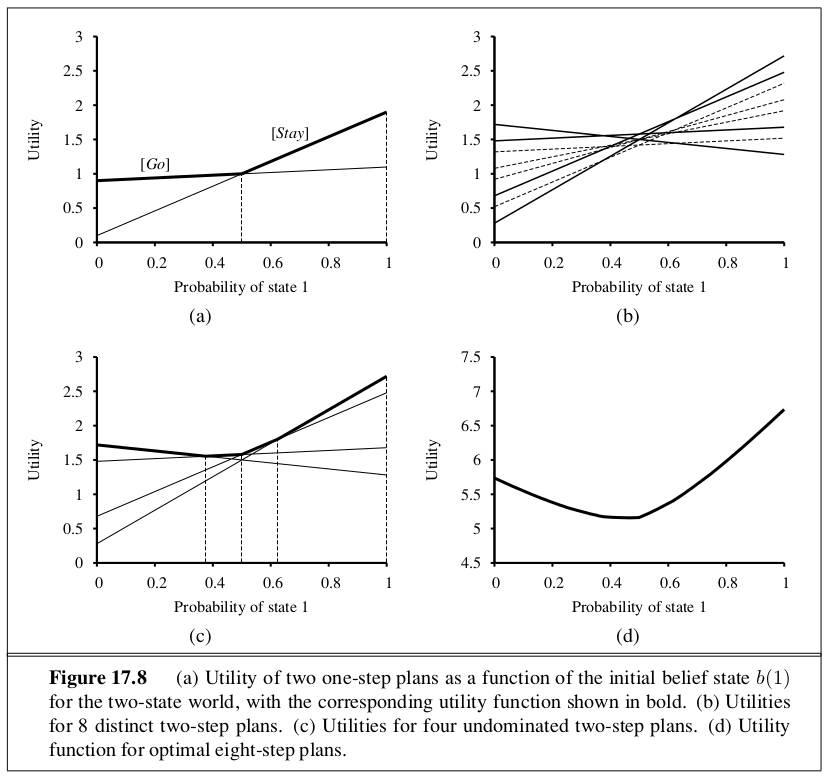

```{r setup, include=FALSE}
knitr::opts_chunk$set(echo = TRUE)
```

_In which we examine methods for deciding what to do today, given that we may decide again tomorrow._

# 17.1 | Sequential Decision Problems 

A sequential decision problem for a fully observable, stochastic environment with a Markovian transition model and additive rewards is called a **Markov Decision Process** or MDP, and consists of a set of states (with an initial state $s_0$); a set $\mathrm{Actions}(s)$ of actions in each state; a transition model $P(s' | s, a)$; and a reward function $R(s)$. A solution must specify what the agent should do for any state that the agent might reach. A solution of this kind is called a **policy**. Traditionally,, we denote a policy by $\pi$ and $\pi(s)$ is the action recommended by the policy $\pi$ for state $s$. If the agent has a complete policy, then no matter what the outcome of any action, the agent will always know what to do next. The quality of a policy is measured by the expected utility of the possible environment histories generated by that policy. An **optimal policy**($\pi^*$) is a policy that yields the highest expected utility. 

## 17.1.1 | Utilities Over Time 

The first question to ask is whether there is a **finite horizon** or **infinite horizon** for decision making. A finite horizon means there is a fixed time $N$ after which nothing matters. Thus $U_h([s_0, s_1, ..., s_{N+k}]) = U_h([s_0, s_1, ..., s_{N}]) \forall k$. With a finite horizon, the optimal action in a given state can change over time. The optimal policy for a finite horizon is **nonstationary**. 

With no fixed time limit, there is no reason to behave differently in the same state at different times. Then the optimal action depends only on the current state, and the optimal policy is **stationary**. Policies for the infinite horizon case are therefore simpler than the finite horizon case. Infinite horizon does not mean that all state sequences are infinite, but that there is no fixed deadline. 

The second question is how do we calculate the utility of state sequences? In the terminology of multiattribute utility theory, each state $s_i$ can be viewed as an attribute of the state sequence $[s_0, s_1, s_2, ...]$. To obtain a simple expression in terms of the attributes, we need to make some sort of preference-independence assumption. We can assume that the agent's preferences between state sequences are **stationary**; if two state sequences $[s_0, s_1, s_2, ...]$ and $[s_0', s_1', s_2', ...]$ begin with the same state ($s_0 = s_0'$), then the two sequences should be preference ordered the same way as the sequences $[s_0, s_1, s_2, ...]$ and $[s_0', s_1', s_2', ...]$. Essentially, if we are to prefer one future to another starting tomorrow, then we should prefer that future if we were to start today instead. 

Under stationarity there are just two coherent ways to assign utilities to sequences: 

1. **Additive Rewards**: $U_h([s_0, s_1, s_2, ...]) = R(s_0) + R(s_1) + R(s_2) + ...$

2. **Discounted Rewards**: $U_h([s_0, s_1, s_2, ...]) = R(s_0) + \gamma R(s_1) + \gamma R(s_2) + ...$

where the **discount factor** $\gamma$ is a number between 0 and 1. The discount factor describes the preference of an agent for current rewards over future rewards. When $\gamma$ is close to 0, rewards in the distant future are considered insignificant. When $\gamma$ is 1, discounted rewards are exactly equivalent to additive rewards, so additive rewards are a special case of discounted rewards. 

The problem with infinite horizons is that if an environment doesn't contain a terminal state, or if the agent never reaches one, then all environment histories will be infinitely long, and utilities with additive, undiscounted rewards will generally be infinite. There are 3 solutions: 

1. With discounted rewards, the utility of an infinite sequence is finite. If $\gamma < 1$ and rewards are bounded by $\pm R_{max}$, we have 

\begin{center}
$U_h([s_0, s_1, s_2, ...]) = \sum\limits_{t=0}^{\infty} \gamma^t R(s_t) \leq \sum\limits_{t=0}^{\infty} \gamma^t R_{max} = \frac{R_{max}}{(1 - \gamma)}$
\end{center}

using the standard formula for the sum of an infinite geometric series. 

2. If the environment contains terminal states and if the agent is guaranteed to get one eventually, then we will never need to compare infinite sequences. A policy that is guaranteed to reach a terminal state is called a **proper policy**. With proper policies we can use $\gamma = 1$ (additive rewards).

3. Infinite sequences can be compared in terms of the **average reward** obtained per time step.

Discounted rewards present the fewest difficulties in evaluating state sequences. 

## 17.1.2 | Optimal Policies and the Utilities of States 

We can compare policies by comparing the expected utilities obtained when executing them. We assume the agent is in some initial state $s$ and define $S_t$ (a random variable) to be the state the agent reaches at time $t$ when executing a particular policy $\pi$. The probability distribution over state sequences $S_1, S_2, ...$ is determined by the initial state $s$, the policy $\pi$, and the transition model for the environment. 

The expected utility obtained by executing $\pi$ starting in $s$ is given by: 

\begin{center}
$U^{\pi}(s) = E[\sum\limits_{t=0}^{\infty} \gamma^t R(S_t)]$
\end{center}

where the expectation is with respect to the probability distribution over state sequences determined by $s$ and $\pi$. Then 

\begin{center}
$\pi_s^* = \arg \max\limits_{\pi} U^{\pi}(s)$
\end{center}

$\pi^*_s$ is a policy, so it recommends an action for every state. Therefore, our policy is optimal when $s$ is the starting state. A remarkable consequence of using discounted utilities with infinite horizons is that the optimal policy is independent of the starting state. 

# 17.2 | Value Iteration

**Value Iteration** is used for calculating an optimal policy. The basic idea is to calculate the utility of each state and then use the state utilities to select an optimal action in each state. 

## 17.2.1 | The Bellman Equation for Utilities

There is a direct relationship between the utility of a state and the utility of its neighbors. The utility of a state is the immediate reward for that state plus the expected discounted utility of the next state, assuming that the agent chooses the optimal action. The utility of a state is given by:

\begin{center}
$U(s) = R(s) + \gamma \max\limits_{a \in A(s)} \sum\limits_{s'} P(s' | s, a)U(s')$
\end{center}

This is called the **Bellman Equation**. Utilities of the states are unique solutions of the set of Bellman equations. If there are $n$ states, then there are $n$ Bellman equations, one for each state. 

## 17.2.2 | The Value Iteration Algorithm

Given $n$ Bellman equations with $n$ unknowns, we wish to solve these equations to find the utilities. The problem is that the equations are nonlinear, because the max operator is not a linear operator. One approach to solve systems of nonlinear equations is to try an iterative approach. The iteration step, called a Bellman update, looks like this: 

\begin{center}
$U_{i+1}(s) \gets R(s) + \gamma \max\limits_{a \in A(s)} \sum\limits_{s'} P(s' | s, a)U(s')$
\end{center}

where the update is assumed to be applied simultaneously to all states at each iteration. We can think of the value iteration algorithm as propagating information through the state space by means of local updates. 

## 17.2.3 | Convergence of Value Iteration

Value iteration eventually converges to a unique set of solutions of the Bellman equations. The basic concept used in showing convergence here is the notion of a **contraction**. Roughly speaking, a contraction is a function of one argument that, when applied to two different inputs in turn, produces two output values that are "closer together" by at least some constant factor, than the original inputs. Two important properties of contractions:

- A contraction only have 1 fixed point; if there were 2 fixed points, they would not get closer together when the function was applied, so it would not be a contraction. 
- When the function is applied to any argument, the value must get closer to the fixed point, so repeated application of a contraction always reaches the fixed point in the limit. 

View the Bellman update as an operator $B$ which is applied simultaneously to update the utility of every state. Let $U_i$ denote the vector of utilities for all the states at the $i$th iteration. Then the Bellman update equation can be written:

\begin{center}
$U_{i+1} \gets B U_i$
\end{center}

Next we need a way to measure distances between utility vectors. We will use the **max norm**: 

\begin{center}
$||U|| = \max\limits_s |U(s)|$
\end{center}

Let $U_i$ and $U_i'$ be any two utility vectors. Then we have 

\begin{center}
$||BU_i - BU_i'|| \leq \gamma ||U_i - U_i'||$
\end{center}

That is, the Bellman update is a contraction by a factor of $\gamma$ on the space of utility vectors. Hence from the properties of contractions, it follows that value iteration always converges to a unique solution of the Bellman equations whenever $\gamma < 1$. $U^{\pi_i}(s)$ is the utility obtained if $\pi_i$ is executed starting in $s$, and the **policy loss** $||U^{\pi_i} - U||$ is the most an agent can lose by executing $\pi_i$  instead of the optimal policy $\pi^*$. The policy loss of $\pi_i$ is connected to the error in $U_i$ by the following inequality: 

\begin{center}
if $||U_i - U|| < \epsilon$ then $||U^{\pi_i} - U|| < 2 \epsilon \frac{\gamma}{(1 - \gamma)}$
\end{center}

In practice, it often occurs that $\pi_i$ becomes optimal long before $U_i$ has converged. 

# 17.3 | Policy Iteration 

If one action is clearly better than all the others, then the exact magnitude of the utilities on the states involved need not be precise. This suggests an alternative way to find optimal policies. 

The **policy iteration** algorithm alternates the following two steps, beginning from some initial policy $\pi_0$: 

- **Policy Evaluation**: given a policy $\pi_i$, calculate $U_i = U^{\pi_i}$, the utility of each state if $\pi_i$ were to be executed.
- **Policy Improvement**: calculate a new MEU policy $\pi_{i+1}$, using one-step look-ahead based on $U_i$

The algorithm terminates when the policy improvement step yields no change in the utilities. 

Implementing this algorithm is easier than solving the standard Bellman equations (which is what value iteration does), because the action at each state is fixed by the policy. At the $i$th iteration, the policy $\pi_i$ specifies the action $\pi_i(s)$ in the state $s$. This means that we have a simplified version of the Bellman equation relating the utility of $s$ (under $\pi_i$) to the utilities of its neighbors: 

\begin{center}
$U_i(s) = R(s) + \gamma \sum\limits_{s'} P(s' | s, \pi_i(s))U(s')$
\end{center}

The important point is that these equations are linear because the max operator has been removed. For $n$ states, we have $n$ linear equations with $n$ unknowns, which can be solved in $< O(n^3)$ time by standard linear algebra solvers. 

Instead of calculating the exact policy evaluation, we can perform some number of simplied value iteration steps (because the policy is fixed) to give a reasonably good approximation of the utilities. The simplied Bellman update for this process is 

\begin{center}
$U_{i+1}(s) \gets R(s) + \gamma \sum\limits_{s'} P(s' | s, \pi_i(s))U(s')$
\end{center}

and this is repeated $k$ times to produce the next utility estimate. The resulting algorithm is called **modified policy iteration**. It is often much more efficient than standard policy iteration or value iteration.

There are also algorithms which don't require updating the utility or policy for all states at once. For each iteration we could pick any subset of states and apply either kind of updating (policy improvement or simplied value iteration) to that subset. This type of algorithm is called **asynchronous policy iteration**. Given certain conditions on the initial policy and initial utility function, asynchronous policy iteration is guaranteed to converge to an optimal policy. 

# 17.4 | Partially Observable Markov Decision Processes

The description of Markov Decision Processes so far assumed that the environment was fully observable. When the environment is only partially observable, difficulties arise. The agent doesn't know which state it is in, so it cannot execute the action $\pi(s)$ recommended for that state. Furthermore, the utility of a state $s$ and the optimal action in $s$ depend not just on $s$, but also on how much the agent knows when it is in $s$. 

## 17.4.1 | Definition of Partially Observable Markov Decision Processes 

The POMDP has the same elements as an MDP - the transition model $P(s' | s, a)$, actions $A(s)$, and a reward function $R(s)$, but it also has a **sensor model** P(e | s). The sensor model specifies the probability of perceiving evidence $e$ in state $s$. In POMDPs the belief state $b$ becomes a probability distribution over all possible states. 

The agent can calculate its current belief state as the conditional probability distribution over the actual states given the sequence of percepts and actions so far. This is the **filtering** from ch 15. For POMDPs we must consider the previous belief state, new evidence, and an action. If $b(s)$ was the previous belief state, and the agent does action $a$ and then perceives evidence $e$, then the new belief state is given by 

\begin{center}
$b'(s') = \alpha P(e | s') \sum\limits_s P(s' | s, a)b(s)$
\end{center}

where $\alpha$ is a normalizing constant that makes the belief state sum to 1. The fundamental insight is this: the optimal decision depends only on the agent's current belief state. It does not depend on the actual state the agent is in. 

The decision cycle of a POMDP agent can be broken down into the following 3 steps: 

1. Given the current belief state $b$, execute the action $a = \pi^*(b)$
2. Receive percept $e$
3. Set the current belief state to Forward(b, a, e) and repeat

Solving a POMDP on a physical state space can be reduced to solving an MDP on the corresponding belief state space. 

## 17.4.2 | Value Iteration for Partially Observable Markov Decision Processes 

In 17.2 we looked at a value iteration algorithm that computed one utility value for each state. With infinitely many belief states, we need to take a different approach. Consider an optimal policy $\pi^*$ and its application in a specific belief state $b$: the policy generates an action, then for each subsequent percept, the belief state is updated and a new action is generated, and so on. For this specific $b$, the policy is exactly equivalent to a **conditional plan**. We make 2 observations: 

1. Let the utility of executing a fixed conditional plan starting in physical state $s$ be $\alpha_p (s)$. Then the expected utility of executing $p$ in belief state $b$ is just $\sum\limits_s b(s) \alpha_p (s)$. Hence the expected utility of a fixed conditional plan varies linearly with $b$; that is, it corresponds to a hyperplane in belief space. 
2. At any given belief state $b$, the optimal policy will choose to execute the conditional plan with heighest expected utility. The expected utility of $b$ under the optimal policy is just the utility of the conditional plan:

\begin{center}
$U(b) = U^{\pi^*}(b) = \max\limits_p b \cdot \alpha_p$
\end{center}

If the optimal policy $\pi^*$ chooses to execute $p$ starting at $b$, then it is reasonable to expect that it might choose to execute $p$ in belief states that are very close to $b$. If we bound the depth of the conditional plans, then there are only finitely many such plans and the continuous space of belief states will generally be divided into regions, each corresponding to a particular conditional plan that is optimal in that region. 

From these two observations, we see that the utility function $U(b)$ on belief states, being the maximum of a collection of hyperplanes, will be piecewise linear and convex.



In general, let $p$ be a depth-$d$ conditional plan whose initial action is $a$ and whose depth-$d-1$ subplan for percept $e$ is $p \cdot e$; then 

\begin{center}
$\alpha_p(s) = R(s) + \gamma (\sum\limits_{s'} P(s' | s, a) \sum\limits_e P(e | s')\alpha_{p \cdot e}(s'))$
\end{center}

The recursion gives us a value iteration algorithm. The main difference with this one (POMDP-Value-Iteration) is that it maintains a collection of undominated plans with their utility hyperplanes. Since the 70s (when this algorithm was developed), there have been many advances in creating more efficient forms of value iteration and policy iteration algorithms. Unfortunately, for general POMDPs, finding optimal policies is very difficult (PSPACE-hard). Problems with a few dozen states are often infeasible. 

# Online Agents for Partially Observable Markov Decision Processes

This section outlines a simple approach to agent design for partially observable, stochastic environments. The basic elements are familiar: 

- The transition and sensor models are represented by a dynamic Bayesian network
- The dynamic Bayesian network is extended with decision and utility nodes, as used in decision networks. The resulting model is a **dynamic decision network**
- A filtering algorithm is used to incorporate each new percept and action and to update the belief state representation.
- Decisions are made by projecting forward possible action sequences and choosing the best one. 

DBNs are **factored representations** - they typically have an exponential complexity advantage over atomic representations and can model quite substantial real world problems. Decision-theoretic agents based on dynamic decision networks have advantages compared with other, simpler agent designs presented in earlier chapters. They

- handle partially observable, uncertain environments
- can easily revise their plans to handle unexpected evidence
- With appropriate sensor models they can handle sensor failure and plan to gather information
- They exhibit graceful degradation under time pressure and in complex environments, using various approximation techniques. 

Some defects: 

- Its reliance on forward search through state space, rather than using the hierarchical and other planning techniques of ch 11
- The propositional nature of the DDN language. 

# 17.5 | Decisions with Multiple Agents: Game Theory 

We have concentrated on making decisions in uncertain environments, but what if the uncertainty is due to other agents and the decisions they make?

In this section we look at **game theory** and analyze games with simultaneous moves and other sources of partial observability. Game theorists use the terms **perfect information** and **imperfect information** rather than fully and partially observable. Game theory can be used in at least 2 ways: 

1. **Agent Design**: Game theory can analyze the agent's decisions and compute the expected utility for each decision.
2. **Mechanism Design**: When an environment is inhabited by many agents, it might be possible to define the rules of the environment so that the collective good of all agents is maximized when each agent adopts the game-theoretic solution that maximizes its own utility. Mechanism design can also be used to construct intelligent **multiagent systems** that solve complex problems in a distributed fashion. 

## 17.5.1 | Single-Move Games 

A single move game is defined by 3 components: 

1. **Players** or agents who will be making decisions. 
2. **Actions** that the players can choose. The players may or may not have the same set of actions available. 
3. A **Payoff Function** that gives the utility to each player for each combination of actions by all the players. For single move games the payoff function can be represented by a matrix, a representation known as the **strategic form**.

We say that a strategy $s$ for player $p$ **strongly dominates** strategy $s'$ if the outcome for $s$ is better for $p$ than the outcome for $s'$, for every choice of strategies by the other player. Strategy $s$ **weakly dominates** $s'$ if $s$ is better than $s'$ on at least one strategy profile and no worse on any other. A dominant strategy is a strategy that dominates all others. It is irrational to play a dominated strategy and irrational not to play a dominant strategy if one exists. 

We say that an outcome is **Pareto optimal** if there is no other outcome that all players would prefer. An outcome is **Pareto dominated** by another outcome if all players would prefer the other outcome. When each player has a dominant strategy, the combination of those strategies is called a **dominant strategy equilibrium**. In general, a strategy profile forms an **equilibrium** if no player can benefit by switching strategies, given that every other player sticks with the same strategy. An equilibrium is essentially a **local optimum** in the space of policies. John Nash proved that every game has at least one equilibrium. This concept is called a **Nash equilibrium** in his honor. 

In 1928 von Neumann developed a method for finding the optimal mixed strategy for two player, **zero-sum games** - games in which the sum of the payoffs is always 0. von Neumann's method is called the **maximin technique**. If both players play their optimal mixed strategies, there will be a **maximin equilibrium** of the game. von Neumann also showed that every two player zero-sum game has a maximin equilibrium when you allow mixed strategies. A player who adopts the maximin strategy has 2 guarantees: 

1. No other strategy can do better against an opponent who plays well. 
2. The player continues to do just as well even if the strategy is revealed to the opponent. 

The general algorithm for finxing maximin equilibria in zero-sum games is somewhat involved. With $n$ possible actions, a mixed strategy is a point in $n$-dimensional space and the lines become hyperplanes. Its also possible for some pure strategies for the second player to be dominated by others, so that they are not optimal against any strategy for the first player. After removing all such strategies, the optimal choice at the root is the highest or lowest intersection point of the remaining hyperplanes. Finding this choice is an example of a **linear programming** problem: maximize an objective function subject to linear constraints. 

## 17.5.2 | Repeated Games 

The simplest kind of multimove game is the **repeated game**, in which players face the same choice repeatedly, but each time with knowledge of the history of all players' previous choices. A strategy profile for a repeated game specifies an action choice for each player at each time step for every possible history of previous choices. As with Markov Decision Processes, payoffs are additive over time. 

## 17.5.3 | Sequential Games 
