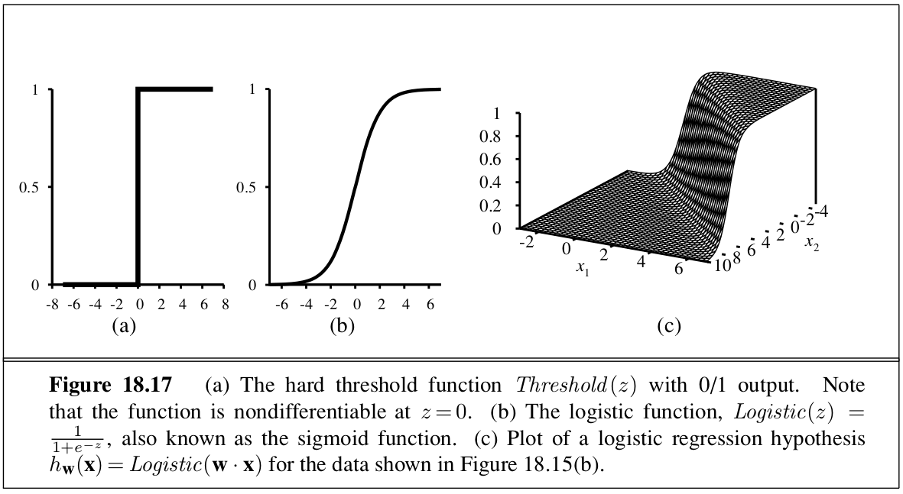
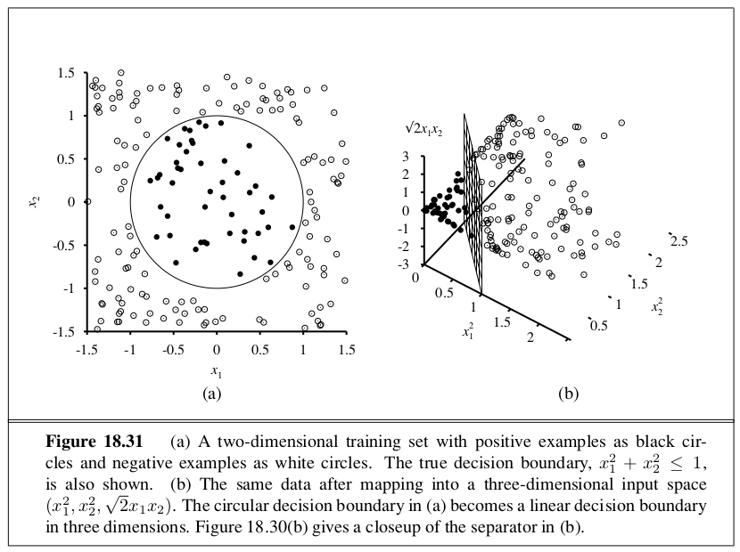

```{r setup, include=FALSE}
knitr::opts_chunk$set(echo = TRUE)
```

_In which we describe agents that can improve their behavior through diligent study of their own experiences_

# 18.1 | Forms of Learning 

Any component of an agent can be improved by learning from data. The improvements, and techniques used to make them, depend on four major factors:

- Which component is to be improved
- What prior knowledge the agent already has
- What representation is used for the data and the component
- What feedback is available to learn from

# 18.2 | Supervised Learning 

The task of supervised learning is this: 

Given a training set of $N$ example input-output pairs $(x_1, y_1), (x_2, y_2), ..., (x_n, y_n)$, where each $y_j$ was generated by an unknown function $y = f(x)$, discover a function $h$ that approximates the true function $f$. 

In general, there is a tradeoff between complex hypotheses that fit the training data well and simpler hypotheses that may generalize better. We say that a learning problem is **realizable** if the hypothesis space contains the true function. Supervised learning can be done by choosing the hypothesis $h^*$ that is most probable given the data: 

\begin{center}
$h^* = \arg\max\limits_{h \in \mathcal{H}} P(h | data) = \arg\max\limits_{h \in \mathcal{H}} P(data|h)p(h)$
\end{center}

There is a tradeoff between the expressiveness of a hypothesis space and the complexity of finding a good hypothesis within that space. For example, fitting a straight line to data is an easy computation; fitting high degree polynomials is somewhat harder.

# 18.3 | Learning Decision Trees 

The greedy search used in decision tree learning is designed to approximately minimize the depth of the tree. The idea is to pick the attribute that goes as far as possible toward providing an exact classification of the other examples. We need a formal measure of good and bad in order to understand the concept of importance in the choices we make. We will use the notion of information gain, which is defined in terms of **entropy**. 

Entropy is a measure of the uncertainty of a random variable; acquisition of information corresponds to a reduction in entropy. In general, the entropy of a random variable $V$ with values $v_k$, each with probability $P(v_k)$, is defined as: 

\begin{center}
Entropy: $H(V) = \sum\limits_k P(v_k) \log_2 \frac{1}{P(v_k)} = - \sum\limits_k P(v_k) \log_2 P(v_k)$
\end{center}

A randomly chosen example from the training set has the $k$th value for the attribute with probability $\frac{(p_k + n_k)}{(p+n)}$, so the expected entropy remaining after testing attribute $A$ is 

\begin{center}
$\mathrm{Remainder}(A) = \sum\limits_{k=1}^d \frac{(p_k + n_k)}{(p+n)} B(\frac{(p_k)}{(p_k+n_k)})$
\end{center}

Then the **information gain** from the attribute test on A is the expected reduction in entropy: 

\begin{center}
$\mathrm{Information Gain}(A) = B(\frac{p}{p+n}) - \mathrm{Remainder}(A)$
\end{center}

For decision trees, a technique called **decision tree pruning** combats overfitting. Pruning works by eliminating nodes that are not clearly relevant. In order to detect if a node is irrelevant, we check information gain. In order to ascertain how large a gain should be required in order to split on a particular attribute, we can use a statistical significance test.

In this case, the null hypothesis is that the attribute is irrelevant and the information gain for an infinitely large sample would be zero. We can measure the deviation by comparing actual numbers of positive and negative examples in each subset, $p_k$ and $n_k$, with the expected numbers, $\hat{p_k}$ and $\hat{n_k}$, assuming true irrelavance: 

\begin{center}
$\hat{p_k} = p \times \frac{(p_k + n_k)}{(p+n)}$ \quad \quad $\hat{n_k} = n \times \frac{(p_k + n_k)}{(p+n)}$
\end{center}

A convenient measure of total deviation is given by

\begin{center}
$\Delta = \sum\limits_{k=1}^d \frac{(p_k - \hat{p_k})^2}{p + n} + \frac{(n_k = \hat{n_k})^2}{p + n}$
\end{center}

Under the null hypothesis, the value of $\Delta$ is distributed according to the $\chi^2$ distribution with $v - 1$ degrees of freedom. This form of pruning is known as $\chi^2$ pruning. 


## 18.3.6 | Broadening the Applicability of Decision Trees 

To extend the decision tree induction to a wider variety of problems, a number of issues must be addressed. 

- Missing data : How should we classify an example that is missing one of the test attributes? How should we modify the information gain formula when some examples have unknown values for the attribute

- Multivalued attributes : When an attribute has many possible values, the information gain measure gives an inappropriate indication of the attributes usefulness. One solution is to use the gain ratio.

- Continuous and integer-valued input attributes : Continuous or integer-valued attributes (like height weight) have an infinite set of possible values. Rather than generating infinite branches, decision trees typically find the split point that gives the highest information gain. Splitting is the most expensive part of real world decision tree learning applications. 

- Continuous valued output attributes: If we are trying to predict a numerical output, we need a regression tree rather than a classification tree. 

# 18.4 | Evaluating and Choosing the Best Hypothesis 

We wish to learn a hypothesis that fits the future data best. In order to do this, we make the **stationarity assumption**: that there is a probability distribution over examples that remains stationary over time. Essentially, we want iid values. 

The next step is define best fit. We define the **error rate** of a hypothesis as the proportion of mistakes that it makes. 

## 18.4.1 | Model Selection: Complexity vs. Goodness of Fit

We can think of the task of finding the best hypothesis as two tasks: model selection defines the hypothesis space and then optimization finds the hypothesis within that space. 

## 18.4.2 | From Error Rates to Loss 

In machine learning it is traditional to express utilities by means of a **loss function**. The loss function $L(x, y, \hat{y})$ is defined as the amount of utility lost by predicting $h(x) = \hat{y}$ when the correct answer is $f(x) = y$. In general small errors are better than large ones. Two functions that implement this idea are the absolute value of the different ($L_1$ loss) and the square of the difference ($L_2$ loss). If we are content with the idea of minimizing error rate we can use the $L_{0/1}$ loss function, which has a loss of 1 for an incorrect answer and is appropriate for discrete-valued outputs: 

\begin{center}
Absolute Value Loss: $L_1(y, \hat{y}) = |y - \hat{y}|$

Squared Error Loss: $L_2(y, \hat{y}) = (y - \hat{y})^2$

0/1 Loss: $L_{0/1}(y, \hat{y}) = 0 \quad \mathrm{if} \quad y = \hat{y}, \quad \mathrm{else} \quad 1$
\end{center}

The learning agent can theoretically maximize its expected utility by choosing the hypothesis that minimizes the expected loss over all input-output pairs it will see. It is meaningless to talk about expectation without defining a prior probability distribution $P(X, Y)$ over examples. Let $\Xi$ be the set of all possible input-output examples. Then the expected **generalization loss** for a hypothesis $h$ with respect to loss function $L$ is 

\begin{center}
$\mathrm{GenLoss}_L (h) = \sum\limits_{(x, y) \in \Xi} L(y, h(x)) P(x, y)$
\end{center}

and the best hypothesis, $h^*$, is the one with the minimum expected generalization loss: 

\begin{center}
$h^* = \arg \min\limits_{h \in \mathcal{H}} \mathrm{GenLoss}_L (h)$
\end{center}

Since $P(x, y)$ is not known, the learning agent can only estimate generalization loss with **empirical loss** on a set of examples, E: 

\begin{center}
$\mathrm{EmpLoss}_{L, E}(h) = \frac{1}{N} \sum\limits_{(x, y) \in E} L(y, h(x))$
\end{center}

where the estimated best hypothesis $\hat{h^*}$ is the one with the minimum empirical loss: 

\begin{center}
$\hat{h^*} = \arg \min\limits_{h \in \mathcal{H}} EmpLoss_{L,E}(h)$
\end{center}

# 18.5 | The Theory of Learning 

How do we know that the hypothesis $h$ is close to the target function $f$ if we don't know what $f$ is? How many examples do we need to get a good $h$? What hypothesis space should we use? If the hypothesis space is very complex, can we even find the best $h$ or do we have to settle for a local maximum in the space of hypotheses? How complex should $h$ be? How do we avoid overfitting? Questions like these are addressed by **computational learning theory**.

The underlying principle is that any hypothesis that is seriously wrong will almost certainly be found out with high probability after a small number of examples, because it will make an incorrect prediction. Thus, any hypothesis that is consistent with a sufficiently large set of training examples is unlikely to be seriously wrong: it must be **probablity approximately correct**. Any learning algorithm that returns hypotheses that are probably approximately correct is called a **PAC learning algorithm**. We can use this approach to provide bounds on the performance of various learning algorithms. 

The simplest PAC theorem deals with Boolean functions, for which the $0/1$ loss is appropriate. The **error rate** of a hypothesis $h$ is defined formally as the expected generalization error for examples drawn from the stationary distribution: 

\begin{center}
$\mathrm{error}(h) = \mathrm{GenLoss}_{L_{0/1}}(h) = \sum\limits_{x, y} L_{0,1}(y, h(x))P(x, y)$
\end{center}

A hypothesis is called **approximately correct** if error$(h) \leq \epsilon$. We can show that we can find an $N$, such that, after seeing $N$ examples, with high probability, all consistent hypotheses will be approximately correct. We can think of an approximately correct hypothesis as being close to the true function in hypothesis space: it lies within an $\epsilon$-ball around the true function $f$. The hypothesis space outside this ball is called $\mathcal{H}_{bad}$. We can calculate the probability that a seriously wrong hypothesis $h_b \in \mathcal{H}_{bad}$ is consistent with the first $N$ examples as follows: 

We know error$(h_b) > \epsilon$. Thus the probability that it agrees with a given example is at most $1 - \epsilon$. Since the examples are independent, the bound for $N$ examples is 

\begin{center}
$P(h_b$ agrees with $N$ examples) $\leq (1 - \epsilon)^N$
\end{center}

The probability that $\mathcal{H}_{bad}$ contains at least one consistent hypothesis is bounded by the sum of the individual probabilities: 

\begin{center}
$P(\mathcal{H}_{bad}$ contains a consistent hypothesis) $\leq |\mathcal{H}_{bad}|(1 - \epsilon)^N \leq |\mathcal{H}|(1 - \epsilon)^N$
\end{center}

where we have used the fact that $|\mathcal{H}_{bad}| \leq |\mathcal{H}|$. We wish to reduce the probability of this event below some small number $\delta$: 

\begin{center}
$|\mathcal{H}|(1 - \epsilon)^N \leq \delta$
\end{center}

Given that $1 - \epsilon \leq e^{- \epsilon}$, we can achieve this if we allow the algorithm to see 

\begin{center}
$N \geq \frac{1}{\epsilon}(\ln\frac{1}{\delta} + \ln |\mathcal{H}|)$
\end{center}

examples. If a learning algorithm returns a hypothesis that is consistent with this many examples, then with probability of at least $1 - \delta$, it has an error of at most $\epsilon$. Therefore, it is probably approximately correct. The number of require examples, as a function of $\epsilon$ and $\delta$, is called the **sample complexity** of the hypothesis space. 

To obtain generalization to unseen examples, we need to restrict the hypothesis space $\mathcal{H}$ in some way. This runs the risk of eliminating the true function altogether, but there are 3 ways to escape this dilemma: 

1. Bring prior knowledge to bear on the problem
2. Insist that the algorithm return not just any consistent hypothesis, but preferably a simple one.
3. Focus on learnable subsets of the entire space of Boolean functions. 

# 18.6 | Regression and Classification with Linear Models 

This is a very good read, but perhaps a bit ambitious to fit an entire linear models course in a section. 




# 18.7 | Artificial Neural Networks 

Neural networks are composed of nodes, or units connected by directed links. A link from a unit $i$ to a unit $j$ serves to propagate the activation $a_i$ from $i$ to $j$. Each link also has a numeric weight $w_{i, j}$ associated with it which determines the strength and sign of the connection. 

Each unit $j$ first computes a weighted sum of its inputs: 

\begin{center}
$in_j = \sum\limits_{i=0}^n w_{i, j} a_i$
\end{center}

Then it applies an activation function $g$ to this sum to derive the output: 

\begin{center}
$a_j = g(in_j) = g(\sum\limits_{i=0}^n w_{i,j}a_i)$
\end{center}

The activation function $g$ is usually either a hard threshold, in which case the unit is called a **perceptron**, or a logistic function, in which case the term **sigmoid perceptron** is sometimes used. Both of these nonlinear activation functions ensure that the entire network of units can represent a nonlinear function. As a result, a conmbination of units in a neural network architecture can be used as a tool for doing nonlinear regression. 

There is no good theory for deriving the right neural network architecture currently. We can use cross validation in order to test several architectures and regularization methods. 

# 18.8 | Nonparametric Models 

A learning model that summarizes data with a set of parameters of fixed size (independent of the number of training examples) is called a **parametric model**. A **nonparametric model** is one that cannot be characterized by a bounded set of parameters.

## 18.8.1 | Nearest Neighbor Models 

Given a query $x_q$, find the $k$ examples that are nearest to $x_q$. This is called **k-nearest neighbors**. To do classification, we find $NN(k, x_q)$, then take the plurality vote of the neighbors (which is the majority vote for cases of binary classification). To avoid ties, $k$ is always odd. To do regression, we can take the mean or median of the k neighbors, or we can solve a linear regression problem on the neighbors. 

Typically distances are measured with the **Minkowski Distance**, or $L^p$ norm: 

\begin{center}
$L^p(x_j, x_q) = (\sum\limits_i |x_{j,i} - x_{q, i}|^p)^{1/p}$
\end{center}

If $p = 2$, then this is the Euclidean distance. If $p = 1$, then this is the Manhattan distance. With Boolean attributes, the number of attributes on which the two points differ is called the **Hamming Distance**. Typically Euclidean distance is used if the dimensions are measuring similar properties, and Manhattan distance is used if the dimensions are dissimilar. To avoid issues with scaling between two measures, we apply **normalization** to the measurements in each dimension. A more complex metric known as the **Mahalonobis Distance** takes into account the covariance between dimensions. 

## 18.8.2 | Finding Nearest Neighbors with k-d Trees 

A balanced binary tree over data with an arbitrary number of dimensions is called a **k-d tree**, or k-dimensional tree. Exact lookup from a binary tree is just like lookup from a binary tree (with the caveat that we must check which dimension we are testing at each node). k-d trees are appropriate only when there are many more examples than dimensions, preferably at least $2^n$ examples. 

## 18.8.3 | Locality-Sensitive Hashing 

Hash tables have the potential to provide even faster lookup than binary trees. Hash codes rely on exact matches though, and they randomly distribute values among the bins. We want to have near points grouped together in the same bin, so we want a **locality-sensitive hash**. We can't use hashes to solve $NN(k, x_q)$ exactly, but with a clever use of randomized algorithms we can find an approximate solution. 

**Approximate Near-Neighbors**: Given a dsata set of example points and a query point $x_q$, find, with high probability, an example point (or points) that is near $x_q$. We require that if there is a point $x_j$ that is within a radius $r$ of $x_q$, then with high probability the algorithm will find a point $x_j'$ that is within distance $cr$ of $q$. If there is no point within radius $r$ then the algorithm is allowed to report failure. The values of $c$ and "high probability" are parameters of the algorithm. 

The intuition we rely on is that if two points are close together in an $n$-dimensional space, then they will necessarily be close when projected down into a one-dimensional space. We can discretize the line into bins - hash buckets - so that, with high probability, near points project down to exactly the same bin. Points that are far away from each other will tend to project down into different bins for most projections, but there will always be a few projections that coincidentally project far-apart points into the same bin. Thus the bin for point $x_q$ contains many (but not all) points that are near to $x_q$, as well as some points which are far away. 

# 18.9 | Support Vector Machines 

There are 3 properties that make SVMs attractive: 

1. SVMs construct a **maximum margin separator** - a decision boundary with the largest possible distance to example points. This helps them generalize well. 
2. SVMs create a linear seperating hyperplace, but they have the ability to embed the data into a higher dimensional space, using the **kernel trick**. Often, data that was not linearly separable in the original input space are easily separable in the higher dimensional space. The high dimensional linear separator is actually nonlinear in the original space. This means that the hypothesis space is greatly expanded over methods that use strictly linear representations. 
3. SVMs are a nonparametric method - they retain training examples and potentially need to store them all. In practice they often end up retaining only a small fraction of the number of examples. Thus SVMs combine the advantages of nonparametric and parametric models: they have the flexibility to represent complex functions, but they are resistant to overfitting. 



Each kernel corresponds to a particular higher dimensional feature space. **Mercer's Theorem** says that any reasonable (positive definite) kernel function corresponds to some feature space. Then this is the kernel trick: Optimal linear seperators can be found efficiently in feature spaces with billions of (or in some cases, infinitely many) dimensions. 

The kernel method can be applied not only with learning algorithms that find optimal linear separators, but also with any other algorithm that can be reformulated to work only with dot products of pairs of data points. Once this is done, the dot product is replaced by a kernel function and we have a **kernelized** version of the algorithm. This can easily be done for k-nearest neighbors and perceptron learning, among others. 

# 18.10 | Ensemble Learning

The idea of **ensemble learning** methods is to select a collection, or ensemble, of hypotheses from the hypothese space and combine their predictions. Ockham's razor tells use not to make hypotheses more complex than necessary, but boosting shows us that predictions tend to improve as the ensemble hypotheses gets more complex. Various explanations have been proposed for this. One view is that boosting approximates **Bayesian learning**, which can be showed to be an optimal learning algorithm, and the approximation improves as more hypotheses are added. Another possible explanation is that the addition of further hypotheses enables the ensemble to be more definite in its distinction between positive and negative examples.

# 18.12 | Summary 

- Learning takes many forms, depending on the nature of the agent, the component to be improved, and the available feedback.

- If the available feedback provides the correct answer for example inputs, then the learning problem is called supervised learning. The task is to learn a function $y = h(x)$. Learning a discrete valued function is called classification; learning a continuous function is called regression

- Inductive learning involves finding a hypothesis that agrees well with the examples. Ockham's Razor suggests choosing the simplest consistent hypothesis. The difficulty of this task depends on the chosen representation. 

- Decision trees can represent all Boolean functions. The information gain heuristic provides an efficient method for finding a simple, consistent decision tree.

- The performance of a learning algorithm is measured by the learning curve, which shows the prediction accuracy on a test set as a function of the training set size.

- When there are multiple models to choose from, cross validation can be used to select a model that will generalize well

- Sometimes not all errors are equal. A loss function tells us how bad each error is; the goal then is to minimize loss over a validation set.

- Computational learning theory analyzes the sample complexity and computational complexity of inductive learning. There is a tradeoff between the expressiveness of the hypotheses language and the ease of learning

- Linear regression is a widely used model. The optimal parameters of a linear regression model can be found by gradient descent search, or computed exactly. 

- A linear classifier with a hard threshold - also known as a perceptron - can be trained by a simple weight update rule to fit data that are linearly separable. In other cases, the rule fails to converge.

- Logistic regression replaces the perceptron's hard threshold with a soft threshold defined by a logistic function. Gradient descent works well even for noisy data that are not linearly separable. 

- Neural networks represent complex nonlinear functions with a network of linear threshold units. Multilayer feed forward neural networks can represent any function, given enough units. The backpropagation algorithm implements a gradient descent in parameter space to minimize the output error. 

- Nonparametric models use all the data to make each prediction, rather than trying to summarize the data first with a few parameters. Examples include nearest neighbors and locally weighted regression.

- Support vector machines find linear separators with maximum margin to improve the generalization performance of the classifier. Kernel methods implicitly transform the input data into a high dimensional space where a linear separator may exist, even if the original data are non-separable. 

- Ensemble methods such as boosting often perform better than individual methods. In online learning we can aggregate the opinions of experts to come arbitrarily close to the best expert's performance, even when the distribution of the data is constantly shifting. 


