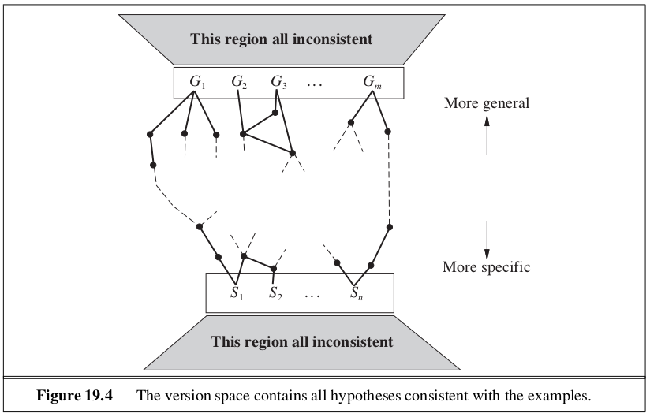

```{r setup, include=FALSE}
knitr::opts_chunk$set(echo = TRUE)
```

_In which we examine the problem of learning when you know something already._

In this chapter, we study learning methods that can take advantage of prior knowledge of the world. 

# 19.1 | A Logical Formulation of Learning

Here, instead of finding a hypothesis that agrees with the observed samples, we seek a hypothesis represented by a set of logical sentences. We wish to find a hypothesis that classifies the examples well and generalizes well to new examples. We are concerned with hypothesis $h_j$ expressed in the form:

\begin{center}
$\forall x \quad Goal(x) \iff C_j (x)$
\end{center}

where $C_j (x)$ is a candidate definition - some expression involving attribute predicates.

The learning algorithm believes only one hypothesis, $h_1 \lor h_2 \lor ... \lor h_n$ is correct. As the examples arrive, hypotheses that are not **consistent** with the examples can be ruled out. For a hypotheses to be inconsistent,

  - It can be a **false negative** for the hypothesis, if the hypothesis says it should be negative but in fact it is positive.
  - It can be a **false positive** if it should be positive but it is in fact negative
  
Here are two approaches to find logically consistent hypotheses without much effort: 

## 19.1.2 | Current Best Hypothesis Search

The idea behind **current best hypothesis search** is to maintain a single hypothesis, and to adjust it as new examples arrive in order to maintain consistency. Taking each new sample into context for the hypotheses is a form of **generalization**. If we remove segments of the hypothesis space, it is called **specialization**.


With a large number of examples and a large hypothesis space, some difficulties arise: 

1. Checking all the previous examples over again for each modification is very expensive
2. The search process may involve a great deal of backtracking. 

## 19.1.3 | Least Commitment Search

Backtracking arises because the current best hypothesis approach has to choose a particular hypothesis as its best guess even though it does not have enough data yet to be sure of the choice. We can choose to only keep around the hypotheses which are consistent with the data so far. As various hypotheses are found to be inconsistent with the examples, the disjunction shrinks, retaining only those hypotheses not ruled out. The set of hypotheses remaining is called the **version space**, and the learning algorithm is called the version space learning algorithm (or the **candidate elimination** algorithm). 

In order to deal with the enormous hypothesis space, we can take advantage of the fact that we have an ordering on the hypothesis space, generalization / specialization. This is a partial ordering, meaning each boundary will not be a point, but a set of hypotheses called a **boundary set**. We can represent the entire version space using two boundary sets: a general boundary set (the **G-set**) and a specific boundary (the **S-set**). Everything in between is guaranteed to be consistent with the examples. 



We initially set the G-set to True (containing all hypotheses) and the S-set to False (containing no hypotheses). For each new sample, we check if it is a true positive, false positive, true negative or false negative. We continue these operations for each new sample until one of 3 things happens: 

1. We have one hypothesis left in the version space
2. The version space collapses - either S or G becomes empty indicating there are no consistent hypotheses for the training set
3. We run out of examples and several hypotheses remain in the version space. 

There are a few drawbacks to the version space approach:

  - If the domain contains noise or insufficient attributes for exact classification, the version space will always collapse
  - If we allow unlimited disjunction in the hypothesis space, the S-set will always contain a single most specific hypothesis, namely the disjunction of the descriptions of the positive examples seen to date. Similarly, the G-set will contain just the negation of the disjunction of the descriptions of the negative examples
  - For some hypothesis spaces, the number of elements in the S-set or G-set may grow exponentially in the number of attributes
  
No solution has been found for noise as of yet. The problem of disjunction can be addressed by allowing only limited forms of disjunction or by including a **generalization hierarchy** of more general predicates.

# 19.2 | Knowledge in Learning 

Let $Descriptions$ denote the conjunction of all the example descriptions in the training set, and let $Classifications$ denote the conjunction of all the example classifications. Then a $Hypothesis$ that "explains the observations" must satisfy the following property: 

\begin{center}
$Hypothesis \land Descriptions \models Classifications$
\end{center}

This kind of relationship is called an **entailment constraint**, in which the hypothesis is the unknown.

The generalization process known as **explanation based learning**, or EBL, satisfies the following entailment constraints:

\begin{center}
$Hypothesis \land Descriptions \models Classifications$

$Background \models Hypothesis$
\end{center}

It was initially thought that EBL was a way to learn from examples, but because it requires background knowledge to be sufficient to explain the hypothesis, which in turn explains the observations, the agent does not actually learn anything factually new from the example. The agent could have derived the example from what it already knew (regardless of the amount of computation that may require). EBL is now viewed as a method for converting first principle theories into useful, special purpose knowledge.

In **Relevance Based Learning** RBL, the prior knowledge background concerns the relevance of a set of features to the goal predicate. This knowledge, together with the observations, allows the agent to infer a new, general rule that explains the observations:

\begin{center}
$Hypothesis \land Descriptions \models Classifications$

$Background \land Descriptions \land Classifications \models Hypothesis$
\end{center}

While RBL does make use of the content of the observations, it doesn't produce hypotheses that go beyond the logical content of the background knowledge and the observations. It is a deductive form of learning and by itself cannot account for the creation of new knowledge starting from scratch. 

In **Knowledge Based Learning** KBIL, the background knowledge and the new hypothesis combine to explain the examples. The learning algorithm should propose hypotheses that are as simple as possible, consistent with the constraint. The entailment constraint is 

\begin{center}
$Background \land Hypothesis \land Descriptions \models Classifications$
\end{center}

KBIL algorithms are studied mainly in the field of **inductive logic programming** (ILP). In ILP systems, prior knowledge plays 2 key roles:

1. Since any hypothesis generated must be consistent with prior knowledge and new observations, the effective hypothesis size is reduced to include only those theories that are consistent with what is already known
2. For any given set of observations, the size of the hypothesis required to construct an explanation for the observations can be reduced, because the prior knowledge will be available to help out the new rules in explaining the observations. The smaller the hypothesis, the easier it is to find. 

# 19.3 | Explanation Based Learning

Explanation based learning is a method for extracting general rules from individual observations. The technique of **memoization** speeds up programs by saving the results of computation by accumulating a database of input-output pairs. Explanation based learning takes this farther by creating general rules that cover an entire class of cases. Alfred North Whitehead and Bertrand Russell wrote _Civilization advances by extending the number of important operations that we can do without thinking about them._ 

## 19.3.1 | Extracting General Rules from Examples 

The basic idea behind EBL is to first construct an explanation of the observation using prior knowledge, and then to establish a definition of the class of cases for which the same explanation structure can be used. The explanation can be a logical proof, but more generally it can be any reasoning or problem solving process whose steps are well defined. 

