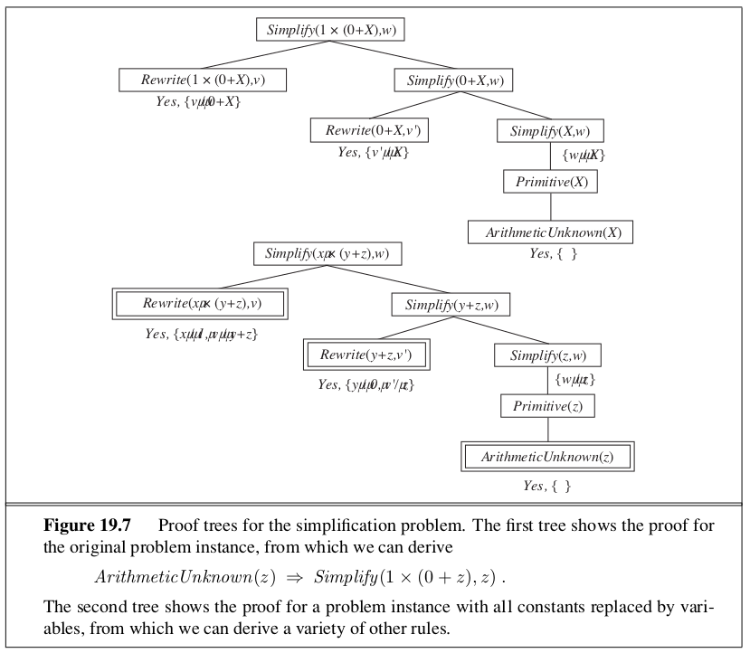

```{r setup, include=FALSE}
knitr::opts_chunk$set(echo = TRUE)
```

_In which we examine the problem of learning when you know something already._

In this chapter, we study learning methods that can take advantage of prior knowledge of the world. 

# 19.1 | A Logical Formulation of Learning

Here, instead of finding a hypothesis that agrees with the observed samples, we seek a hypothesis represented by a set of logical sentences. We wish to find a hypothesis that classifies the examples well and generalizes well to new examples. We are concerned with hypothesis $h_j$ expressed in the form:

\begin{center}
$\forall x \quad Goal(x) \iff C_j (x)$
\end{center}

where $C_j (x)$ is a candidate definition - some expression involving attribute predicates.

The learning algorithm believes only one hypothesis, $h_1 \lor h_2 \lor ... \lor h_n$ is correct. As the examples arrive, hypotheses that are not **consistent** with the examples can be ruled out. For a hypotheses to be inconsistent,

  - It can be a **false negative** for the hypothesis, if the hypothesis says it should be negative but in fact it is positive.
  - It can be a **false positive** if it should be positive but it is in fact negative
  
Here are two approaches to find logically consistent hypotheses without much effort: 

## 19.1.2 | Current Best Hypothesis Search

The idea behind **current best hypothesis search** is to maintain a single hypothesis, and to adjust it as new examples arrive in order to maintain consistency. Taking each new sample into context for the hypotheses is a form of **generalization**. If we remove segments of the hypothesis space, it is called **specialization**.


With a large number of examples and a large hypothesis space, some difficulties arise: 

1. Checking all the previous examples over again for each modification is very expensive
2. The search process may involve a great deal of backtracking. 

## 19.1.3 | Least Commitment Search

Backtracking arises because the current best hypothesis approach has to choose a particular hypothesis as its best guess even though it does not have enough data yet to be sure of the choice. We can choose to only keep around the hypotheses which are consistent with the data so far. As various hypotheses are found to be inconsistent with the examples, the disjunction shrinks, retaining only those hypotheses not ruled out. The set of hypotheses remaining is called the **version space**, and the learning algorithm is called the version space learning algorithm (or the **candidate elimination** algorithm). 

In order to deal with the enormous hypothesis space, we can take advantage of the fact that we have an ordering on the hypothesis space, generalization / specialization. This is a partial ordering, meaning each boundary will not be a point, but a set of hypotheses called a **boundary set**. We can represent the entire version space using two boundary sets: a general boundary set (the **G-set**) and a specific boundary (the **S-set**). Everything in between is guaranteed to be consistent with the examples. 


We initially set the G-set to True (containing all hypotheses) and the S-set to False (containing no hypotheses). For each new sample, we check if it is a true positive, false positive, true negative or false negative. We continue these operations for each new sample until one of 3 things happens: 

1. We have one hypothesis left in the version space
2. The version space collapses - either S or G becomes empty indicating there are no consistent hypotheses for the training set
3. We run out of examples and several hypotheses remain in the version space. 

There are a few drawbacks to the version space approach:

  - If the domain contains noise or insufficient attributes for exact classification, the version space will always collapse
  - If we allow unlimited disjunction in the hypothesis space, the S-set will always contain a single most specific hypothesis, namely the disjunction of the descriptions of the positive examples seen to date. Similarly, the G-set will contain just the negation of the disjunction of the descriptions of the negative examples
  - For some hypothesis spaces, the number of elements in the S-set or G-set may grow exponentially in the number of attributes
  
No solution has been found for noise as of yet. The problem of disjunction can be addressed by allowing only limited forms of disjunction or by including a **generalization hierarchy** of more general predicates.

# 19.2 | Knowledge in Learning 

Let $Descriptions$ denote the conjunction of all the example descriptions in the training set, and let $Classifications$ denote the conjunction of all the example classifications. Then a $Hypothesis$ that "explains the observations" must satisfy the following property: 

\begin{center}
$Hypothesis \land Descriptions \models Classifications$
\end{center}

This kind of relationship is called an **entailment constraint**, in which the hypothesis is the unknown.

The generalization process known as **explanation based learning**, or EBL, satisfies the following entailment constraints:

\begin{center}
$Hypothesis \land Descriptions \models Classifications$

$Background \models Hypothesis$
\end{center}

It was initially thought that EBL was a way to learn from examples, but because it requires background knowledge to be sufficient to explain the hypothesis, which in turn explains the observations, the agent does not actually learn anything factually new from the example. The agent could have derived the example from what it already knew (regardless of the amount of computation that may require). EBL is now viewed as a method for converting first principle theories into useful, special purpose knowledge.

In **Relevance Based Learning** RBL, the prior knowledge background concerns the relevance of a set of features to the goal predicate. This knowledge, together with the observations, allows the agent to infer a new, general rule that explains the observations:

\begin{center}
$Hypothesis \land Descriptions \models Classifications$

$Background \land Descriptions \land Classifications \models Hypothesis$
\end{center}

While RBL does make use of the content of the observations, it doesn't produce hypotheses that go beyond the logical content of the background knowledge and the observations. It is a deductive form of learning and by itself cannot account for the creation of new knowledge starting from scratch. 

In **Knowledge Based Learning** KBIL, the background knowledge and the new hypothesis combine to explain the examples. The learning algorithm should propose hypotheses that are as simple as possible, consistent with the constraint. The entailment constraint is 

\begin{center}
$Background \land Hypothesis \land Descriptions \models Classifications$
\end{center}

KBIL algorithms are studied mainly in the field of **inductive logic programming** (ILP). In ILP systems, prior knowledge plays 2 key roles:

1. Since any hypothesis generated must be consistent with prior knowledge and new observations, the effective hypothesis size is reduced to include only those theories that are consistent with what is already known
2. For any given set of observations, the size of the hypothesis required to construct an explanation for the observations can be reduced, because the prior knowledge will be available to help out the new rules in explaining the observations. The smaller the hypothesis, the easier it is to find. 

# 19.3 | Explanation Based Learning

Explanation based learning is a method for extracting general rules from individual observations. The technique of **memoization** speeds up programs by saving the results of computation by accumulating a database of input-output pairs. Explanation based learning takes this farther by creating general rules that cover an entire class of cases. Alfred North Whitehead and Bertrand Russell wrote _Civilization advances by extending the number of important operations that we can do without thinking about them._ 

## 19.3.1 | Extracting General Rules from Examples 

The basic idea behind EBL is to first construct an explanation of the observation using prior knowledge, and then to establish a definition of the class of cases for which the same explanation structure can be used. The explanation can be a logical proof, but more generally it can be any reasoning or problem solving process whose steps are well defined. The EBL method constructs two proof trees simultaneously. The second tree uses a _variabilized goal_ in which the constants from the original goal are replaced by variables. As the original proof proceeds, the variabilized proof proceeds in step, using exactly the same rule applications. 



The basic EBL process works as follows: 

1. Given an example, construct a proof that the goal predicate applies to the example using the available background knowledge
2. In parallel, construct a generalized proof tree for the variabilized goal using the same inference steps as in the original proof
3. Construct a new rule whose left-hand side consists of the leaves of the proof tree and whose right hand side is the variabilized goal (after applying the necessary bindings from the generalized proof)
4. Drop any conditions from the left hand side that are true regardless of the values of the variables in the goal

## 19.3.2 | Improving Efficiency

There are many possible rules from a generalized proof tree. The choice of which rule to generate comes down to efficiency. There are three factors involved in the analysis of efficiency gains from EBL: 

1. Adding a large number of rules can slow down the reasoning process, because the inference mechanism must still check those rules even in cases where they do not yield a solution. In other words, it increases the branching factor in the search space. 
2. To compensate for the slowdown in reasoning, the derived rules must offer significant increases in speed for the cases that they do not cover. These increases come about mainly because the derived rules avoid dead ends that would otherwise be taken, but also because they shorten the proof itself.
3. Derived rules should be as general as possible, so that they apply to the largest possible set of cases.

A way to ensure that derived rules are efficient is to insist on the **operationality** of each subgoal in the rule. A subgoal is operational if it is easy to solve. If a test for operationality is carried out at each step in the construction of the generalized proof, then we can prune the rest of a branch as soon as an operational subgoal is found, keeping just the operational subgoal as a conjunct of the new rule. 

Empirical analysis of efficiency is at the heart of EBL. What is considered the efficiency of a given knowledge base is the average case complexity on a distribution of problems. By generalizing from past example problems, EBL makes the knowledge base more efficient for the kind of problems that it is reasonable to expect. 

## 19.4 | Learning Using Relevance Information

Suppose we have the sentence "If $x$ and $y$ have the same nationality $n$ and $x$ speaks language $l$, then $y$ also speaks it". Sentences like these express a strict form of relevance: given nationality, language is fully determined. These sentences are called **functional dependencies** or **determinations**. 

## 19.4.1 | Determining the Hypothesis Space

The main effect of determinations can be seen as limiting the space of hypotheses that the learning agents must consider. Determinations specify a sufficient basis vocabulary from which to construct hypotheses concerning the target predicate. 

## 19.4.2 | Learning and Using Relevance Information

In order to provide a complete story of relevance based learning, we must provide a learning algorithm for determinations. We wish to find the simplest determination consistent with the observations. A determination $P \succ Q$ says that if any examples match on $P$, then they must also match on $Q$. A determination is therefore consistent with a set of examples if every pair that matches on the predicates on the left hand side also matches on the goal predicate. 

There are several algorithms for finding minimal consistent determinations. The most obvious one is to conduct a search through the space of determinations, checking all determinations with one predicate, two predicates, and so on, until a consistent determination is found. 

This section has only scratched the surface of the field of **declarative bias**, which aims to understand how prior knowledge can be used to identify the appropriate hypothesis space within which to search for the correct target definition. 

# 19.5 | Inductive Logic Programming
 
Inductive Logic Programming combines inductive methods with the power of first order representations, concentrating on the representation of hypotheses as logic programs. It has gained popularity for 3 reasons:

1. It offers a rigorous approach to general knowledge based inductive learning problems 
2. It offers complete algorithms for inducing general, first order theories from examples, which can learn successfully in domains where attribute-based algorithms are hard to apply. First order logic is an appropriate language for describing relationships.
3. Inductive logic programming produces hypotheses that are relatively easy for humans to read.

## 19.5.2 | Top-Down Inductive Learning Methods 

The first approach to ILP works by starting with a very general rule and gradually specializing it so that it fits the data. This is essentially what happens in decision tree learning. To do ILP we use first order literals instead of attributes, and the hypothesis is a set of clauses instead of a decision tree.

## 19.5.3 | Inductive Learning with Inverse Deduction

The second major approach to ILP involves inverting the normal deductive proof process. **Inverse Resolution** is based on the observation that if the example $Classifications$ follow from $Background \land Hypothesis \land Descriptions$, then one must be able to prove this fact by resolution (since resolution is complete). If we can run the proof backward, then we can find a hypothesis such that the proof goes through.

Inverse resolution involves a search. Each step is nondeterministic, because for any clause $C$, there can be many or even an infinite number of clauses $C_1$ and $C_2$ which resolve to $C$. Furthermore, the clauses that participate in each step can be chosen from the Background knowledge, from the example Descriptions, from the negated Classifications, or from hypothesized clauses that have already been generated in the inverse resolution tree. The large number of possibilities means a large branching factor (and therefore an inefficient search) without additional controls. 

A number of approaches to taming the search have been tried in implemented ILP systems:

1. Redundant choices can be elimiated - for example, by generating only the most specific hypotheses possible and by requiring that all the hypothesized clauses be consistent with each other, and with the observations. 
2. The proof strategy can be restricted. For example, we could use **linear resolution** (see Ch 9), which is a complete, restricted strategy that produces proof trees that have a linear branching structure in which the whole tree follows on line, with single clauses branching off that line. 
3. The representation language can be restricted. For example, we could eliminate function symbols, or only allow Horn clauses. 
4. Inference can be done using model checking rather than theorem proving. 
5. Inference can be done with ground propositional clauses rather than in first order logic. 

# 19.6 | Summary 

- The use of prior knowledge in learning leads to a picture of **cumulative learning**, in which learning agents improve their learning ability as they acquire more knowledge.

- Prior knowledge helps learning by eliminating otherwise consistent hypotheses and by filling in the explanation of examples, thereby allowing for shorter hypotheses. These contributions often result in faster learning from fewer examples. 

- Understanding the different logical roles played by prior knowledge, as expressed by entailment constraints, helps to define a variety of learning techniques.

- Explanation based learning extracts general rules from single examples by explaining the examples and generalizing the explanation. It provides a deductive method for turning first principles knowledge into useful, efficient, special-purpose expertise.

- Relevance based learning uses prior knowledge in the form of determinations to identify the relevant attributes, thereby generating a reduced hypothesis space and speeding up learning. RBL also allows deductive generalizations from single examples.

- Knowledge based inductive learning finds inductive hypotheses that explain sets of observations with the help of background knowledge.

- Inductive logic programming techniques perform KBIL on knowledge that is expressed in first order logic. ILP methods can learn relational knowledge that is not expressed in attribute-based systems.

- ILP can be done with a top down approach of refining a very general rule or through a bottom up approach of inverting the deductive process.

- ILP methods naturally generate new predicates with which concise new theories can be expressed and show promise as general purpose scientific theory formation systems.

