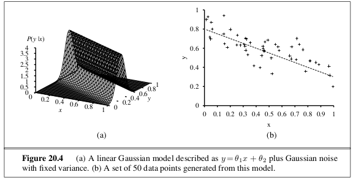
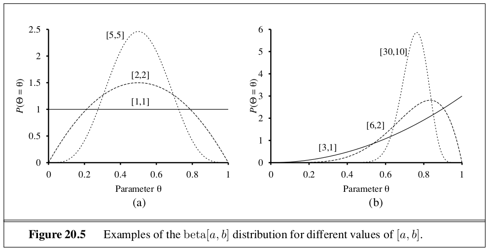
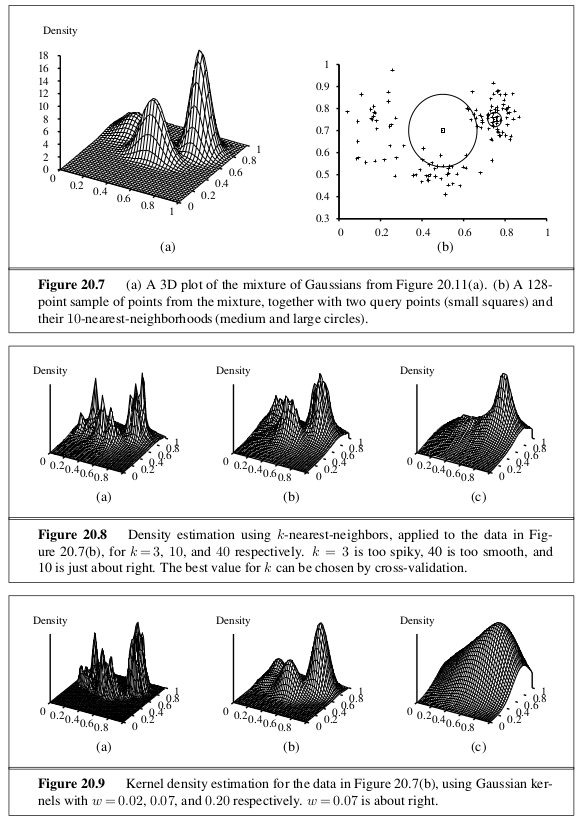

```{r setup, include=FALSE}
knitr::opts_chunk$set(echo = TRUE)
```

_In which we view learning as a form of uncertain reasoning from observations._

# 20.1 | Statistical Learning 

**Bayesian Learning** calculates the probability of each hypothesis, given the data, and makes predictions on that basis. The predictions are made using all the hypotheses, weighted by their probabilities, rather than by using just a single best hypothesis. 

Let $D$ represent all the data, with observed value $d$; then the probability of each hypothesis is obtained by Baye's rule: 

\begin{center}
$P(h_i | d) = \alpha P(d | h_i) P(h_i)$
\end{center}

If we wish to make a prediction about an unknown quantity $X$, we have 

\begin{center}
$P(X | d) = \sum\limits_i P(X | d, h_i) P(h_i | d) = \sum\limits_i P(X | h_i) P(h_i | d)$
\end{center}

where we have assumed that each hypothesis determines a probability distribution over $X$. 

A very common approximation is to make predictions based on a single most probable hypothesis - that is, an $h_i$ that maximizes $P(h_i | d)$. This is often called a **maximum a posteriori** or MAP hypothesis. Finding MAP hypotheses is often easier than Bayesian learning because it requires solving an optimization problem instead of a large summation or integration problem. 

In order to prevent overfitting, Bayesian and MAP learning methods use a prior to penalize complexity. More complex hypothesis have a lower prior probability, but also a greater capacity to fit the data. An insight into the tradeoff between complexity and degree of fit is obtained by taking the log of the first equation above. Choosing $h_{MAP}$ to maximize it is equivalent to minimizing

\begin{center}
$- \log_2 P(d | h_i) - \log_2 P(h_i)$
\end{center}

Using the connection between information encoding and probability, we see that the $- \log_2 P(h_i)$ term equals the number of bits required to specify the hypothesis $h_i$. Therefore MAP learning is choosing the hypothesis that provides maximum compression of the data. The same task is addressed more directly by the **minimum description length**, or MDL learning method. While MAP learning expresses simplicity by assigning higher probabilities to simpler hypotheses, MDL expresses it directly by counting the bits in a binary encoding of the hypothesis and data. 

Finally, if we were to assign a uniform prior over the space of hypotheses, MAP learning reduces to choosing an $h_i$ that maximizes $P(d | h_i)$ - the **maximum likelihood**.

# 20.2 | Learning with Complete Data

The general task of learning a probability model, given data that are assumed to be generated from that model, is called **density estimation**. This section covers the simplest case, where we have **complete data**. 

## 20.2.1 | Maximum Likelihood Parameter Learning: Discrete Models 

Standard method for maximum likelihood parameter learning: 

1. Write down an expression for the likelihood of the data as a function of the parameters
2. Write down the derivative of the log likelihood with respect to each parameter
3. Find the parameter values such that the derivatives are zero

A significant problem with maximum likelihood learning in general: When the data is small enough that some events have not yet been observed, the maximum likelihood assigns zero probability to those events. 

With complete data, the maximum likelihood parameter learning problem for a Bayesian network decomposes into seperate learning problems, one for each parameter. 

## 20.2.2 | Naive Bayes Models

The Naive Bayes Model is a common Bayesian network model, in which the class variable $C$ (which is to be predicted) is the root and the attribute variables $X_i$ are the leaves. The model is naive because it assumes that the attributes are conditionally independent of each other, given the class.

With observed attributes $x_1, ..., x_n$, the probability of each class if given by 

\begin{center}
$P(C | x_1, ..., x_n) = \alpha P(C) \prod\limits_i P(x_i | C)$
\end{center}

Naive Bayes tends to do well on a wide range of applications. The boosted version is a very effective general purpose learning algorithm. It also scales very well to large problems: with $n$ Boolean attributes, there are just $2n + 1$ parameters, and no search is required to find $h_{ML}$, the maximum likelihood naive Bayes hypothesis. 

## 20.2.3 | Maximum Likelihood Parameter Learning: Continuous Models

The principles for maximum likelihood learning are identical in the continuous and discrete cases. 



Consider a linear Gaussian model with one continuous parent $X$ and a continuous child $Y$. Let $Y$ have a Gaussian distribution whose mean depends linearly on the value of $X$ and whose standard deviation is fixed. 

To learn the conditional distribution $P(Y | X)$ we can maximize the conditional likelihood

\begin{center}
$P(y | x) = \frac{1}{\sqrt{2 \pi} \sigma} e^{- \frac{(y - (\theta_1 x + \theta_2))^2}{2 \sigma^2}}$
\end{center}

If we consider just the parameters $\sigma_1$ and $\sigma_2$ that define the linear relationship between $x$ and $y$, then it becomes clear that maximizing the log likelihood is the same as minimizing the numerator $(y - (\theta_1 x + \theta_2))^2$. This is the $L_2$ loss, the squared error between the actual value $y$ and the prediction $\theta_1 x + \theta_2$. This is the quantity minimized by the standard **linear regression** procedure. Minimizing the sum of squared errors gives the maximum likelihood, straight line model, provided that the data are generated with Gaussian noise of fixed variance. 

## 20.2.4 | Bayesian Parameter Learning

The Bayesian approach to parameter learning starts by defining a prior probability distribution over the possible hypotheses, and then, as data arrives, the posterior probability distribution is updated. In the Bayesian view, $\theta$ is the unknown value of a random variable $\Theta$ that defines the hypothesis space; the hypothesis prior is just the prior distribution $P(\Theta)$. If the parameter $\theta$ can be any value between 0 and 1, then $P(\Theta)$ must be a continuous distribution that is nonzero only between 0 and 1 and that integrates to 1. The uniform distribution is a candidate, which is a member of the family of **beta distributions**:

\begin{center}
$\mathrm{beta}[a, b](\theta) = \alpha \theta^{a - 1}(1 - \theta)^{b-1}$
\end{center}



Besides its flexibility, the beta family has another wonderful property: If $\Theta$ has a prior beta[a, b], then, after a data point is observed, the posterior distribution for $\Theta$ is also a beta distribution. In other words, beta is closed under update and the beta family is the **conjugate prior** for the family of distributions for a Boolean variable. 

## 20.2.6 | Density Estimation with Nonparametric Models 


The task of **nonparametric density estimation** makes it possible to learn a probability model without taking any assumptions about its structure and paramterization. It is typically done in continuous domains. 

In **k nearest neighbors** models: 

Given a sample of data points, we wish to estimate the unknown probability density at a query point x. We do this by measuring the density of data points in the neighborhood of x. 

Another choice is to use **kernel functions**. To apply a kernel model to density estimation, we assume that each data point generates its own density function, using a Gaussian kernel. The estimated density at a query point x is then the average density as given by each kernel function: 

\begin{center}
$P(x) = \frac{1}{N} \sum\limits_{j = 1}^{N} \mathcal{K}(x, x_j)$
\end{center}

We can assume spherical Gaussians with standard deviation $w$ along each axis:

\begin{center}
$\mathcal{K}(x, x_j) = \frac{1}{(w^2 \sqrt{2 \pi})^d}e^{- \frac{D(x, x_j)^2}{2 w^2}}$
\end{center}

where $d$ is the number of dimensions in x and $D$ is the Euclidean distance function. Then we must choose a suitable value for kernel width $w$, which can be found via cross validation. 




# 20.3 | Learning with Hidden Variables: The EM Algorithm

The preceding section dealt with the fully observable case. Many real world problems have **hidden variables** (sometimes called **latent variables**), which are not observable in the data that are available for learning. Latent variables can dramatically reduce the number of parameters required to specify a Bayesian network. This, in turn, can dramatically reduce the amount of data needed to learn the parameters. 

## 20.3.1 | Unsupervised Clustering: Learning Mixtures of Gaussians 

Unsupervised clustering begins with data. Then we need to understand what kind of probability distribution might have generated the data. Clustering presumes that the data are generated from a **mixture distribution**, $P$. Such a distribution has $k$ components, each of which is a distribution in its own right. 

Let the random variable $C$ denote the component, with values $1, ..., k$. Then the mixture distribution is given by 

\begin{center}
$P(x) = \sum\limits_{i = 1}^k P(C = i) P(x | C = i)$
\end{center}

where $x$ refers to the values of the attributes for a data point. For continuous data, a natural choice for the component distributions is the multivariate Gaussian, which gives the **mixture of Gaussians** family of distributions. 

The basic idea of EM in the context of Gaussian mixture models is to pretend that we know the parameters of the model and then to infer the probability that each data point belongs to each component. After that, we refit the components to the data, where each component is fitted to the entire data set with each point weighted by the probability that it belongs to that component. The process iterates until convergence. 

We initialize the mixture model parameters arbitrarily, and then iterate the following two steps: 

1. **E-step**: Compute the probabilities $p_{ij} = P(C = i|x_j)$, the probability that datum $x_j$ was generated by component $i$. By Bayes' rule, we have $p_{ij} = \alpha P(x_j | C = i) P(C = i)$. Define $n_i = \sum_j p_{ij}$, the effective number of data points currently assigned to the component $i$. 

2. **M-step**: Compute the new mean, covariance, and component weights using the following steps in sequence: 

\begin{center}

$\mu_i \gets \sum\limits_j \frac{p_{ij}x_j}{n_i}$

$\Sigma_i \gets \sum\limits_j \frac{p_{ij} (x_j - \mu_j)(x_j - \mu_i)^T}{n_i}$

$w_i \gets \frac{n_i}{N}$

\end{center}

where $N$ is the total number of data points. 

The Expectation steo can be viewed as computing the expected values $p_{ij}$ of the hidden **indicator variables** $Z_{ij}$, where $Z_{ij}$ is 1 if datum $x_j$ was generated by the $i$th component, and 0 otherwise.

The Maximization step finds new values of the parameters that maximize the log likelihood of the data, given the expected values of the hidden indicator variables. 


## 20.3.2 | Learning Bayesian Networks with Hidden Variables 

Parameter updates for Bayesian network learning with hidden variables are directly available from the results of inference on each example. Moreover, only local posterior probabilities are needed for each parameter.

## 20.3.3 | Learning Hidden Markov Models 

We can also used EM to learn the transition probabilities in Hidden Markov Models. A Hidden Markov Model can be represented by a dunamic Bayes net with a single discrete state variable. Each data point consists of an observation sequence of finite length, so the problem is to learn the transition probabilities from a set of observation sequences (or one long sequence).

In Bayes nets, each parameter is distinct. In a HMM, the individual transition probabilities from state $i$ to state $j$ at time $t, \theta_{ijt} = P(X_{t+1} = j | X_t = i)$, are repeated across time - that is $\theta_{ijt} = \theta_{ij}$ for all $t$. To estimate the transition probability from state $i$ to state $j$, we simply calculate the expected proportion of times that the system undergoes a transition to state $j$ when in state $i$: 

\begin{center}

$\theta_{ij} \gets \frac{\sum\limits_t \hat{N}(X_{t+1} = j, X_t = i)}{\sum\limits_t \hat{N}(X_t = i)}$

\end{center}

The expected counted are computed by an HMM inference algorithm. The forward backward algorithm can be modified very easily to compute the necessary probabilities. One important point is that the probabilities are obtained by smoothing rather than filtering. We need to pay attention to subsequeny evidence in estimating the probability that a particular transition has occurred. 


## 20.3.4 | The General Form of the EM Algorithm

Let $x$ be all the observed values in all the examples, let $Z$ denote all the hidden variables for all the examples, and let $\theta$ be all the parameters for the probability model. Then the EM algorithm is 

\begin{center}
$\theta^{(i + 1)} = \arg\max\limits_\theta \sum\limits_z P(Z = z | x, \theta^{(i)}) L(x, Z = z | \theta)$
\end{center}


# 20.4 | Summary

- Bayesian learning methods formulate learning as a form of probabilistic inference, using the observations to update a prior distribution over hypotheses. This approach provides a good way to implement Ockham's razor, but quickly becomes intractable for complex hypothesis spaces.

- Maximum A Posteriori learning selects a single most likely hypothesis given the data. The hypothesis prior is still used and the method is often more tractable than full Bayesian learning.

- Maximum Likelihood learning simply selects the hypothesis that maximizes the likelihood of the data. It is equivalent to MAP learning with a uniform prior. In simple cases such as linear regression and fully observable Bayesian networks, maximum likelihood solutions can be found easily in closed form. Naive Bayes learning is a particularly effective technique that scales well.

- When some variables are hidden, local maximum likelihood solutions can be found using the EM algorithm. Applications include clustering using mixtures of Gaussians, learning Bayesian networks, and learning Markov models.

- Learning the structure of Bayesian networks is an example of model selection. This usually involves a discrete search in the space of structures. Some method is required for trading off model complexity against degree of fit. 

- Nonparametric models represent a distribution using the collection of data points. Thus, the number of parameters grows with the training set. Nearest neighbors methods look at the examples nearest the point in question, whereas kernel methods form a distance weighted combination of all the examples. 


