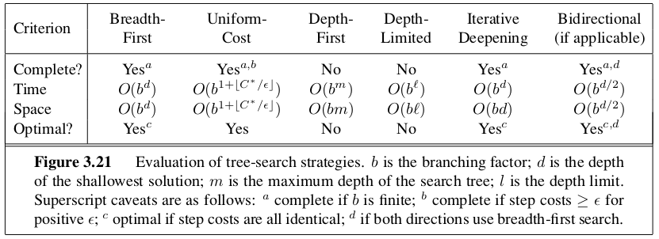

```{r setup, include=FALSE}
knitr::opts_chunk$set(echo = TRUE)
```


_In which we see how an agent can find a sequence of actions that achieves its goals when no single action will do_

This chapter describes one kind of a goal-based agent called a **problem solving agent**. They use atomic representations of the states of the world with no internel representations. Goal based agents that use more advanced factored or structured representations are usually called planning agents. 

# 3.1 | Problem Solving Agents 

Goals help organize behavior by limiting the objectives that the agent is trying to achieve and hence the actions it needs to consider. 

**Goal Formulation** is the first step in problem solving. 
**Problem Formulation** is the process of deciding what actions and states to consider, given a goal. 

The process of looking for a sequence of actions that reaches the goal is called **search**. A search algorithm takes a problem as an input and returns a solution in the form of an action sequence. Once a solution is found, the actions in reccommends can be carried out. 
When an agent is executing its solution sequence, it _ignores its percepts_ when choosing an action because it knows in advance what it will be. An agent that carries out its plans like this essentially has its eyes closed. Control theorists call this an **open loop system**, because ignoring the percepts breaks the loop between agent and environment. 

## 3.1.2 | Formulating Problems 

We wish to abstract the problem as much as possible while retaining validity and ensuring that the abstract actions are easy to carry out. 

# 3.2 | Example Problems 

We must pay attention to the 

* states 
* initial state 
* actions 
* transition model 
* goal test 
* path cost 

for each problem that an agent seeks to solve. 

An interesting toy problem is given by Donald Knuth, ,in order to illustrate how infinite state spaces can arise. 

Knuth conjectured that, starting with the number 4, a sequence of factorial, square root, and floor operations will reach _any_ desired positive integer. For example

\begin{center}
  $\lfloor \sqrt{\sqrt{\sqrt{\sqrt{\sqrt{(4!)!}}}}}\rfloor = 5$
\end{center}

The problem definition is simple: 

* States: positive numbers 
* initial state: 4
* actions: apply factorial, square root, or floor operation 
* transition model: As given by the mathematical definitions of the operations 
* goal test: State is the desired positive integer 

As far as we know, there is no bound on how large a number might be constructed in the process of reaching a given target. For example, the number 620,448,401,733,239,439,360,000 is generated in the expression for 5 - so the state space for this problem is infinite. Such state spaces arise frequently in tasks involving the generation of mathematical expressions, circuits, proofs, programs, and other recursively defined objects. 

## 3.2.2 | Real-World Problems 

**Route-finding problems** are defined in terms of specified locations and transitions along links between them. 

**Touring Problems** are closely related to route finding problems, but with one distinct difference. The state space for these problems includes not just the current states, but a list of each state visited. The **traveling salesperson** problem is a touring problem in which each city must be visited exactly once, and the aim is to find the shortest tour. 

# 3.3 | Searching for Solutions 

A solution is an action sequence, so search algorithms work by considering various possible action sequences. These form a **search tree** with the initial state at the root; the branches are actions and the nodes correspond to states in the state space of the problem. 

The first step is to test whether this is the goal state. Then we need to consider taking various actions. We do this by **expanding**
the current state; that is, applying each legal action to the current state, thereby generating a new set of states. Then we must choose which of the new possibilities to consider. 

This is the essence of search - following up one option now and putting the others aside for later, in case the choice does not lead to a solution. The set of all leaf nodes available for expansion at any given point is called the **frontier**. The process of expanding nodes on the frontier is continued until either a solution is found or there are no more states to expand. 

If a set of nodes recursively refers to a node that was phased out in previous tiers of the tree, we have a **loopy path**. This can vastly expand our state space and can often make tractable problems intractable. Therefore, when we use trees we augment them with the **explored set** data structure to avoid exploring redundant paths. There is a saying, "algorithms that forget their history are doomed to repeat it." 

## 3.3.1 | Infrastructure for Search Algorithms 

Search algorithms require a data structure to keep track of the search tree that is being constructed. For each node $n$ of the tree, we have a structure that contains four components: 

* n.State: the state in the state space to which the node corresponds 
* n.Parent: The node in the search tree that generated this node 
* n.Action: The action that was applied to the parent to generate the node 
* n.Path-Cost: The cost, traditionally denoted by g(n) of the path from the initial state to the node, as indicated by the parent pointers. 

## 3.3.2 | Measuring problem-solving performance 

We evaluate an algorithms performance in 4 ways: 

* Completeness 
* Optimality 
* Time Complexity 
* Space Complexity 

# 3.4 | Uninformed Search Strategies 


Uninformed Search Strategies have no additional information about the states beyond that provided in the problem definition. All they can do is generate successors and distinguish a goal state from a non-goal state. 

All search strategies are distinguished by the order in which nodes are expanded. Strategies that know whether one non-goal state is more promising than another are called **informed search** or **heuristic search** strategies. 

## 3.4.1 | Breadth-First Search

**Breadth-First Search** is a simple strategy in which the root node is expanded first, then all the successors of the root node are expanded next, then their successors, and so on. BFS is an instance of the general graph search algorithm in which the _shallowest_ unexpanded node is chosen for expansion. This is achieved by using a FIFO queue for the frontier. 

There is one slight tweak on the general graph search algorithm, which is that the goal test is applied to each node when it is generated rather than when it is selected for expansion. BFS always has the shallowest path to every node on the frontier. Shallow is not always optimal - but in this case it is optimal if the path cost is a nondecreasing function of the depth of the node. 

BFS has an exponential complexity bound of $O(b^d)$. If we assume 1 node is 1000 bytes, the memory requirements are intractable for BFS. 

## 3.4.2 | Uniform-Cost Search 

When all step costs are equal, breadth first search is optimal because it always expands the _shallowest_ unexpanded node. By a simple extension, we can find an algorithm that is optimal with any step-cost function. Instead of expanding the shallowest node, **uniform-cost search** expands the node $n$ with the lowest path cost $g(n)$. This is done by storing the frontier as a priority queue ordered by $g$. 

In this case, the goal test is applied to a node when it is _selected for expansion_ rather than when it is first generated. A test is also added in case a better path is found to a node currently on the frontier. Because steps are non-negative, paths never get shorter as nodes are added. This implies that uniform cost search expands nodes in order of their optimal path cost. Hence the first goal node selected for expansion must be the optimal solution. 

Uniform cost search is guided by path costs rather than depths. Let $C^*$ be the cost of the optimal solution and assume that every action costs at least $\epsilon$. Then the worst case time and space complexity is $O(b^{1 + \lfloor \frac{C^*}{\epsilon}\rfloor})$, which can be much greater than $b^d$. When all step costs are equal, we get $O(b^{d + 1})$. 

When all step costs are the same, uniform cost search is similar to BFS, except that the latter stops once it generates a goal and UCS examines all the nodes at the goals depth to see if one has a lower cost. Therefore UCS does strictly more work by expanding nodes at depth $d$ unnecessarily.

## 3.4.3 | Depth First Search 

Depth First Search always expands the _deepest_ node in the current frontier of the search tree. As these nodes are expanded, they are dropped from the frontier, so then the search backs up to the next deepest node that still has unexplored successors. 

While BFS uses a FIFO queue, DFS uses a LIFO queue (a stack). As an alternative to the graph search style implementation, it is common to implement depth first search with a recursive function that calls itself on each of its children in turn. 

The properties of DFS depend strongly on whether the graph search or tree search version is used. The Graph Search version, which avoids repeated states and redundant paths, is complete in finite state spaces because it will eventually expand every node. 

The tree search version is _not_ complete. DFTS can be modified at no extra memory cost so that it checks new states against those on the path from the root to the current node; this avoids infinite loops in finite state spaces, but does not avoid the proliferation of redundant paths. 

In infinite state spaces, both versions fail if an infinite non-goal path is encountered. 

The time complexity of DFGS is bounded by the size of the state space (which may be infinite). A DFTS may generate all of the $O(b^m)$ nodes in the search tree, where $m$ is the maximum depth of any node; This can be much greater than the size of the state space. 

DFS is not particularly better than BFS in terms of time complexity, but it does well in space complexity. For a DFGS there is no advantage, but a depth first tree search needs to store only a single path from the root to a leaf node, along with the remaining unexpanded sibling nodes for each node on the path. 

For a state space with branching factor $b$ and maximum depth $m$, depth first search requires storage of only $O(bm)$ nodes. This is important, because when we looked at BFS the memory requirements were enormous. As a comparison, BFS uses 10 exabytes at depth $d = 16$ and DFTS uses only 156 kilobytes. This is a factor of 7 trillion times less space. 

This has lead to DFS being the basic workhorse of many areas of AI, including **constraint satisfaction**, **propositional satisfiability**, and **logic programming**. 

A variant of DFS called **Backtracking Search** uses even less memory. In backtacking, only one successor is generated at a time rather than all successors; each partially expanded node remembers which successor to generate next. In this way, only $O(m)$ memory is needed rather than $O(bm)$. 

## 3.4.4 | Depth Limited Search 

The inabulity of DFS to handle infinite state spaces can be alleviated by supplying DFS with a predetermined path limit $l$. That is, nodes at depth $l$ are treated as if they have no successors. This is called **depth limited search**. 

Unfortunately, if we choose $l < d$, the shallowest goal is beyond the depth limit. 

Its time complexity is $O(b^l)$ and its space complexity is $O(bl)$. We can think of DFS as the special cased of Depth Limited Search where $l = \infty$. 

Sometimes depth limits can be based on knowledge of the problem. We can sometimes find the **diameter** of the state space, which gives us a good depth limit. 

## 3.4.5 | Iterative Deepening Depth First Search 

**Iterative Deepening Search** is a general strategy, often used in combinated with depth first tree search, that finds the best depth limit. It does this by gradually increasing the limit - first 0, then 1, then 2, and so on -- until a goal is found. This occurs when $l \to d$. 

This combined the benefits of DFS and BFS. Like DFS, its memory requirements are $O(bd)$. Like BFS, it is complete when the branching factor is finite and optimal when the path cost is a nondecreasing function of the depth of the node. 

In general, iterative deepening is the preffered uninformed search method when the search space is large and the depth of the solution is not known. 

It is worthwhile to develop an iterative analog to uniform-cost search, inheriting the latter algorithms optimality guarantees while avoiding its memory requirements. The resulting algorithm is called **iterative lengthening search**. Unfortunately, iterative lengthening occurs substantial overhead compared to uniform cost search. 

## 3.4.6 | Bidirectional Search 

The idea behind bidirectional search is to run two simultaneous searches - one forward from the initial state and the other backward from the goal - hoping that the two searches meet in the middle. 

The motivation is that $b^{d/2} + b^{d/2} << b^d$. We could think of this as the area of two small circles being less than the area of one big circle centered on the start and reaching to the goal. 

In BDS we replace the goal test with a check to see whether the frontiers of the two searches intersect. If they do, a solution has been found. It is important to note that the first such solution may not be optimal, even if both the searches are Breadth-First Searches. 

The time and space complexity of bidirectional search using BFS in both directions is $O(b^{d/2})$. We can reduce this by roughly half if one of the two searches is done by iterative deepening, but at least one of the frontiers must be kept in memory so that the intersection check can be done. This space requirement is the most significant weakness of bidirectional search. 

## 3.4.7 | Comparing Uninformed Search Strategies 

[h!]

# 3.5 | Informed (Heuristic) Search Strategies 

This section shows how an **informed strategy** -- one that uses problem-specific knowledge beyond the definition of the problem itself -- can find solutions more efficiently than an uninformed strategy. 

The approach we consider is called **Best First Search**. It is an instance of the general tree search or graph search algorithm, in which a node is selected for expansion based on an **evaluation function**, $f(n)$. The evaluation function is construed as a cost estimate, so the node with the lowest evaluation is expanded first. 

The choice of $f$ determines the search strategy. Most best-first algorithms include as a component of $f$ a **heuristic function**, denoted $h(n)$. 

\begin{center}
  $h(n)$ = estimated cost of the cheapest path from the state at node $n$ to a goal state. 
\end{center}

We study heuristic functions more in 3.6. For now, we consider them to be arbitrary, non negative, problem specific functions with the constraint: if $n$ is a goal node, then $h(n) = 0$. 

## 3.5.1 | Greedy Best First Search 

**Greedy Best First Search** tries to expand the node that is closest to the goal, on the grounds that this is likely to lead to a solution quickly. Thus, it evaluates nodes by using just the heuristic function; $f(n) = h(n)$. 

For example, if we had a route finding problem we could use a straight line distance heuristic to find the distances between nodes and the goal. Then we could proceed by minimizing the distances. 

Greedy Best First Tree Search is incomplete in a finite state space. The worst case time and space complexity for the tree version is $O(b^m)$, where $m$ is the maximum depth of the search space. 

## 3.5.2 | A* Search: Minimizing the Total Estimated Solution Cost 

The most widely known form of best-first search is called **A* Search**. It evaluates nodes by combining $g(n)$, the cost to reach the node, and $h(n)$, the cost to get from the node to the goal. Then 

\begin{center}
  $f(n) = g(n) + h(n) = $ estimated cost of the cheapest solution through $n$. 
\end{center}

Then, if we are trying to find the cheapest solution, a reasonable thing to try first is the node with the lowest value of $g(n) + h(n)$. 

Provided that the heuristic function $h(n)$ satisfies certain conditions, A* search is both complete and optimal. The algorithm is identical to Uniform-Cost Search, except that A* uses $g + h$ instead of $g$. 

### Conditions for Optimality: Admissibility and Consistency 

The first condition required for optimality is that $h(n)$ is an **admissible heuristic**. This is one that _never overestimates_ the cost to reach the goal. Since $g(n)$ is the actual cost to reach $n$ along the current path, we have as an immediate consequence that $f(n)$ never overestimates the true cost of a solution along the current path through $n$. For example, the straight line estimate is the shortest possible estimate because the shortest path between two points is a straight line. Therefore, the straight line heuristic never overestimates the cost. 

A second, slightly stronger condition called **consistency** (or **monotonicity**) is required for applications of A* to graph search. A heuristic $h(n)$ is consistent if, for every node $n$ and every successor $n'$ of $n$ generated by any action $a$, the estimated cost of reaching the goal from $n$ is no greater than the step cost of getting to $n'$ plus the estimated cost of reaching the goal from $n'$: 

\begin{center}
  $h(n) \leq c(n, a, n') + h(n')$
\end{center}
 
This is a form of the general **triangle inequality**. 
 
### Optimality of A* 

The tree search version of A* is optimal is $h(n)$ is admissible, while the graph search version is optimal if $h(n)$ is consistent. 

Proof of the second claim: 

We first want to establish the following: if $h(n)$ is consistent, then the values of $f(n)$ along any path are nondecreasing. This follows directly from the definition of consistency. 

Suppose $n'$ is a successor of $n$. Then $g(n') = g(n) + c(n, a, n')$ for some action $a$. Then we have 

\begin{center}
  $f(n') = g(n') + h(n') = g(n) + c(n, a, n') + h(n') \geq g(n) + h(n) = f(n)$
\end{center}

Thus the values of $f(n)$ along any path are nondecreasing. 

Next we wish to prove that whenever A* selects a node $n$ for expansion, the optimal path to that node has been found. 

If this were not the case, there would be another frontier node $n'$ on the optimal path from the start node to $n$, by the graph seperation property. Because $f$ is nondecreasing along any path, $n'$ would have lower $f$-cost than $n$ and would have been selected first. 

By the two preceding observations, it follows that the sequence of nodes expanded by A* using Graph Search is in nondecreasing order of $f(n)$. Hence, the first goal node selected for expansion must be an optimal solution because $f$ is the true cost for goal nodes (which have $h = 0$) and all later goal nodes will be at least as expensive.  

Since $f$-costs are nondecreasing along any path also means that we can draw **contours** in the state space (like the contours in a topographic map). Since A* expands the frontier node of lowest $f$-cost, we can see that it fans out from the start node, adding nodes in concentric bands of increasing $f$-cost. 

If C* is the cost of the optimal solution path, we can say the following: 

* A* expands all nodes with fn < C\*
* A* mught then expand some of the nodes right on the goal contour (where fn = C\*) before selecting a node. 

Completeness requires that there be only finitely many nodes with cost less than or equal to C*, a condition that is true if all step costs exceed some finite $\epsilon$ and if $b$ is finite.

Among algorithms that extend search paths from the root and use the same heuristic information -- A* is optimally efficient for any given consistent heuristic. No other optimal algorithm is guaranteed to expand fewer nodes than it. This is because any algorithm that does not expand all nodes with $f(n) < C$\* runs the risk of missing the optimal solution. 

The complexity of A* often makes it impractical to insist on finding an optimal solution. One can use variants of it that find suboptimal solutions quickly, or one can sometimes design heuristics that are more accurate but not strictly admissible. In any case, the use of a good heuristic provides enormous savings compared to the use of an uninformed search. 

While time complexity is not A*'s main drawback, space complexity is. For this reason, it is not practical for many large scale problems. 

## 3.5.3 | Memory Bounded Heuristic Search

The simplest way to reduce memory requirements for A\* is to adapt the idea of iterative deepening to the heuristic search context, resulting in the **iterative deepening A* (IDA\*)** algorithm.

The main difference between IDA* and standard iterative deepening is that the cutoff used is the $f$-cost($g+h$) rather than the depth. At each iteration, the cutoff value is the smallest $f$-cost of any node that exceeded the cutoff on the previous iteration. 

IDA* is practical for problems with unit step costs and avoids the substational overhead associated with keeping a sorted queue of nodes. 

It suffers the same difficulties with real valued costs as the iterative version of uniform cost search. 

**Recursive Best First Search** is a simple recursive algorithm that attempts to mimic the operation of standard best first search, but using only linear space. 

It is similar to recursive depth first search, but instead of continuing indefinitely down the current path, it uses an $f$-limit variable to keep track of the $f$-value of the best alternative path available from the ancestor of the current node. If the current node exceeds this limit, the recursion unwinds back to the alternative path. As it unwinds, RBFS replaces the $f-$value of eachnode along the path with a backed up value - the best $f$-value of its children. This way, it remembers the best leaf in a forgotten subtree and can decide whether its worth reexpanding at a later time. 

Like A* Tree Search, RBFS is an optimal algorithm if the heuristic function $h(n)$ is admissible. Its space complexity is linear in the depth of the deepest optimal solution, but its time complexity is difficult to characterize since it depends on both the accuracy of the heuristic function and how often the path changes as nodes are expanded. 

Since IDA* and RFBS use little memory, they forget what they have done and may end up reexpanding the same states many times over. 

If we wish to use all available memory, there are the algorithms MA* (memory bounded A\*) and SMA\* (simplified MA\*). SMA\* proceeds like A\*, expanding the best leaf until memory is full. Then it drops the worst leaf node, the one with the highest f-value.  

In practical terms, SMA* is a fairly robust choice for finding optimal solutions, particularly when the state space is a graph, step costs are not uniform, and node generation is expensive compared to the overhead of maintaining the frontier and the explored set. On very hard problems, it may be the case that SMA\* is forced to switch back and forth continually among many candidate solutions, only a small subset of which can fit in memory. That is to say, memory limitations can make a problem intractable from the point of view of computation time. 

## 3.5.4 | Learning to Search Better 

Can an agent learn to search better? Yes, and the method relies on a concept called the **metalevel state space**. Each state in a metalevel state space captures the internal (computational) state of a program that is searching in an object-level state space (such as a map of romania). 

A **metalevel learning** algorithm can help make better choices regarding the internal computational state of a program. The goal of learning is to minimize the **total cost** of problem solving, trading off computational expense and path cost. 

# 3.6 | Heuristic Functions 

## 3.6.1 | The Effect of Heuristic Accuracy on Performance 

One way to characterize the quality of a heuristic is the **effective branching factor b\*. ** If the total number of nodes generated by A* for a particular problem is $N$ and the solution depth is $d$, then $b$\* is the branching factor that the uniform tree of depth $d$ would have in order to contain $N+1$ nodes. Thus, $N + 1 = 1 + b + b^2 + ... + b^d$. 


## 3.6.2 | Generating Admissible Heuristics from Relaxed Problems 

How might we invent heuristics mechanically? 

If we were to give the problem fewer restrictions (a **relaxed problem**) then our state space graph for our problem would generate a supergraph of the original state space (the removal of restrictions adds more edges to the graph). Because our relaxed supergraph contains all the edges of the original graph, an optimal solution to the original problem is also a solution in the relaxed problem. Hence, the cost of an optimal solution to a relaxed problem is an admissible heuristic for the original problem. 

If we generate many admissible heuristics, we can let our heuristic be $h(n) = \max\{{h_1(n), ..., h_m(n)\}}$.

## 3.6.3 | Pattern Databases 

We can construct databases with sets of heuristics for solving classes of problems. Basically, given some problem, we can store the exact solution costs for every possible subproblem instance. 

## 3.6.4 | Learning Heuristics from Experience 

We can learn optimal solutions by using data on solving many instances of a problem. Then, from that data, we can construct models which allow us to predict future states. 


