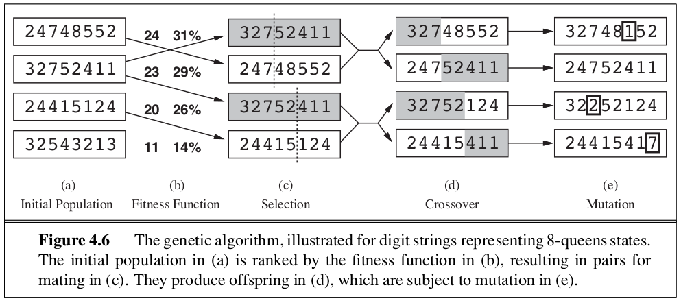
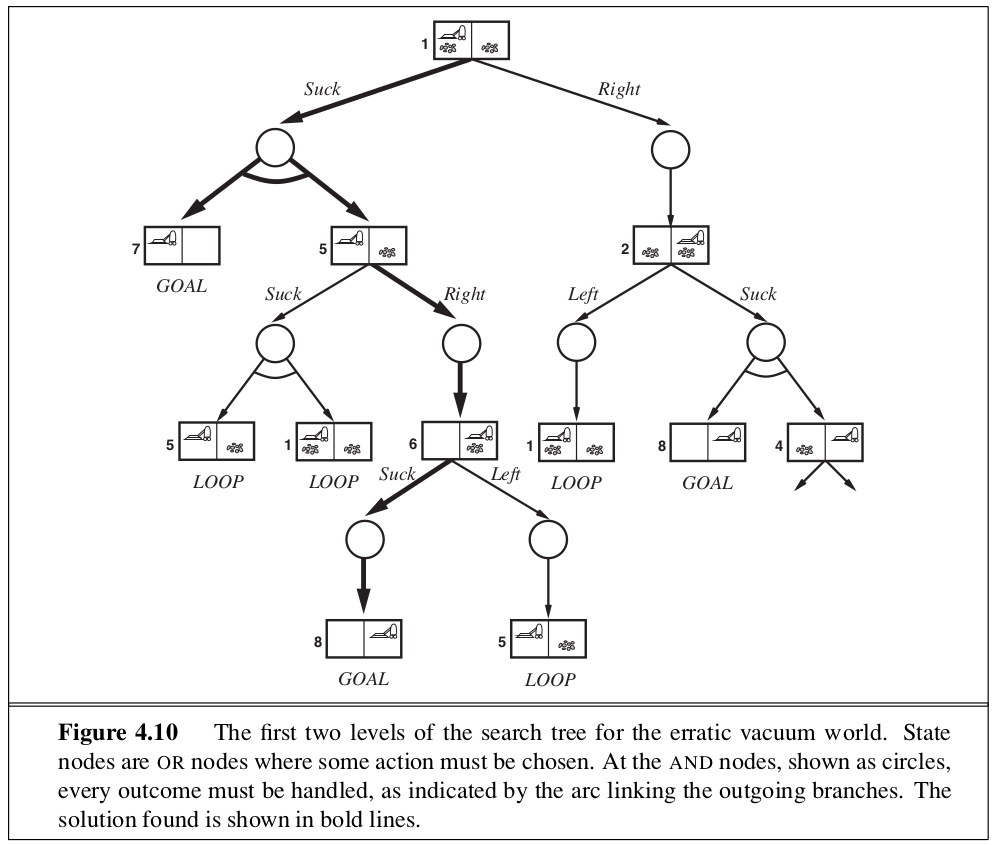

```{r setup, include=FALSE}
knitr::opts_chunk$set(echo = TRUE)
```

_In which we relax the simplifying assumptions of the previous chapter, thereby getting closer to the real world._

Chapter 3 addressed observable, deterministic, known environments where the solution is a sequence of actions. This chapter relaxes those assumptions.

In 4.1, 4.2 cover algorithms that perform purely **local search** in the state space, evaluating and modifying one or more current states rather than systematically exploring paths from an initial state. These are suitable for problems in which all that matters is the solution state, not the path cost to reach it. 

In 4.3-4.4 we relax the assumptions of determinism and observability. The key idea is that if an agent cannot predict exactly what percept it will receive, then it will need to consider what to do under each **contingency** that its percepts may reveal. 

In 4.5, we investigate **online search**, in which the agent is faced with a state space that is initially unknown and must be explored. 

# 4.1 | Local Search Algorithms and Optimization Problems 

Local search algorithms operate using a single current node rather than multiple paths, and generally move only to neighbors of that node. Typically, the paths followed by search are not retained. 

They have 2 key advantages: 
1. They used very little memory - usually a constant amount 
2. They can find reasonable solutions in large or infinite continuous state spaces for which systematic algorithms are unsuitable

They are also useful for solving pure **optimization** problems, in which the aim is to find the best state according to an **objective function**. 

## 4.1.1 | Hill-Climbing Search 

The hill-climbing search algorithm (steepest ascent version) is a loop that continually moves in the direction of increasing value (uphill). It terminates when it reaches a peak where no neighbor has a higher value. Hill climbing is sometimes called **greedy local search** because it grabs a good neighbor state without thinking ahead about where to go next. 

Unfortunately, hill climbing often gets stuck for the following reasons: 

* Local maxima
* Ridges: results in a sequence of local maxima that is very difficult for greedy algorithms to navigate
* Plateaux: A flat area of the state-space landscape

Some varients of hill climbing: 

**Stochastic Hill Climbing**: Chooses at random from among the uphill moves; the probability of selection can vary with steepness of the uphill move. Usually converges more slowly, but in some state landscapes it finds better solutions.

**First-Choice Hill Climbing**: Implements stochastic hill climbing by generating successors randomly until one is generated that is better than the current state. This is a good strategy when a state has many (e.g. thousands) of successors. 

Since the preceding hill climbing algorithms often get stuck on a local maxima:
**Random-Restart Hill Climbing**: conducts a series of hill-climbing searches from randomly generated initial states, until a goal is found. 

## 4.1.2 | Simulated Annealing 

A hill climbing algorithm that never makes downhill moves towards states with lower value (or higher cost) is guaranteed to be incomplete, because it can get stuck on a local maximum. In contrast, a purely random walk - moving to a successor chosen uniformly at random from a set of successors - is complete, but extremely inefficient. 

Combining hill climbing with a random walk, we get **Simulated Annealing**. 

To explain this, we switch our point of view from hill climbing to **gradient descent**(i.e. minimizing cost) and imagine a task of getting a ping-pong ball into the deepest crevice in a bumpy surface. If we just let the ball roll, it will settle in a local minima. If we shake the surface, we can bounce the ball out of the local minima. We wish to shake the surface just hard enough that we don't dislodge it from a global minima. 

The simulated annealing process starts by shaking hard, and then gradually reduces the intensity of the shaking. 

## 4.1.3 | Local Beam Search 

Keeping just one node in memory may seem an extreme reaction to the problem of memory limitations. 

The **local beam search** algorithm keeps track of $k$ states rather than just one. It begins with $k$ randomly generated states. At each step, all the successors of all $k$ states are generated. If any one is a goal, the algorithm halts. Otherwise it selects the $k$ best successors from the complete list and repeats. In a local beam search, useful information is passed among the parallel search threads. The algorithm quickly abandons unfruitful searches and moves its resources to where the most progress is being made. 

In its simplest form, local beam search can suffer from a lack of diversity among the $k$ states - they can quickly become concentrated in a small region of the state space, turning the search into a more expensive version of hill climbing. 

**Stochastic Beam Search** - instead of choosing the best $k$ from a pool of candidate successors, stochastic beam search chooses $k$ successors at random, with the probability of choosing a given successor being an increasing function of its value. This is similar to the process of natural selection, whereby successors (offspring) of a state (organism) populate the next generation according to its value (fitness). 

## 4.1.4 | Genetic Algorithms 

A **genetic algorithm** is a variant of stochastic beam search in which sucessor states are generated by combining 2 parent states rather than modifying a single state. 

GAs begin with a set of $k$ randomly generated states, called the population. Each state, or individual, is represented as a string over a finite alphabet - most commonly, a string of 0s and 1s. Next, each state is rated by the objective function, or (in GA terminology) the **fitness function**. A fitness function should return higher values for better states. 

For each pair to be mated, a **crossover** point is chosen randomly from the positions in the string. Then the offspring are created by crossing over the parent strings at the crossover point. Finally, each location is subject to random **mutation** with a small independent probability. 



# 4.2 | Local Search in Continous Spaces 

In chapter 2, it was pointed out that most real-world environments are continous -- but none of the algorithms shown so far (except for first-choice hill climbing and simulated annealing) can handle continuous state and action spaces, because they have infinite branching factors. 

Suppose we wish to place 3 new airports anywhere in Romania, such that the sum of the squared distances from each city on the map to its nearest airport is minimized. The state space is then defined by the coordinates of the airports: $(x_1, y_1), (x_2, y_2), (x_3, y_3)$. This is a _six-dimensional space_ (or we could say that states are defined by 6 variables). 

Moving around in this space corresponds to moving one or more of the airports in the map. 

Let $C_i$ be the set of cities whose closest airport (in the current state) is airport $i$. Then, in the neighborhood of the current state, where the $C_i$s remain constant, we have 

\begin{center}
  $f(x_1, x_2, x_3, y_1, y_2, y_3) = \sum\limits_{i=1}^3\sum\limits_{c \in C_i} (x_i - x_c)^2 + (y_i - y_c)^2$.
\end{center}

This expression is correct locally, but not globally because the sets $C_i$ are (discontinuous) functions of the state. 

### Discretization

One way to avoid continuous problems is to **discretize** the neighborhood of each state. For example, we can move only one airport at a time in either the $x$ or $y$ direction by a fixed amount $\pm \partial$. With 6 variables, this gives 12 possible successors for each state. We can then apply any of the local search algorithms described previously, or we could apply stochastic hill climbing and simulated annealing directly without discretizing the space. These algorithms choose successors randomly, which can be done by generating random vectors of length $\partial$. 

### Gradient Methods 

Many methods attempt to use the gradient of the landscape to find a maximum. 

The gradient of the objective function is a vector $\nabla f$ that gives the magnitude and direction of the steepest slope. For our problem: 

\begin{center}
  $\nabla f = (\frac{\partial f}{\partial x_1}, \frac{\partial f}{\partial y_1}, \frac{\partial f}{\partial x_2}, \frac{\partial f}{\partial y_2}, \frac{\partial f}{\partial x_3}, \frac{\partial f}{\partial y_3})$
\end{center}

In some cases, we can find a maximum by solving the equation $\nabla f = 0$. In many cases, this can not be solved in closed form. 

For example, with 3 airports, the expression for the gradient depends on what cities are closest to each airport in the current state. This means we can compute the gradient locally, but not globally. For example 

\begin{center}
  $\frac{\partial f}{\partial x_1} = 2 \sum\limits_{c \in C_1} (x_i - x_c)$
\end{center}

Given a locally correct expression for this gradient, we can perform steepest-ascent hill climbing by updating the current state according to the formula: 

\begin{center}
  $x \leftarrow x + \alpha \nabla f(x)$
\end{center}

where $\alpha$ is a small constant often called the step size. 

In some cases, the objective function may not be differentiable. Then we can calculate an **empirical gradient** by evaluating the response to small increments and decrements in each coordinate. Empirical gradient search is the same as steepest-ascent hill climbing in a discretized version of the state space. 

There are also a variety of methods for adjusting $\alpha$. If $\alpha$ is too small, too many steps are needed - if it is too big, it may overshoot the target. The technique of **line search** tries to overcome this dilemma by extending the current gradient direction - usually by repeatedly doubling $\alpha$ until $f$ starts to decrease again. 

### Newton-Raphson Method 

For many problems, the most effective algorithm is the **Newton-Raphson** method. This is a general technique for finding roots of functions (solving $g(x) = 0$). It works by computing a new estimate for the root $x$ according to Newton's formula: 

\begin{center}
  $x \leftarrow x - \frac{g(x)}{g'(x)}$.
\end{center}

To find a max or min of $f$, we need to find $x$ s.t. the gradient is zero ($\nabla f(x) = 0$). This, we can write the update equation in matrix-vector form as

\begin{center}
  $x \leftarrow x - \mathbb{H}_f^{-1}(x)\nabla f(x)$
\end{center}

where $\mathbb{H}_f(x)$ is the **Hessian** matrix of second derivatives, whose elements $H_{ij}$ are given by $\frac{\partial^2 f}{\partial x_i \partial x_j}$.

For high dimensional problems, computing the $n^2$ entries of the Hessian and inverting it may be expensive, so many approximate versions of the Newton-Raphson method have been developed. 

### Constrained Optimization 

An optimization problem is constrained if solutions must satisfy some hard constraints on the values of the variables. The best known category is that of **linear programming** problems, in which constraints must be linear inequalities forming a **convex set** and the objective function is also linear. The time complexity of linear programming is polynomial in the number of variables. 

Linear programming is probably the most widely studied and broadly useful class of optimization problems. It is a special case of the more general problem of **convex optimization**, which allows the constraint region to be any convex region and the objective to be any function that is convex within the constraint region. Under certain consitions, convex optimization problems are also polynomially solvable and may be feasible in practice with thousands of variables. 

# 4.3 | Searching with Nondeterministic Actions 

When the environment is either partially observable or nondeterministic (or both), percepts become useful.

In a partially observable environment, every percept helps narrow down the set of possible states the agent might be in, thus making it easier for the agent to achieve its goals. 

When the environment is nondeterministic, percepts tell the agent which of the possible outcomes of its actions has actually occurred. 

In both cases, the future percepts can not be determined in advance and the agents future acitons will depend on thos future percepts. Therefore, the solution to the problem is not a sequence, but a **contingency plan** (or strategy) that specifies what to do depending on what percepts are received. 

Solutions for nondeterministic problems can contain nested **if-then-else** statements; this means they are trees rather than sequences. 

## 4.3.2 | AND-OR Search Trees 

In a deterministic environment, the only branching is introduced by an agent's own choices in each state - these are called OR nodes. 
In a nondeterministic environment, branching is also introduced by the environment's choice of outcome for each action - these are called AND nodes. 



We might also consider a somewhat different agent design, in which the agent can act before it has found a guaranteed plan and deals with some contingencies only as they arise during execution. This type of **interleaving** of search and execution is useful for exploration problems and game playing. 

One key aspect of and-or search trees is the way in which they deal with cycles - which often arise in nondeterministic problems. If the current state is identical to a state on the path from the root, then it returns with a failure. This doesn't mean that there is no solution from the current state - but it does mean that if there is a noncyclic solution, it must be reachable from the earlier incarnation of the current state - so the new incarnation can be discarded.

With this check, we ensure that the algorithm terminates in every finite state space, because every path must reach a goal, a dead end, or a repeated state. 

AND-OR graphs can also be explored by breadth-first or best-first methods. The concept of a heuristic function must be modified to estimate the cost of a contingent solution rather than a sequence, but the notion of admissibility carries over and there is an analog of the A* algorithm for finding optimal solutions. 

# 4.4 | Searching with Partial Observations 

In partial observability, the agent's percepts do not suffice to pin down the exact state. Therefore, the key concept required for solving partially observable problems is the **belief state**, representing the agent's current belief about the possible physical states it might be in, given the sequence of actions and percepts up to that point. 

## 4.4.1 | Searching with No Observation 

When the agent's percepts provide no information at all, we have what is called a **sensorless** problem, or sometimes a **conformant** problem. To solve sensorless problems, we search in the space of belief states rather than physical states. In the belief state space, the problem is _fully observable_ because the agent always knowns its own belief state. Furthermore, the solution is a seqwuence of actions. This is because the percepts received after each action are completely predictable - empty! So there are no contingencies to plan for. This is true even if the environment is nondeterministic.

## 4.4.2 | Searching with Observations 

For partially observable problems, we can consider the following sets: 

* A full observable problem has a set PERCEPTS = s for all states s
* a sensorless problem has the set PERCEPTS = null

## 4.4.3 | Solving Partially Observable Problems 

We can directly apply the AND-OR search algorithm to derive a solution for partially observable problems. The difference is that in a partially observable state, we use belief states. Then, giving those belief states to the AND-OR search algorithm, it returns a conditional plan that tests the belief state rather than the actual state. This makes sense because in a partially observable environment the agent won't be able to execute a solution that requires testing the actual state. 

As is the case in standard search algorithms applied to sensorless problems, the AND-OR search algorithm treats belief states as black boxes, just like other states. One can improve on this by checking for previously generated belief states that are subsets or supersets of the current state, just as for sensorless problems. 

One can also derive incremental search algorithms, analogous to those described for sensorless problems, that provide substantial speedups over the black box approach. 

## 4.4.4 | An Agent for Partially Observable Environments 

The design of a problem solving agent for partially observable environments is quite similar to the simple problem-solving agent. The agent formulates a problem, calls a search algorithm to solve it, and executes the solution. 

There are two main differences: 

1. The solution to the problem will be a conditional plan rather than a sequence (if then else)
2. The agent will need to maintain its belief state as it performs actions and receives percepts. 

Given an initial belief state $b$, an action $a$, and a percept $o$, the new belief state is: 

\begin{center}
  $b' = \mathrm{Update(Predict(}b, a), o)$.
\end{center}

In partially observable environments -- which include the vast majority of real world environments -- maintaining one's belief state is a core function of any intelligent system. This function goes under various names, including monitoring, filtering, and state estimation. 

# 4.5 | Online Search Agents and Unknown Environments 

So far we have focused on agents that use **offline search** algorithms. They compute a complete solution before setting foot in the real world and then execute the solution. 

In contrast, an **online search** agent **interleaves** computation and action: first it takes an action, then it observes the environment and computes the next action. Online search is a good idea in dynamic or semidynamic domains -- domains where there is a penalty for sitting around and computing too long. It is also helpful in nondeterministic domains because it allows the agent to focus its computational efforts on the contingencies that actually arise rather than those that might happen but probably don't. 

In a state of ignorance, the agent faces an **exploration** problem and must use its actions as experiments in order to learn enough to make deliberation worthwhile. 

Typically the agents objective is to reach a goal state while minimizing cost. The cost is the total path cost of the path that the agent actually travels. It is common to compare this cost with the path cost of the path the agent would follow if it knew the search space in advance (the actual shortest path). This is called the **competitive ratio** and we would like it to be as small as possible. 

_no algorithm can avoid dead ends in all state spaces_. 

## 4.5.3 | Online Local Search 

Like depth-first search, **hill climbing search** has the property of locality in its node expansions. Since it keeps just one node in its memory, it is already an online search algorithm. Unfortunately, it is not very useful in its simplest form because it leaves the agent sitting at local maxima with nowhere to go. Moreover, random restarts can not be used because the agent can not transport itself to a new state. 

Instead of random restarts, one might consider using a **random walk** to explore the environment. It can be shown that given a finite state space, a random walk will eventually find a goal or complete its exploration. 

Augmenting hill climbing with memory rather than randomness turns out to be a more effective approach. The basic idea is to store a current best estimate $H(s)$ of the cost to reach the goal from each state that has been visited. An agent implementing this strategy is called learning real time A* (LRTA\*). One important detail is that actions that have not yet been tried in a state $s$ are always assumed to lead immediately to the goal with the least possible cost, namely $h(s)$. This optimism under uncertainty encourages the agent to explore new, possibly promising paths. 

AN LRTA agent is guaranteed to find a goal in any finite, safely explorable environment. Unlike A* however, it is not complete for infinite state spaces - there are cases where it can be led infinitely astray. It can explore a state of size $n$ in $O(n^2)$ worst case, but often does much better. 


