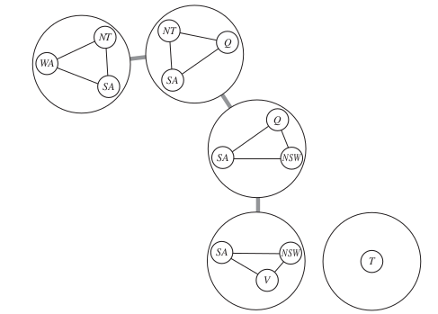

```{r setup, include=FALSE}
knitr::opts_chunk$set(echo = TRUE)
```

_In which we see how treating states as more than just little black boxes leads to the invention of a range of powerful new search methods and a deeper understanding of problem structure and complexity._

In this chapter, we solve problems in which each state has a **factored** representation: a set of variables, each of which has a value. A problem is solved when each variable has a value that satisfies all the constraints on the variable. A problem described this way is called a **constraint satisfaction problem**. 

The main idea is to eliminate large portions of the search space all at once by identifying variable / value combinations that violate the constraints. 

# 6.1 | Defining Constraint Satisfaction Problems 

A constraint satisfaction problem consists of 3 components, $X$, $D$, and $C$: 

-   $X$ is the set of variables, $\{X_1, ..., X_n\}$
-   $D$ is the set of domains, $\{D_1, ..., D_n\}$, one for each variable 
-   $C$ is a set of constraints that specify allowable combinations of values

To solve a CSP, we need to define a srare space and the notion of a solution. Each state in a CSP is defined by an **assignment** of values to some or all of the variables, $\{X_i = v_i, X_j = v_j, ...\}$. An assignment that does not violate any constraints is called a consistent or legal assignment. 

A **complete assignment** is one in which every variable is assigned, and a solution to a CSP is a consistant, complete assignment. A **partial assignment** is one that assigns values to only some of the variables. 

## 6.1.3 | Variations on the CSP Formalism 

The simplest kinds of CSP involve variables that have discrete, finite domains. 

If we have a discrete domain that is infinite, we can no longer enumerate the options. Instead, we must use a **constraint language** that understands constraints like $T_1 + d_1 \leq T_2$ directly without enumerating all pairs of allowable values. 

Special solution algorithms exist for linear constraints, but it can be shown that no algorithm exists for solving general nonlinear constraints on integer variables. 

CSPs with **continuous domains** are common in the real world. The best known categories of these are called **linear programming** problems, where constraints must be linear equalities or inequalities. 

The simplest type of constraint is called a **unary constraint**, which restricts our value to that of a single variable. Similarly, a binary constraint involves 2 values. We can also assert that values are between values, like an inequality. A constraint involving an arbitrary number (but not necessarily all of) variables is called a **global constraint**. 

Constraints needn't be black and white. Many real-world CSPs include **preference constraints**, indicating which solutions are preferred. With these in a problem formulation, CSPs with preferences can be solved with optimization search methods, either path-based or local. This is called a **Constraint Optimization Problem**. Linear Programming problems do this kind of optimization. 

# 6.2 | Constraint Propagation: Inference in CSPs

In regular state space algorithms, we can only perform one operation: search. In CSPs, we can also do a type of inference called **constraint propagation**. This is when we use constraints to reduce the number of legal values for a variable. The key idea is **local consistency**. If we treat each variable as a node in a graph, and each binary constraint as an arc, then the process of enforcing local consistency in each part of the graph causes inconsistent values to be eliminated throughout the graph. 

There are different types of local consistency: 

### 6.2.1 | Node Consistency

A single variable (corresponding to a node in the CSP network) is node-consistent if all the values in the variable's domain satisfy the variable's unary constraints.

### 6.2.2 | Arc Consistency 

A variable in a CSP is arc-consistent if every value in its domain satisfies the variable's binary constraints. More formally, $X_i$ is arc-consistent with respect to another variable $X_j$ is for every value in the current domain $D_i$ there is some value in the domain $D_j$ that satisfies the binary constraint on the arc $(X_i, X_j)$. 

It is possible to extend the notion of arc-consistency from binary to $n$-ary constraints.

### 6.2.3 | Path Consistency 

Path Consistency tightens the binary constraints by using implicit constraints that are inferred by looking at triples of variables. 

A two variable set $\{X_i, X_j\}$ is path consistent with respect to a thid variable $X_m$ if, for every assignment $\{X_i = a, X_j = b\}$ consistent with the constraints on $\{X_i, X_j\}$ there is an assignment to $X_m$ that satisfies the constraints on $\{X_i, X_m\}$ and $\{X_m, X_j\}$. This is called path consistency because one can think of it as looking at a path from $X_i$ to $X_j$ with $X_m$ in the middle. 

### 6.2.4 | K-Consistency

Stronger forms of propagation can be defined with the notion of **k-consistency**. A CSP is k-consistent if, for any set of $k-1$ variables and for any consistent assignment to those variables, a consistent value can always be assigned to any kth variable. 

- 1 consistency is node consistency
- 2 consistency is arc consistency
- 3 consistency is path consistency 
- k consistency is k consistency :D 

A CSP is **strongly k-consistent** if it is k-consistent and also $(k-1)$ consistency, $(k-2)$ consistent, and so on down to 1 consistent. 

# 6.3 | Backtracking Search for CSPs

Some problems can be solved by inference over constraints alone, but many others require search as well. 

The term **backtracking search** is used for a depth-first search that chooses values for one variable at a time and backtracks when a variable has no legal values left to assign. It repeatedly chooses an unassigned variable, and then tries all values in the domain of that variable in turn, trying to find a solution. If any inconsistency is detected, then it returns failure, causing the previous call to try another value. 

In chapter 3 we improved the performance of uninformed search algorithms by passing them domain-specific heuristic functions derived from knowledge of the problem. We can solve CSPs efficiently without such knowledge, but we can add sophistication to the unspecified functions in the algorithm to adress the following questions: 

- Which variable should be assigned next, and in what order should its values be tried? 
- What inferences should be performed at each step in the search? 
- What the search arrives at an assignment that violates a constraint, can the search avoid repeating this failure? 

### 6.3.1 | Variable and Value Ordering 

Choosing the next variable in order is not usually the most efficient search. If we have constraints (ex: a -> red, b -> blue => c ->  green) that force a value upon another, we can define a heuristic based about choosing the variable with the fewest legal values. This is the **minimum remaining values** heuristic. It has also been called the most constrained variable or fail first heuristics (the latter because it picks a variable that is most likely to cause a failure soon, pruning the search tree). The MRV heuristic generally performs better than a random or static ordering, sometimes by a factor of 1000 or more. 

We can also use the **degree heuristic**, which attempts to reduce the branching factor on future choices by selecting the variable that is involved in the largest number of constraints on other unassigned variables. 

Once a variable has been selected, our algorithm must decide on the order in which to examine its values. For this, the **least constraining value** heuristic can be useful. It chooses the value that rules out the fewest choices for the neighboring variables in the constraint graph. In general, this heuristic is trying to leave the maximum flexibility for subsequent variable assignments.

Why should variable selection be fail-first, and value selection be fail-last? For a wide variety of problems, a variable ordering that chooses a variable with the minimum number of remaining values helps minimize the number of nodes in the search tree by pruning larger parts of the tree earlier. For value ordering, we only need one solution - therefore it makes sense to look for the most likely values first. If we wished to enumerate all solutions rather than just find one, then value ordering would be irrelevant. 

### 6.3.2 | Interleaving Search and Inference 

Previously we looked at cases where algorithms inferred reductions in the domain of variables before the search began. During the course of a search, every time we make a choice of a value for a variable we have a new opportunity to infer domain reductions on the neighboring variables. 

One of the simplest forms is called **forward checking**. Whenever a variable $X$ is assigned, the forward checking process establishes arc-consistency for it: for each unassigned variable $Y$ that is connected to $X$ by a constraint, delete from $Y$'s domain any value that is inconsistent with the value chosen for $X$. Since forward checking only does arc consistency inferences, there is no reason to use it if we did arc consistency as a preprocessing step. 

### 6.3.3 | Intelligent Backtracking: Looking Backward

The regular backtracking-search algorithm has a simple policy for when a branch of a search fails: back up to the preceding variable and try a different value for it. 

A different approach is to backtrack to a variable that might fix the problem. To do this, we keep track of a set of assignments that are in conflict with some value (we call this the **conflict set**). The **backjumping** method backtracks to the most recent assignment in the conflict set. 

**Constraint Learning** is the idea of finding a minimum set of variables from the conflict set that causes the problem. 

# 6.4 | Local Search for CSPs

Local search algorithms turn out to be very effective for solving many CSPs. They use a complete state formulation: the initial state assigns a value to every variable, and the search changes the value of one variable at a time. In choosing a new value for a variable, the most obvious heuristic is to select the value that results in the minimum number of conflicts with other variables - the **min-conflicts heuristic**. 

We can also use **constraint weighting** to concentrate the search on important constraints. Giving each constraint a numeric weight, at each step of the search the algorithm chooses a variable / value pair to change that will result in the lowest total weight of all violated constraints. The weights are then adjusted by incrementing the weight of each constraint that is violated by the current assignment. 

# 6.5 | The Structure of Problems 

We can look at the structure of a problem to ascertain ways to find solutions quickly. For example, if we are trying to color in Tasmania, we may note that it is not connected to the mainland. Thus coloring Tasmania and coloring the mainland are independent subproblems. Independence can be ascertained simply by finding **connected components** of the constraint graph. Completely indepdent subproblems are great, but rare. 

Some other graph structures are easy to solve. A constraint graph is a **tree** when any two variables are connected by only one path. _Any tree structured CSP can be solved in time linear in the number of variables_. The key to this is a new notion of consistency, called **directed arc consistency**. A CSP is defined to be directed arc consistent under an ordering of variables $X_1, X_2, ..., X_n$ if and only if every $X_i$ is arc consistent with each $X_j$ for $j > i$.

To solve a tree structured CSP, pick any variable to be the root of the tree and choose an ordering of the variables such that each variable appears after its parent in the tree. Such an ordering is called a **topological sort**. With this structure, we don't have to backtrack - we can move linearly through the variables. 

The general algorithm for solving a CSP with this method is as follows: 

1. Choose a subset S of the CSPs variables such that the constraint graph becomes a tree after removal of S. S is called a **cycle cutset**
2. For each possible assignment to the variables in S that satisfies all constraints on S: 
  a) remove from the domains of the remaining variables any values that are inconsistent with the assignment for S, and 
  b) If the remaining CSP has a solution, return it together with the assignment for S 
  
Finding the smallest cycle cutset is NP-hard, but several efficient approximation algorithms are known. The overall approach is called **cutset conditioning**. 

The second approach is based on constructing a **tree decomposition** of the constraint graph into a set of connected subproblems. Each subproblem is solved independently and the resulting solutions are then combined. CSPs with constraint graphs of bounded tree width are solvable in polynomial time. Unfortunately, finding the decomposition with minimal tree width is NP-hard, but there are heuristics which work well in practice. 



# 6.6 | Summary

- Constraint Satisfaction Problems represent a state with a set of variable / value pairs and represent the conditions for a solution by a set of contraints on the variables. 
- A number of inference techniques use the constraints to infer which variable / value pairs are consistent and which are not. These include node, arc, path, and k-consistency 
- Backtracking Search, a form of depth first search, is commonly used for solving CSPs. Inference can be interwoven with search 
- The minimum remaining values and degree heuristics are domain independent methods for deciding which variable to choose next in a backtracking search. The least constraining value heuristic helps in deciding which value to try for a given variable. Backtracking occurs when no legal assignment can be found for a variable. Conflict directed backjumping backtracks directly to the source of the problem
- Local search using the min-conflicts heuristics has also been applied to constraint satisfaction problems with great success 
- The complexity of solving a CSP is strongly related to the structure of its constraint graph. Tree structured problems can be solved in linear time. Cutset condition can reduce a general CSP to a tree structured one and is quite efficient is a small cutset can be found. Tree decomposition techniques transform the CSP into a tree of subproblems and are efficient if the tree width of the constraint graph is small. 


