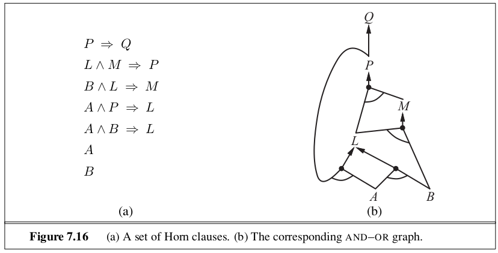

```{r setup, include=FALSE}
knitr::opts_chunk$set(echo = TRUE)
```

_In which we design agents that can form representations of a complex world, use a process of inference to derive new representations about the world, and use these new representations to deduce what to do_. 

# 7.1 | Knowledge-Based Agents

The central component of a knowledge-based agent is it's **knowledge base**, which is a set of **sentences** (in the logical sense). There must be a way to add new sentences to the knowledge base and to query what is known; this is called Tell and Ask, respectively. Both may involve **inference**, deriving new sentences from old sentences.  

Starting with an empty knowledge base, the agent designer call Tell sentences one by one until the agent knows how to operate in its environment. This is called the **declarative** approach to system building. In contrast, the **procedural** approach encodes desired behaviours directly as code.

# 7.3 | Logic 

Each sentence must be expressed according to a **syntax** of the representation language. A logic must also define the **semantics**, or meaning of sentences. The semantics define the truth of each sentence with respect to each possible world. When we need to be precise, we use the term **model** in place of "possible world". 

Models are mathematical abstractions, each of which simply fixes the truth or falsegood of every relevant sentence. If a sentence $\alpha$ is true in model $m$, we say that $m$ satisfies $\alpha$ or sometimes $m$ is a model of $\alpha$. We use the notation $M(\alpha)$ to mean the set of all models of $\alpha$. 

The relation of logical **entailment** between sentences is the idea that a sentence _follows logically_ from another sentence. In notation we write $\alpha \models \beta$.

The formal definition of entailment: 

$\alpha \models \beta$ if and only if, in every model in which $\alpha$ is true, $\beta$ is also true. Alternatively, $\alpha \models \beta$ iff $M(\alpha) \subseteq M(\beta)$.

Note the inclusion of $\subseteq$ means that $\alpha$ is a stronger assertion than $\beta$; it rules out more possible worlds.

Enumerating all possible models to check if a model $\alpha$ is true in all models in which a sentence $KB$ is true is called **model checking**, or $M(KB) \subseteq M(\alpha)$. In understanding entailment and inference, it might help to think of the set of all consequences of $KB$ as a haystack and of $\alpha$ as a needle. Entailment is like a needle being in a haystack, and inference is like finding it. 

If an inference algorithm $i$ can derive $\alpha$ from $KB$, we write $KB \vdash_i \alpha$, or $\alpha$ is derived from $KB$ by $i$, or $i$ derives $\alpha$ from $KB$.

An inference algorithm which derives only entailed sentences is called **sound** or **truth-preserving**. In contrast, an unsound inference procedure makes things up as it goes along - it announces the discovery of nonexistent needles. 

The property of **completeness** is also desirable. An inference algorithm is complete if it can derive any sentence that is entailed. 

# 7.4 | Propositional Logic : A Very Simple Logic

Propositional entailment is co-NP-complete (i.e. probably no easier than NP-complete). Therefore every known inference algorithm for propositional logic has a worst case complexity that is exponential in the size of the input. 

# 7.5 | Propositional Theorem Proving 

Another way we can determine entailment (aside from enumarating models in model checking) is **theorem proving**. This is applying rules of inference directly to the sentences in our knowledge base to construct a proof of the desirved sentence without consulting models.

We can say sentences $\alpha$ and $\beta$ are **logically equivalent** if they are true in the same set of models. $\alpha \equiv \beta$ iff $\alpha \models \beta$ and $\beta \models \alpha$. 

A sentence is valid if it is true in all models. This is known as a **tautology**.

A sentence is **satisfiable** if it is true in, or satisfied by, _some_ model. The problem of determining the satisfiability of sentences in propositional logic - the SAT problem - was the first problem proved to be NP-complete.

validity and satisfiability are connected: $\alpha$ is valid iff $\neg \alpha$ is unsatisfiable. Another result is the following: $\alpha \models \beta$ iff the sentence $\alpha \wedge \neg \beta$ is unsatisfiable. This is called proof by contradiction or reductio ad absurdum.

## 7.5.1 | Inference and Proofs 

The best known inference rule that can be applied to derive a proof is called **Modus Ponens**. This means that, whenever sentences of the form $\alpha \implies \beta$ and $\alpha$ are given, the sentence $\beta$ can be inferred.

Another useful rule is **And-Elimination**, which states that, from a conjunction, any of the conjuncts can be inferred. This means that if $\alpha \wedge \beta$, then $\alpha$.

Searching for proofs is an alternative to enumerating models. In many practical cases, finding a proof can be more efficient because the proof can ignore irrelevant propositions, no matter how many of them there are. 

One final property of logical systems is **monotonicity**, which says that the set of entailed sentences can only increase as information is added to the knowledge base. For any sentences $\alpha$ and $\beta$, if $KB \models \alpha$, then $KB \wedge \beta \models \alpha$. Nonmonotonic logics, which violate the monotonicity property, capture a common property of human reasoning: changing ones mind. 

## 7.5.2 | Proof by Resolution

The current section introduces a single inference rule, **resolution**, that yeilds a complete inference algorithm when coupled with any complete search algorithm. The resolution rule forms the basis for a famiily of complete inference procedures. A resolution based theorem prover can, for any sentences $\alpha$ and $\beta$ in propositional logic, decide whether $\alpha \models \beta$. 

### Conjunctive Normal Form 

The resolution rule applies only to clauses (disjunctions of literals). Thankfully every sentence of propositional logic is logically equivalent to a conjunction of clauses. A sentence expressed as a conjunction of clauses is said to be in **conjunctive normal form (CNF)**. The steps are as follows: 

1. Eliminate $\iff$, replacing $\alpha \iff \beta$ with $(\alpha \implies \beta) \land (\beta \implies \alpha)$. 
2. Eliminate $\implies$, replacing $\alpha \implies \beta$ with $\neg \alpha \lor \beta$
3. CNF requires $\neg$ to appear only in literals, so we move $\neg$ inwards by repeated application of double negation elimination and De Morgan's Law
4. Then we have a sentence containing nested $\land$ and $\lor$ operators applied to literals. We then apply the distributivity law and get the original sentence in CNF as a conjunction of clauses.

### Completeness of Resolution

The **resolution closure** of a set of clauses $S$ is the set of all clauses derivable by repeated application of the resolution rule to clauses in $S$ or their derivatives. 

The completeness theorem for resolution in propositional logic is called the **ground resolution theorem**: 

If a set of clauses is unsatisfiable, then the resolution closure of these clauses contains the empty clause. 

## 7.5.3 | Horn Clauses and Definite Clauses 

The completeness of resolution makes it a very important inference method, but in many practical situations, the full power of resolution is not needed. Some real world knowledge bases satisfy certain restrictions on the form of sentences they can contain, which enables them to use a more restricted and efficient inference algorithm. 

One such form is the **definite clause**, which is a disjunction of literals of which _exactly one is positive_ (like $\neg a, b, \neg c$, but not $a, b, \neg c$). 

Slightly more general is the **Horn clause**, which is a disjunction of literals of which _at most one is positive_. Horn clauses are closed under resolution: if you resolve two Horn clauses, you get a Horn clause. 

Knowledge bases containing only definite clauses are interesting for 3 reasons:

1. Every definite clause can be written as an implication whose premise is a conjunction of positive literals and whose conclusion is a single positive literal. 
2. Inference with Horn clauses can be done through forward chaining and backward chaining algorithms. This type of inference is the basis for **logic programming**. 
3. Deciding entailment with Horn clauses can be done in time that is linear in the size of the knowledge base. 

## 7.5.4 | Forward and Backward Chaining 

The forward chaining algorithm determines if a single proposition query is entailed by a knowledge base of definite clauses. Forward chaining is an example of the general concept of **data-driven** reasoning (in which the focus of attention starts with the known data). 



The backward chaining algorithm, similarly, works backwards from the query. Backward chaining is a form of **goal-directed reasoning**. In practice, backward chaining is usually much less than linear in the size of the knowledge base, because the process touches only relevant facts. 

# 7.6 | Effective Propositional Model Checking 

The algorithms in this section are for checking satisfiability: the SAT problem (testing entailment, $\alpha \models \beta$ can be done by testing unsatisfiability of $\alpha \land \neg \beta$). There are manu similarities between satisfying a model for a logical sentence and finding a solution for a constraint satisfaction problem. Many combinatorial problems in computer science can be reduced to checking the satisfiability of a propositional sentence. 

## 7.6.1 | A Complete Backtracking Algorithm 

The first algorithm considered is the **Davis_Putnam** algorithm, as described initially by Davis and Putnam but expanded upon by Davis, Logemann, and Loveland. It takes as input a sentence in conjunctive normal form - a set of clauses. Then it is essentially a recursive, depth-first enumeration of possible models. Some features: 

_Early termination_: It detects whether the sentence must be true or false, even with a partially completed model.
_Pure symbol heuristic_:  A **pure symbol** is a sumbol that always appears with the same sign in all clauses. For example, in $a \lor \neg b, \neg b \lor \neg c, c \lor a$, the symbol $a$ is pure because only the positive literal appears, b is pure because only the negative literal appears, and $c$ is impure. In determining the purity of a symbol, the algorithm can ignore clauses that are already known to be true in the model constructed so far. 
_Unit clause heuristic_: A unit clause is a clause with just one literal. In the context of DPLL, it also means clauses in which all literals but one are already assigned false by the model. For example, if $b = $ true, then $\neg b \lor \neg c$ simplifies to $\neg c$, which is a unit clause. Assigning one unit clause can create another unit clause. For example, if c is set to false, $c \lor a$ becomes a unit clause, causing true to be assigned to a. This cascade of forced assignments is called a **unit propagation**. 

# 7.8 | Summary 

- Intelligent agents need knowledge about the world in order to reach good decisions. 

- Knowledge is contained in agents in the form of sentences in a knowledge representation language that are stored in a knowledge base. 

- A representation language is defined by its syntax, which specifies the structure of sentences, and its semantics, which defines the truth of each sentence in each possible world or model. 

- The relationship of entailment between sentences is crucial to our understanding of reasoning. A sentence $\alpha$ entails another sentence $\beta$ if $\beta$ is true in all worlds where $\alpha$ is true. Equivalent definitions include the validity of the sentence $\alpha \implies \beta$ and the unsatisfiability of the sentence $\alpha \land \neg \beta$.

- Inference is the process of deriving new sentences from old ones. Sound inference algorithms derive only sentences that are entailed. Complete algorithms derive all sentences that are entailed. 

- Propositional logic is a simple language consisting of proposition symbols and logical connectives. It can handle propositions that are known true, known false, or completely unknown. 

- The set of all possible models, given a fixed propositional vocabulary, is finite, so entailment can be checked by enumerating models. Efficient model checking inference algorithms for propositional logic include backtracking and local search methods and can often solve large problems quickly. 

- Inference rules are patterns of sound inference that can be used to find proofs. The resolution rule yields a complete inference algorithm for knowledge bases that are expressed in conjunctive normal form. Forward chaining and backward chaining are very natural reasoning algorithms for knowledge bases in Horn form. 

- Local search methods such as WalkSAT can be used to find solutions. Such algorithms are sound, but not complete.

- Logical state estimation involves maintaining a logical sentence that describes the set of possible states consistent with the observation history. Each update step requires inference using the transition model of the environment, which is built from successor state axioms that specify how each fluent changes. 

- Decisions within a logical agent can be made by SAT solving: finding possible models specifying future action sequences that read the goal. This approach works only for fully observable or sensorless environments.

- Propositional logic does not scale to environments of unbounded size because it lacks the expressive power to deal concisely with time, space, and universal patterns of relationships among objects. 


 
